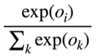

  

指数能让输入值得到非负的输出结果

训练集，shuffle=True；测试集，shuffle=False

Sigmoid: [0, 1]
Tanh: [-1, 1]
ReLU: 因为相比sigmoid的指数运算很贵，而不需要指数运算的ReLU很快。

激活函数避免“层数的塌陷”，意思是如果不用激活函数，那么数层线性层完全就是一层线性层，而有了激活函数，加入了非线性后，上下层之间就不是线性关系了。

为什么最后一层不加激活函数？因为最后一层不需要避免层数的塌陷，没有下一层。

---

`nn.CrossEntropyLoss()`的label必须是`labels = labels.long()`类型

----

MLP能模拟任何效果，但是之所以不用MLP，而是用CNN、RNN是因为MLP直接去训练，训练不了。必须通过我们人为来指导模型怎么做，降低训练的复杂度，如同给了个锤子去敲，而不是让它自己去用手。

canonical space也是同理，直接从A到C很难学，指定让它加个B的过渡就行。如同让学生打草稿再正式写的过程。