- [1. 显示出来](#1-显示出来)
- [2. 两个格式](#2-两个格式)
  - [2.1. plt.figure](#21-pltfigure)
  - [2.2. 子图](#22-子图)
    - [2.2.1. fig.subplots](#221-figsubplots)
    - [2.2.2. plt.subplots](#222-pltsubplots)
    - [2.2.3. plt.subplot](#223-pltsubplot)
- [3. 属性](#3-属性)
  - [3.1. 标题](#31-标题)
  - [3.2. label](#32-label)
  - [3.3. 图例](#33-图例)
  - [3.4. 网格](#34-网格)
  - [3.5. xlim](#35-xlim)
  - [3.6. 刻度 xticks](#36-刻度-xticks)
  - [3.7. 刻度精度](#37-刻度精度)
  - [3.8. 绘图风格](#38-绘图风格)
  - [3.9. 布局](#39-布局)
  - [3.10. marker](#310-marker)
  - [3.11. 灰度图](#311-灰度图)
  - [3.12. 保存画布](#312-保存画布)


---

[Matplotlib中文网、Matplotlib官方中文文档](https://matplotlib.org.cn/)

## 1. 显示出来
【`%matplot inline`、`%matplot notebook`与`plt.show()`】：

解释：
- 这些都是用来显示绘制的图像的，只用打一个就行了。
- `plt.show()`是各IDE通用的。
- `%matplot inline`是专在Jupyter中用来自动显示图像的。将图像以静态方式显示。
- `%matplot notebook`是专在Jupyter中用来自动显示图像的。将图像以动态方式显示。

例如：
- Jupyter notebook的%matplot notebook：

- Jupyter notebook的%matplot inline：

- 其他IDE，如IDLE：


## 2. 两个格式

Matplotlib有两个库的使用格式：
- Axes: 使用Figure或Axes对象上的方法来显示地创建（指定哪个）
- pyplot: 隐式地跟踪当前的Figure和Axes

|功能|plt|ax|fig|
|:-|:-:|:-:|:-:|
|最后一个，或者无中生有||`ax = plt.gca()`|`fig = plt.gcf()`|
|新创画布|||`fig = plt.figure()`|
|新创子图||`ax = plt.subplot(1, 2, 1)` </br> `ax = fig.subplots()` </br> `axs = fig.subplots(1,2)`||
|同时新创画布和子图||`fig, ax = plt.subplots()` </br> `fig, axs = plt.subplots(1, 2)`||
|绘制|`plt.plot`|`ax.plot`||
|画布标题|`plt.suptitle`||`fig.suptitle`|
|子图标题|`plt.title`|`ax.set_title`||
|坐标轴label|`plt.xlabel`|`ax.set_xlabel`||
|x边界|`plt.xlim`|`ax.set_xlim`||
|x刻度|`plt.xticks`|`ax.set_xticks`||
|图例|`plt.legend`|`ax.legend`||
|网格|`plt.grid`|`ax.grid`||


### 2.1. plt.figure

显示的返回，可以用ax和fig用；不需要返回，设置当前的画布是哪个。
```python
fig = plt.figure()
plt.figure()
```

设定整个画布的尺寸
```python
fig = plt.figure(figsize=(3, 3))
```
哪个画布: 有`num`的则返回，没有创建一个新的`num`。默认的，数字的从1开始自增。
```python
# num: int | str | Figure | SubFigure | None = None
fig = plt.figure()
print(fig.number)
# 1
```

例子：

```python
# 本来是产生两个画布
import matplotlib.pyplot as plt

plt.figure()
plt.plot([0,1,2,3])

plt.figure()
plt.plot([3,2,1,0])
```
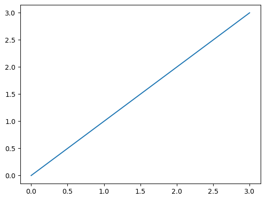  
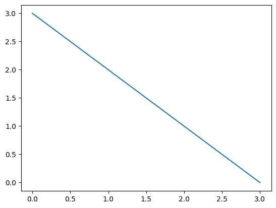  

```python
# 同一个fig
import matplotlib.pyplot as plt

plt.figure(2)
plt.plot([0,1,2,3])

plt.figure(2)
plt.plot([3,2,1,0])
```
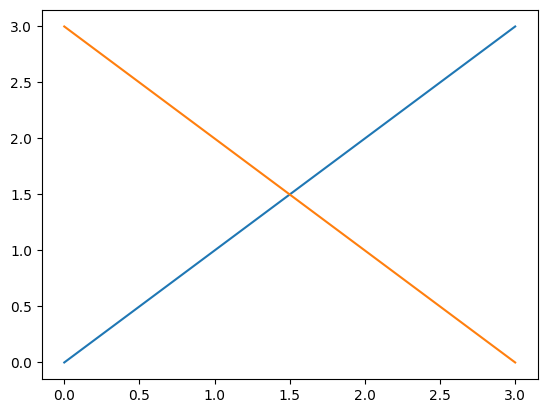  

### 2.2. 子图

#### 2.2.1. fig.subplots
```python
fig = plt.figure()
ax = fig.subplots()     # 默认创建一行一列，直接返回一个
ax.plot([0,1,2,3])
```
  
```python
fig = plt.figure()
axs = fig.subplots(1, 2)        # 一行两列，返回列表
axs[0].plot([1, 2, 3], [0, 0.5, 0.2])
axs[1].plot([3, 2, 1], [0, 0.5, 0.2])
```
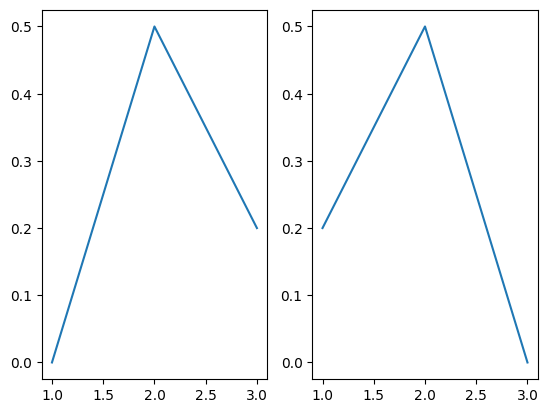  

#### 2.2.2. plt.subplots

```python
fig, axs = plt.subplots(1, 2)       
axs[0].plot([1, 2, 3], [0, 0.5, 0.2])
axs[1].plot([3, 2, 1], [0, 0.5, 0.2])
```
#### 2.2.3. plt.subplot

```python
import matplotlib.pyplot as plt

plt.subplot(1, 2, 1)
plt.plot([1, 2, 3], [0, 0.5, 0.2])

plt.subplot(1, 2, 2)
plt.plot([3, 2, 1], [0, 0.5, 0.2])

# ax = plt.subplot(1, 2, 1)
# ax.plot([1, 2, 3], [0, 0.5, 0.2])

# ax = plt.subplot(1, 2, 2)
# ax.plot([3, 2, 1], [0, 0.5, 0.2])
```
## 3. 属性
### 3.1. 标题

```python
import matplotlib.pyplot as plt

plt.subplot(1, 2, 1)
plt.plot([1, 2, 3], [0, 0.5, 0.2])

plt.subplot(1, 2, 2)
plt.plot([3, 2, 1], [0, 0.5, 0.2])
plt.title('ax title')

plt.suptitle('suptitle')


# fig, axs = plt.subplots(1, 2)       
# axs[0].plot([1, 2, 3], [0, 0.5, 0.2])
# axs[1].plot([3, 2, 1], [0, 0.5, 0.2])

# axs[1].set_title('ax title')
# fig.suptitle('suptitle')
```
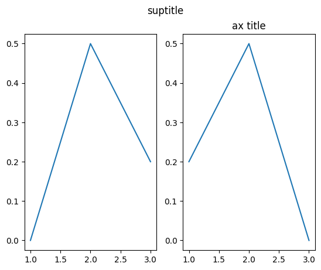  


> 显示中文

加上这些，解决更改字体导致显示不出符号的问题

```python
from pylab import mpl
mpl.rcParams['font.sans-serif'] = ['SimHei']
mpl.rcParams['axes.unicode_minus'] = False
```

### 3.2. label

```python
import matplotlib.pyplot as plt

plt.plot([5, 2, 7], [2, 16, 4])
plt.xlabel("X axis")
plt.ylabel("Y axis")
```
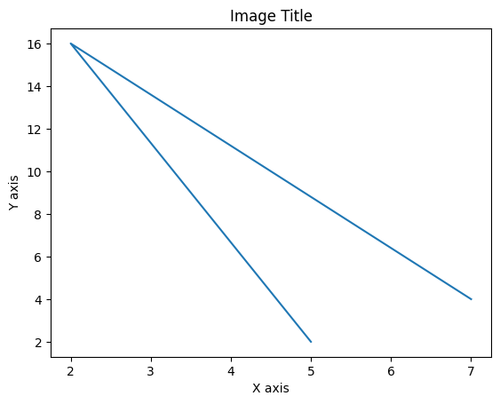  

### 3.3. 图例

```python
import matplotlib.pyplot as plt

ax = plt.gca()
ax.plot([1, 2, 3], [0, 0.5, 0.2])
ax.plot([3, 2, 1], [0, 0.5, 0.2])
ax.legend(['f(x)', 'g(x)'])
```

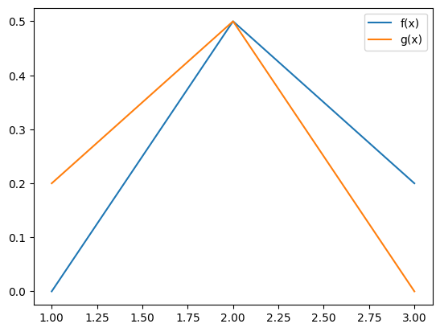  

### 3.4. 网格

```python
import matplotlib.pyplot as plt

plt.plot([0, 1, 2, 3])
plt.grid()
```
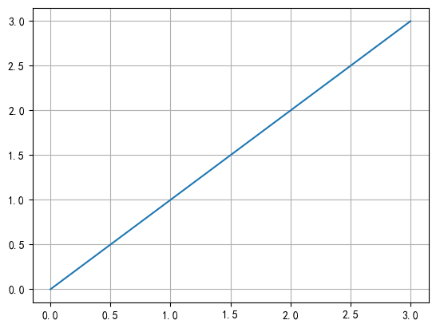  

网格颜色： `plt.grid(color='blue')`

### 3.5. xlim

显示范围 [a, b]
```python
import matplotlib.pyplot as plt

plt.plot([0, 1, 2, 3])
plt.xlim((0, 4))    # 元祖
# plt.xlim([0, 4])  # 列表
```
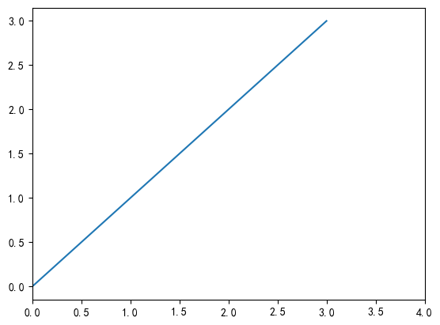  
### 3.6. 刻度 xticks

```python
import matplotlib.pyplot as plt
import numpy as np

fig, axs = plt.subplots(1, 2)       
axs[0].plot([1, 2, 3], [0, 0.5, 0.2])
axs[1].plot([3, 2, 1], [0, 0.5, 0.2])

axs[0].set_xticks(range(0, 4))            # range()只能生成整数数列
axs[1].set_xticks(np.arange(0, 10, 1.5))   # np.arange()可以生成浮点数数列
```

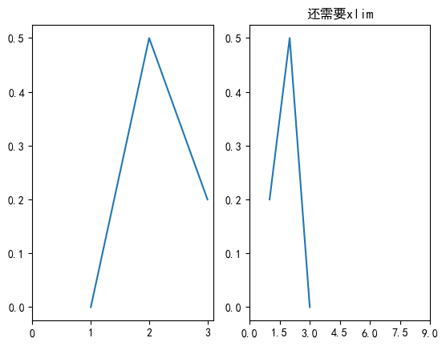  


PS: 如子图2，只是标注轴上的刻度，并不能代替边界，不想见到的数据还是会出现

### 3.7. 刻度精度

```python
import matplotlib.pyplot as plt
import matplotlib.ticker as ticker

fig, ax = plt.subplots()
ax.plot([1, 2, 3], [0, 0.5, 0.2])
ax.set_xticks(range(0, 4))
ax.xaxis.set_major_formatter(ticker.FormatStrFormatter("%.3f"))
```
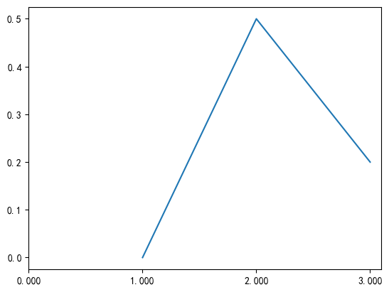  

### 3.8. 绘图风格

- 使用`plt.style.use('')`设定风格：
- 使用`plt.style.available`显示库中的风格：如`ggplot`、`fivethirtyeight`、`dark_background`、`grayscale`

```python
import matplotlib.pyplot as plt

styles = plt.style.available  # 28 个
# ['Solarize_Light2',
#  '_classic_test_patch',
#  '_mpl-gallery',
#  '_mpl-gallery-nogrid',
#  'bmh',
#  'classic',
#  'dark_background',
#  'fast',
#  'fivethirtyeight',
#  'ggplot',
#  'grayscale',
#  'seaborn-v0_8',
#  'seaborn-v0_8-bright',
#  'seaborn-v0_8-colorblind',
#  'seaborn-v0_8-dark',
#  'seaborn-v0_8-dark-palette',
#  'seaborn-v0_8-darkgrid',
#  'seaborn-v0_8-deep',
#  'seaborn-v0_8-muted',
#  'seaborn-v0_8-notebook',
#  'seaborn-v0_8-paper',
#  'seaborn-v0_8-pastel',
#  'seaborn-v0_8-poster',
#  'seaborn-v0_8-talk',
#  'seaborn-v0_8-ticks',
#  'seaborn-v0_8-white',
#  'seaborn-v0_8-whitegrid',
#  'tableau-colorblind10']
plt.figure(figsize=(13, 15))
plt_index = 1
for style in styles:
    plt.subplot(7, 4, plt_index)
    plt.style.use(style)
    plt.plot([1, 2, 3], [0, 0.5, 0.2])
    plt.title(style)
    plt_index += 1
plt.tight_layout()
```
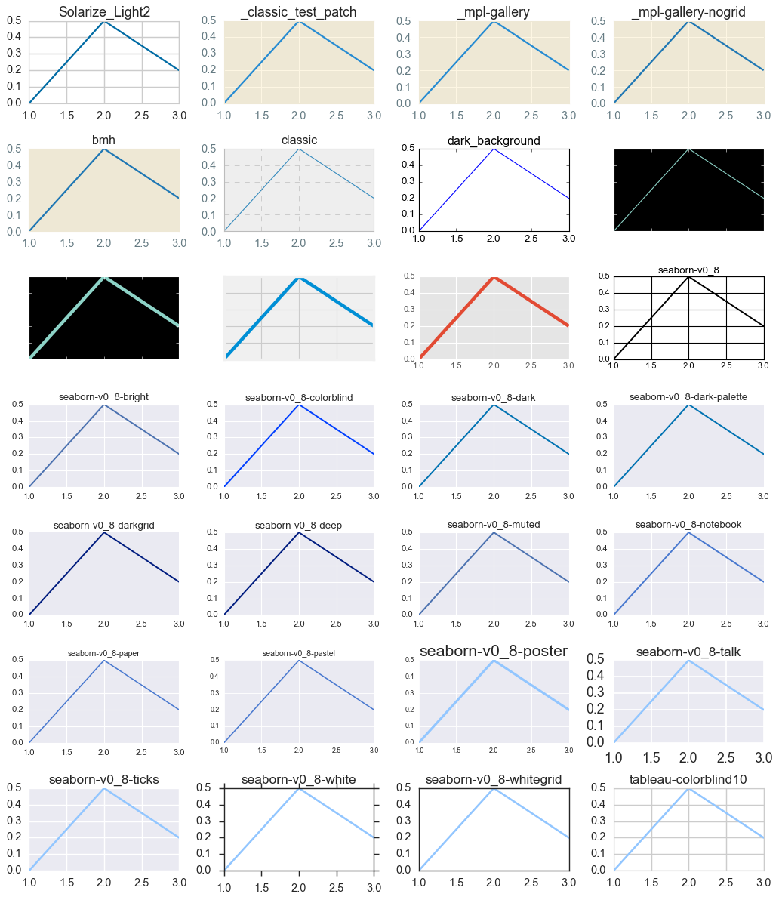  

### 3.9. 布局

紧致布局（自动调整子图的间距，调整title的大小让其完全显示）
```python
import matplotlib.pyplot as plt

for plt_index in range(1, 7):
    plt.subplot(3, 2, plt_index)
    plt.plot([1, 10, 2, 7, 3])

plt.tight_layout()

# UserWarning: Tight layout not applied. tight_layout cannot make axes height small enough to accommodate all axes decorations.
# 这是当子图太多时而画布尺寸太小, 那么加大就行。
```
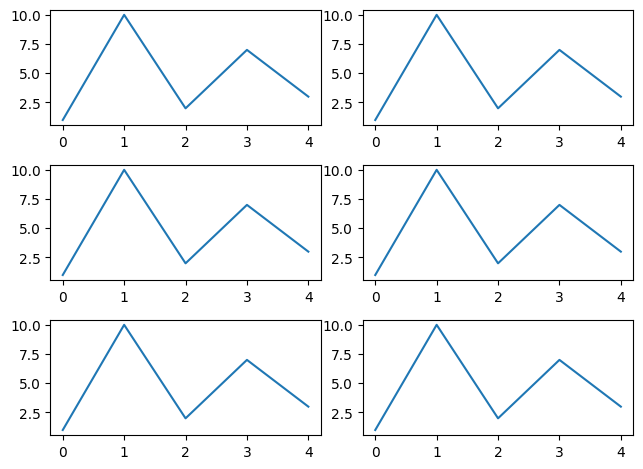  


无缝布局
```python
import matplotlib.pyplot as plt

for plt_index in range(1, 7):
    plt.subplot(3, 2, plt_index)
    plt.plot([1, 10, 2, 7, 3])
plt.subplots_adjust(wspace=0, hspace=0)
```

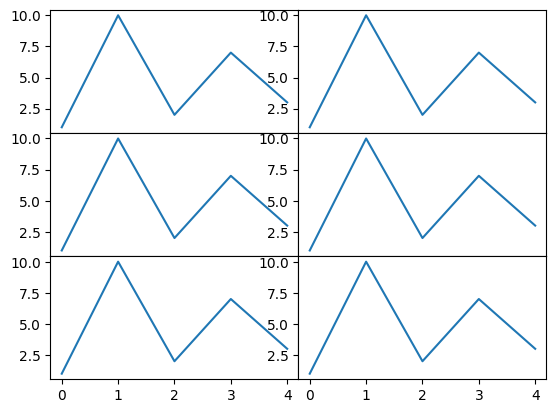  


### 3.10. marker

```python
import matplotlib.pyplot as plt

markers = {
    ".": "point",       # "."是符号，point是意思。到时候传入的是前者。
    ",": "pixel",
    "^": "triangle_up",
    "<": "triangle_left",
    ">": "triangle_right",
    "+": "plus",
    "|": "vline",
    "_": "hline",
    "*": "star",
    "d": "thin_diamond",
    "D": "diamond",
    "h": "hexagon1",
    "H": "hexagon2",
    "p": "pentagon",
    "P": "plus_filled",
    "x": "x",
    "X": "x_filled",
    "s": "square",
    "o": "circle",
    "v": "triangle_down",
    "1": "tri_down",
    "2": "tri_up",
    "3": "tri_left",
    "4": "tri_right",
    "8": "octagon",
    0: "tickleft",
    1: "tickright",
    2: "tickup",
    3: "tickdown",
    4: "caretleft",
    5: "caretright",
    6: "caretup",
    7: "caretdown",
    8: "caretleftbase",
    9: "caretrightbase",
    10: "caretupbase",
    11: "caretdownbase",
    "None": "nothing",
    None: "nothing",
    " ": "nothing",
    "": "nothing",
}
plt.figure(figsize=(10, 15))
plt.suptitle('plot')
plt_index = 1
for marker in markers:
    plt.subplot(8, 6, plt_index)
    plt.plot([5, 3, 1, 4, 2], marker=marker)  # here
    if type(marker) == str:
        marker = '"' + marker + '"'
    elif marker is None:
        marker = "None"
    plt.title(marker)
    plt_index += 1
plt.tight_layout()
```

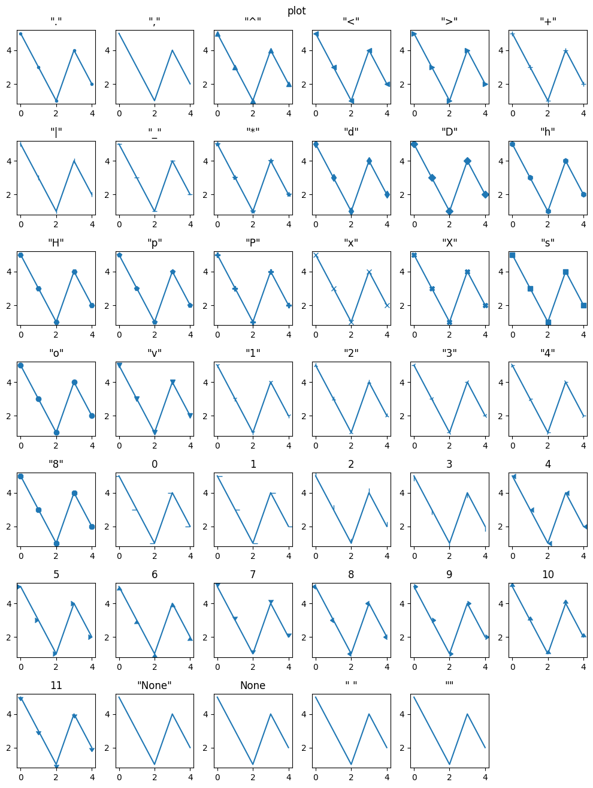  

```python
import matplotlib.pyplot as plt

markers = {
    ".": "point",       # "."是符号，point是意思。到时候传入的是前者。
    ",": "pixel",
    "^": "triangle_up",
    "<": "triangle_left",
    ">": "triangle_right",
    "+": "plus",
    "|": "vline",
    "_": "hline",
    "*": "star",
    "d": "thin_diamond",
    "D": "diamond",
    "h": "hexagon1",
    "H": "hexagon2",
    "p": "pentagon",
    "P": "plus_filled",
    "x": "x",
    "X": "x_filled",
    "s": "square",
    "o": "circle",
    "v": "triangle_down",
    "1": "tri_down",
    "2": "tri_up",
    "3": "tri_left",
    "4": "tri_right",
    "8": "octagon",
    0: "tickleft",
    1: "tickright",
    2: "tickup",
    3: "tickdown",
    4: "caretleft",
    5: "caretright",
    6: "caretup",
    7: "caretdown",
    8: "caretleftbase",
    9: "caretrightbase",
    10: "caretupbase",
    11: "caretdownbase",
    "None": "nothing",
    None: "nothing",
    " ": "nothing",
    "": "nothing",
}
plt.figure(figsize=(10, 15))
plt.suptitle('scatter')
plt_index = 1
for marker in markers:
    plt.subplot(8, 6, plt_index)
    plt.scatter(range(5), [5, 3, 1, 4, 2], marker=marker)
    if type(marker) == str:
        marker = '"' + marker + '"'
    elif marker is None:
        marker = "None"
    plt.title(marker)
    plt_index += 1
plt.tight_layout()
```

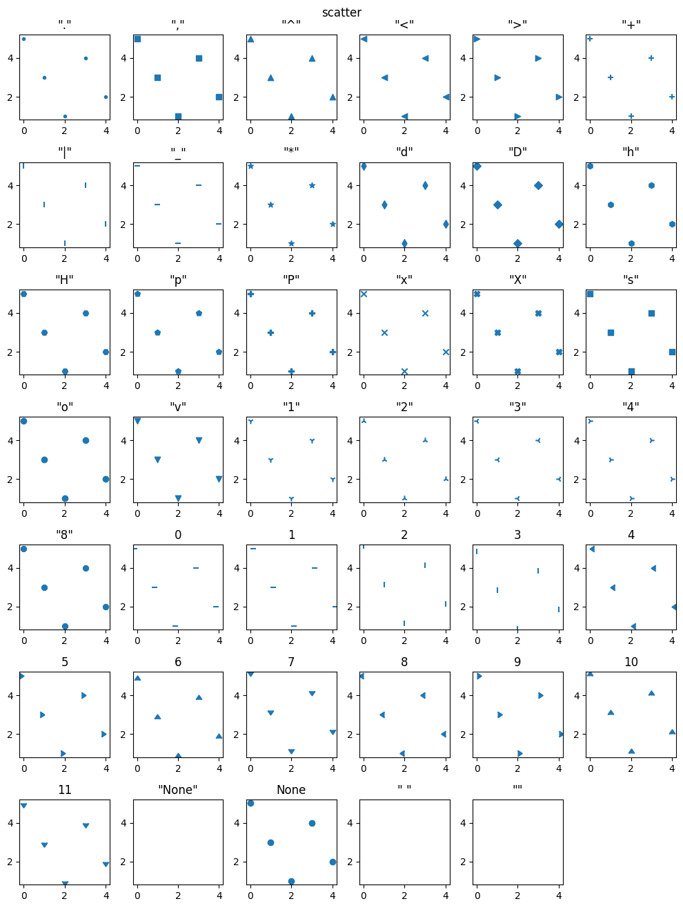  


### 3.11. 灰度图


```python
import numpy as np
import matplotlib.pyplot as plt

# 设定整个画布的尺寸
plt.figure(figsize=(7, 7))

data = np.random.randint(0, 256, (10, 10, 3))

# 绘制10*10像素的
plt.subplot(4, 2, 1)
plt.imshow(data)

# R红色单通道
plt.subplot(4, 2, 3)
plt.imshow(data[:, :, 0])

# R红色的映射灰度
plt.subplot(4, 2, 4)
plt.imshow(data[:, :, 0], cmap='gray')

# G绿色单通道
plt.subplot(4, 2, 5)
plt.imshow(data[:, :, 1])

# G绿色的映射灰度
plt.subplot(4, 2, 6)
plt.imshow(data[:, :, 1], cmap='gray')

# B蓝色单通道
plt.subplot(4, 2, 7)
plt.imshow(data[:, :, 2])

# B蓝色的映射灰度
plt.subplot(4, 2, 8)
plt.imshow(data[:, :, 2], cmap='gray')

# 显示画布
plt.show()
```


### 3.12. 保存画布

```python
plt.savefig('plot.png', dpi=200)
```


---

```python
fig, ax = plt.subplots()
ax.plot(split_sizes, means)
ax.errorbar(split_sizes, means, yerr=stds, ecolor='red', fmt='ro')
ax.set_ylabel('ResNet50 Execution Time (Second)')
ax.set_xlabel('Pipeline Split Size')
ax.set_xticks(split_sizes)
ax.yaxis.grid(True)
plt.tight_layout()
plt.savefig("split_size_tradeoff.png")
plt.close(fig)
```
```python
def plot(means, stds, labels, fig_name):
    fig, ax = plt.subplots()
    ax.bar(np.arange(len(means)), means, yerr=stds,
           align='center', alpha=0.5, ecolor='red', capsize=10, width=0.6)
    ax.set_ylabel('ResNet50 Execution Time (Second)')
    ax.set_xticks(np.arange(len(means)))
    ax.set_xticklabels(labels)
    ax.yaxis.grid(True)
    plt.tight_layout()
    plt.savefig(fig_name)
    plt.close(fig)
```