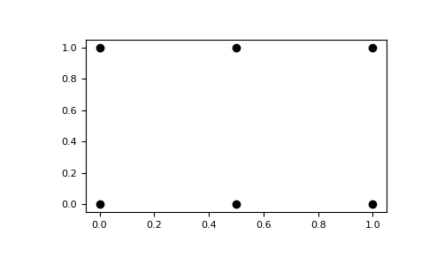

- [1. np.random.choice()](#1-nprandomchoice)
- [2. np.newaxis](#2-npnewaxis)
- [3. np.concatenate](#3-npconcatenate)
- [4. np.tile](#4-nptile)
- [5. linspace](#5-linspace)
- [6. meshgrid](#6-meshgrid)


## 1. np.random.choice()
<https://blog.csdn.net/ImwaterP/article/details/96282230>

## 2. np.newaxis 
<https://zhuanlan.zhihu.com/p/356601576>
- 是切片
- `y[:, np.newaxis, :] == y[...,  np.newaxis, :]`, [4,1,3]
- `y[:, np.newaxis, :].shape`, [4, 1 ,3]; `y[:, np.newaxis, :].shape`, [4, 3, 1]


## 3. np.concatenate

The arrays must have the same shape, except in the dimension corresponding to axis (the first, by default).
```python
# numpy.concatenate((a1, a2, ...), axis=0, out=None, dtype=None, casting="same_kind")

# a: [2, 2], b: [1, 2]
a = np.array([[1, 2], [3, 4]])
b = np.array([[5, 6]])

# [2+1, 2] = [3, 2]
np.concatenate([a, b])
# array([[1, 2],
#        [3, 4],
#        [5, 6]])

# [2, 2+1] = [2, 3]
np.concatenate((a, b.T), axis=1)
# array([[1, 2, 5],
#        [3, 4, 6]])

# If `axis` is `None`, arrays are flattened before use. 
np.concatenate((a, b), axis=None)
# array([1, 2, 3, 4, 5, 6])
```

## 4. np.tile

`numpy.tile(A, reps)`:通过重复A代表给出的次数来构建数组，平铺效果。
- If `reps` has length `d`, the result will have dimension of `max(d, A.ndim)`.
- 具体是，对`A`和`reps`的shape都来对齐，在前面补1，实现`d`相等，`[2, 2], [3]`→`[2, 2], [1, 3]`。
- `reps`对齐后的意思就是，对相应的维度进行复制几次。
```python
#########
# [3]
a = np.array([0, 1, 2])
# 都是1维，那么对1维复制2次
np.tile(a, 2)
array([0, 1, 2, 0, 1, 2])

# [3]变成[1, 3]，即[[0,1,2]]
# 然后第一维复制2次得到[[0,1,2],[0,1,2]]，
# 然后再对第二维度复制2次
np.tile(a, (2, 2))
array([[0, 1, 2, 0, 1, 2],
       [0, 1, 2, 0, 1, 2]])

# [3]变成[1,1,3]，即[[[0,1,2]]]
# 然后第一维复制2次得到[[[0,1,2]],[[0,1,2]]]]
# 然后再对第二维度复制1次则不变，
# 第三维度复制2次即下
np.tile(a, (2, 1, 2))
array([[[0, 1, 2, 0, 1, 2]],
       [[0, 1, 2, 0, 1, 2]]])

#########
# [2,2]
b = np.array([[1, 2], [3, 4]])

# [2]变成[1,2]
# 第一维复制1次则不变，[[1, 2], [3, 4]]
# 第二维复制2次，则
np.tile(b, 2)
array([[1, 2, 1, 2],
       [3, 4, 3, 4]])

# 维度相等
# 第一维复制2次则，[[1, 2], [3, 4], [1, 2], [3, 4]]
# 第二维复制1次，则不变
np.tile(b, (2, 1))
array([[1, 2],
       [3, 4],
       [1, 2],
       [3, 4]])

#########
[4]
c = np.array([1,2,3,4])
# [4]变成[1,4]，即[[1,2,3,4]]
# 第一维复制4次则，[[1,2,3,4],[1,2,3,4],[1,2,3,4],[1,2,3,4]]
# 第二维复制1次，则不变
np.tile(c,(4,1))
array([[1, 2, 3, 4],
       [1, 2, 3, 4],
       [1, 2, 3, 4],
       [1, 2, 3, 4]])
```

## 5. linspace

```python
# 包含 start 和 stop, [start, stop]
>>>  np.linspace(1, 10, 10)
array([ 1.,  2.,  3.,  4.,  5.,  6.,  7.,  8.,  9., 10.])

# 不想在序列计算中包括最后一点, [start, stop)
>>> np.linspace(1, 10, 10, endpoint=False)
array([1. , 1.9, 2.8, 3.7, 4.6, 5.5, 6.4, 7.3, 8.2, 9.1])
```
间隔是 ( stop - start ) / (num - 1), 这么理解：5个点num，间隔为4。

- `array([ 1.,  2.,  3.,  4.,  5.,  6.,  7.,  8.,  9., 10.])`
`np.linspace(1, 10, 10)`
- `array([ 0.,  1.,  2.,  3.,  4.,  5.,  6.,  7.,  8.,  9., 10.])`
`np.linspace(0, 10, 10 + 1)`
- `array([ 0.,  1.,  2.,  3.,  4.,  5.,  6.,  7.,  8.,  9.])`
`np.linspace(0, 10, 10 + 1)[:-1]` or `np.linspace(0, 10, 10, endpoint=False)`

## 6. meshgrid


参考资料：[meshgrid理解](https://blog.csdn.net/lllxxq141592654/article/details/81532855)


1. meshgrid函数的作用：生成坐标矩阵。
2. meshgrid函数的输入，两个一维数组
3. meshgrid函数的输出：两个二维矩阵


`indexing='xy'`:
- In the 2-D case ：inputs length (M, N), outputs shape (N, M) 
- In the 3-D case : inputs length (M, N, P), outputs shape (N, M, P) 
```python
import numpy as np
# 横坐标有几个，纵坐标有几个
nx, ny = (3, 2)
x = np.linspace(0, 1, nx)
y = np.linspace(0, 1, ny)
# shape(2, 3)，意思是，横坐标3个，纵坐标2个
xv, yv = np.meshgrid(x, y)
# xv：坐标矩阵的横坐标
# array([[0. , 0.5, 1. ],
#        [0. , 0.5, 1. ]])
# yv：坐标矩阵的纵坐标
# array([[0.,  0.,  0.],
#        [1.,  1.,  1.]])
'''
```

```python
import matplotlib.pyplot as plt
plt.plot(xv, yv, marker='o', color='k', linestyle='none')
plt.show()
```
  


例子2：计算$x^2 + y^2$
```python
import numpy as np
point = np.array([ 0. ,1. ,2. ,3.])
x, y = np.meshgrid(point, point)
z = x ** 2 + y ** 2
print(z)
'''
[[ 0.  1.  4.  9.]
 [ 1.  2.  5. 10.]
 [ 4.  5.  8. 13.]
 [ 9. 10. 13. 18.]]
'''
```