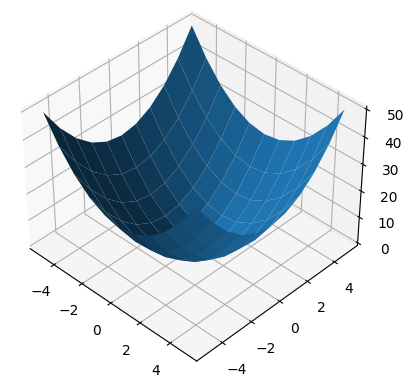

- [1. np.random.choice()](#1-nprandomchoice)
- [2. 增加维度与删除维度](#2-增加维度与删除维度)
  - [2.1. 增加维度 np.newaxis, None, np.expand\_dims](#21-增加维度-npnewaxis-none-npexpand_dims)
  - [2.2. 广播](#22-广播)
    - [2.2.1. 计算shape](#221-计算shape)
    - [2.2.2. 修正shape](#222-修正shape)
      - [torch.Tensor.expand](#torchtensorexpand)
  - [2.3. np.repeat](#23-nprepeat)
    - [2.3.1. torch.Tensor.repeat](#231-torchtensorrepeat)
  - [2.4. np.squeeze](#24-npsqueeze)
- [3. np.concatenate](#3-npconcatenate)
- [4. np.tile](#4-nptile)
- [5. linspace](#5-linspace)
- [6. meshgrid](#6-meshgrid)


## 1. np.random.choice()
<https://blog.csdn.net/ImwaterP/article/details/96282230>

```bash
numpy.random.choice(a, size=None, replace=True, p=None)
从a(只要是ndarray都可以，但必须是一维的)中随机抽取数字，并组成指定大小(size)的数组
replace:True表示可以取相同数字，False表示不可以取相同数字
数组p：与数组a相对应，表示取数组a中每个元素的概率，默认为选取每个元素的概率相同。
```

## 2. 增加维度与删除维度

### 2.1. 增加维度 np.newaxis, None, np.expand_dims

- `np.newaxis, None`
    
    是切片, <https://zhuanlan.zhihu.com/p/356601576>
    
```python
>>> np.newaxis is None             # `np.newaxis` 等价于 `None`
True

>>> x = np.array([1, 2])
>>> x[np.newaxis, :].shape
(1, 2)
>>> x[:, None].shape               
(2, 1)

>>> y = np.array([[1, 2],[3, 4]])
>>> y[:, :, None].shape            # 多个连续的`:` 等于 `...`
(2, 2, 1)
>>> y[..., None].shape
(2, 2, 1)
```
- `np.expand_dims(a, axis)`
  
    要插入`None`到哪些轴

```python
>>> x = np.array([1, 2])                  # [2]
>>> np.expand_dims(x, axis=1).shape       # 插入一个轴，那么有两个轴, 01
(2, 1)
>>> np.expand_dims(x, axis=0).shape
(1, 2)
>>> np.expand_dims(x, axis=(0, 1)).shape  # 插入两个轴，那么有三个轴, 012
(1, 1, 2)
>>> np.expand_dims(x, axis=(1, 0)).shape
(1, 1, 2)
>>> np.expand_dims(x, axis=(2, 0)).shape
(1, 2, 1)
>>> np.expand_dims(x, axis=(0, 2)).shape
(1, 2, 1)
```

### 2.2. 广播
- 得到的数组将具有与具有最大维度数的输入数组相同的维度数 ndim = max ndim
- 其中每个维度的大小是输入数组中对应维度的
- 它从尾部（即最右侧）尺寸开始，然后向左移动。
  
  即 ndim 较小的数组会在前面追加一个长度为 1 的维度。
- 注意：缺失的尺寸假定为1，即被扩散的轴必须是1

#### 2.2.1. 计算shape 

`numpy.broadcast_shapes(*args)`
```python
>>> np.broadcast_shapes((3,1),(3,))
(3, 3)
# 3 x 1
#     3
# 3 x 3
>>> np.broadcast_shapes((1,3),(3,))
(1, 3)
# 1 x 3
#     3
# 1 x 3
```
`numpy.broadcast` 类，传入参数是 init 函数
```python
>>> x = np.array([[1], [2], [3]])
>>> y = np.array([4, 5, 6])
>>> np.broadcast(x, y)
<numpy.broadcast object at 0x000001F6B7D09D00>
>>>
>>> np.broadcast(x, y).shape
(3, 3)
>>> np.broadcast(x, y).ndim
2
```

!!! note 缺失的尺寸假定为1，即被扩散的轴必须是1
       ```python
       >>> np.broadcast_shapes((4,),(2,))
       ValueError: shape mismatch: objects cannot be broadcast to a single shape.  
       Mismatch is between arg 0 with shape (4,) and arg 1 with shape (2,).

       >>> np.broadcast_shapes((4,3),(3))
       (4, 3)
       >>> np.broadcast_shapes((4,3),(1,3))
       (4, 3)
       >>> np.broadcast_shapes((4,3),(2,3))
       ValueError: shape mismatch: objects cannot be broadcast to a single shape.  
       Mismatch is between arg 0 with shape (4, 3) and arg 1 with shape (2, 3).
       ```
#### 2.2.2. 修正shape
`numpy.broadcast_to(array, shape, subok=False)`
```python
>>> x = np.array([1, 2, 3])
>>> np.broadcast_to(x, (4, 3))
array([[1, 2, 3],
       [1, 2, 3],
       [1, 2, 3],
       [1, 2, 3]])
```
`numpy.broadcast_arrays(*args, subok=False)`
```python
>>> x = np.array([[1,2,3]])        # (1, 3)
>>> y = np.array([[4],[5]])        # (2, 1)
>>> np.broadcast_arrays(x, y)
[array([[1, 2, 3],
       [1, 2, 3]]), array([[4, 4, 4],
       [5, 5, 5]])]
>>> np.broadcast_arrays(x, y)[0].shape
(2, 3)
>>> np.broadcast_arrays(x, y)[1].shape
(2, 3)
```

!!! note 不匹配尾部

       ```python
       # 我们想要 (3, 28, 28)
       >>> y = np.array([4,5,6])   # [3]
       >>> np.broadcast_to(y, (3, 28, 28))                  
       ValueError: operands could not be broadcast together with remapped shapes [original->remapped]: (3,)  and requested shape (3,28,28)

       >>> np.broadcast_to(y.reshape(3, 1, 1), (3, 28, 28))
       >>> np.broadcast_to(y[..., None, None], (3, 28, 28))
       ```


##### torch.Tensor.expand
`torch.Tensor.expand(*sizes)`
```python
>>> x = torch.Tensor([[1], [2], [3]])            # [3, 1]
>>> x.expand(3,4)                                # [3, 4]
tensor([[1., 1., 1., 1.],
        [2., 2., 2., 2.],
        [3., 3., 3., 3.]])
```
### 2.3. np.repeat
`numpy.repeat(a, repeats, axis=None)` or `Ndarry.repeat(repeats, axis=None)`:
- `axis`: 默认`None`展平数组
```python
>>> np.repeat(3, 4)                # 3 重复 4次
array([3, 3, 3, 3])
>>> x = np.array([[1,2],[3,4]])
>>> np.repeat(x, 2)                # [1,2,3,4] 每个重复 2次
array([1, 1, 2, 2, 3, 3, 4, 4])
>>> np.repeat(x, 3, axis=1)        # (2,2) 重复 dim=1 3次，那么(2,6)
array([[1, 1, 1, 2, 2, 2],
       [3, 3, 3, 4, 4, 4]])
>>> np.repeat(x, [1, 2], axis=0)   # (2,2) dim=0的 x[0]重复1次, x[1]重复2次
array([[1, 2],
       [3, 4],
       [3, 4]])
>>> np.repeat(x, [1, 2], axis=1)   # x[:, 0] 重复1次，x[:, 1] 重复2次
array([[1, 2, 2],
       [3, 4, 4]])
```

例子：
```python
>>> a = np.array([1,2,3,4])
>>> np.expand_dims(a, 0).repeat(1000, axis=0).shape # [4]->[1,4]->[1000,4]
(1000, 4)
```

#### 2.3.1. torch.Tensor.repeat
`torch.Tensor.repeat()`: 

先补全维度 [1, 1, ..., 原本的维度], 再对每个维度分别复制(a,b,...)次。

而且不是像`numpy.repeat()`每个元素分别复制，其是整块复制（可以理解为**先从最后一维度复制**，复制好后再重复前一维度）

```python
>>> torch.tensor([3]).repeat(4)    # [1]
tensor([3, 3, 3, 3])               # [4] 

>>> a = torch.tensor([1,2])        # [2]
>>> a.repeat(2, 2)                 # [2] -> [1,2] -> [2, 4]
tensor([[1, 2, 1, 2],              # [[1,2]] 从最后一维度复制是 [[1,2,1,2]]，再复制前一维度，[[1,2,1,2],[1,2,1,2]]
        [1, 2, 1, 2]])
# 而不是
# tensor([[1, 1, 2, 2],
#         [1, 1, 2, 2]])
>>> a = torch.tensor([[1,2],[3,4]])
>>> a.repeat(2, 3)
tensor([[1, 2, 1, 2, 1, 2],
        [3, 4, 3, 4, 3, 4],
        [1, 2, 1, 2, 1, 2],
        [3, 4, 3, 4, 3, 4]])
# 先是最后一维度复制3次，[[1, 2, 1, 2, 1, 2], [3, 4, 3, 4, 3, 4]]
# 再是前一维度复制2次
```

### 2.4. np.squeeze

删除维度 

`numpy.squeeze(a, axis=None)`

```python
>>> x = np.array([[[0], [1], [2]]])
>>> x.shape
(1, 3, 1)
>>> np.squeeze(x).shape
(3,)
>>> np.squeeze(x, axis=0).shape
(3, 1)
>>> np.squeeze(x, axis=1).shape
Traceback (most recent call last):
...
ValueError: cannot select an axis to squeeze out which has size not equal to one
>>> np.squeeze(x, axis=2).shape
(1, 3)
>>> x = np.array([[1234]])
>>> x.shape
(1, 1)
>>> np.squeeze(x)
array(1234)  # 0d array
>>> np.squeeze(x).shape
()
>>> np.squeeze(x)[()]
1234
```

## 3. np.concatenate

The arrays must have the same shape, except in the dimension corresponding to axis (the first, by default).
```python
# numpy.concatenate((a1, a2, ...), axis=0, out=None, dtype=None, casting="same_kind")

# a: [2, 2], b: [1, 2]
a = np.array([[1, 2], [3, 4]])
b = np.array([[5, 6]])

# [2+1, 2] = [3, 2]
np.concatenate([a, b])
# array([[1, 2],
#        [3, 4],
#        [5, 6]])

# [2, 2+1] = [2, 3]
np.concatenate((a, b.T), axis=1)
# array([[1, 2, 5],
#        [3, 4, 6]])

# If `axis` is `None`, arrays are flattened before use. 
np.concatenate((a, b), axis=None)
# array([1, 2, 3, 4, 5, 6])
```

## 4. np.tile

`numpy.tile(A, reps)`:通过重复A代表给出的次数来构建数组，平铺效果。
- If `reps` has length `d`, the result will have dimension of `max(d, A.ndim)`.
- 具体是，对`A`和`reps`的shape都来对齐，在前面补1，实现`d`相等，`[2, 2], [3]`→`[2, 2], [1, 3]`。
- `reps`对齐后的意思就是，对相应的维度进行复制几次。
```python
#########
# [3]
a = np.array([0, 1, 2])
# 都是1维，那么对1维复制2次
np.tile(a, 2)
array([0, 1, 2, 0, 1, 2])

# [3]变成[1, 3]，即[[0,1,2]]
# 然后第一维复制2次得到[[0,1,2],[0,1,2]]，
# 然后再对第二维度复制2次
np.tile(a, (2, 2))
array([[0, 1, 2, 0, 1, 2],
       [0, 1, 2, 0, 1, 2]])

# [3]变成[1,1,3]，即[[[0,1,2]]]
# 然后第一维复制2次得到[[[0,1,2]],[[0,1,2]]]]
# 然后再对第二维度复制1次则不变，
# 第三维度复制2次即下
np.tile(a, (2, 1, 2))
array([[[0, 1, 2, 0, 1, 2]],
       [[0, 1, 2, 0, 1, 2]]])

#########
# [2,2]
b = np.array([[1, 2], [3, 4]])

# [2]变成[1,2]
# 第一维复制1次则不变，[[1, 2], [3, 4]]
# 第二维复制2次，则
np.tile(b, 2)
array([[1, 2, 1, 2],
       [3, 4, 3, 4]])

# 维度相等
# 第一维复制2次则，[[1, 2], [3, 4], [1, 2], [3, 4]]
# 第二维复制1次，则不变
np.tile(b, (2, 1))
array([[1, 2],
       [3, 4],
       [1, 2],
       [3, 4]])

#########
[4]
c = np.array([1,2,3,4])
# [4]变成[1,4]，即[[1,2,3,4]]
# 第一维复制4次则，[[1,2,3,4],[1,2,3,4],[1,2,3,4],[1,2,3,4]]
# 第二维复制1次，则不变
np.tile(c,(4,1))
array([[1, 2, 3, 4],
       [1, 2, 3, 4],
       [1, 2, 3, 4],
       [1, 2, 3, 4]])
```

## 5. linspace

在区间内，平均划分，返回n个点。
```python
# 包含 start 和 stop, [start, stop]
>>>  np.linspace(1, 10, 10)
array([ 1.,  2.,  3.,  4.,  5.,  6.,  7.,  8.,  9., 10.])

# 不想在序列计算中包括最后一点, [start, stop)
>>> np.linspace(1, 10, 10, endpoint=False)
array([1. , 1.9, 2.8, 3.7, 4.6, 5.5, 6.4, 7.3, 8.2, 9.1])
```
间隔是 ( stop - start ) / (num - 1).

- `array([ 1.,  2.,  3.,  4.,  5.,  6.,  7.,  8.,  9., 10.])`
`np.linspace(1, 10, 10)`

- `array([ 0.,  1.,  2.,  3.,  4.,  5.,  6.,  7.,  8.,  9., 10.])`
`np.linspace(0, 10, 10 + 1)`
- `array([ 0.,  1.,  2.,  3.,  4.,  5.,  6.,  7.,  8.,  9.])`
`np.linspace(0, 10, 10 + 1)[:-1]` or `np.linspace(0, 10, 10, endpoint=False)`

## 6. meshgrid


参考资料：[meshgrid理解](https://blog.csdn.net/lllxxq141592654/article/details/81532855), [numpy](https://numpy.org/doc/stable/reference/generated/numpy.meshgrid.html)


`numpy.meshgrid(*xi, copy=True, sparse=False, indexing='xy')`


1. meshgrid函数的作用：生成坐标矩阵。
2. meshgrid函数的输入，K个一维数组
3. meshgrid函数的输出：K个K维矩阵, 分别表示第一维度、第二维度……第K维度。


> `indexing='xy'`: Cartesian indexing. M个横坐标，N个纵坐标。返回成数组自然是N行M列
- In the 2-D case ：inputs length (M, N), outputs shape (N, M) 
- In the N-D case : inputs length (M, N, P3, P4, ..., PK), outputs shape (N, M, P3, P4, ..., PK)

```python
import numpy as np

# 横坐标3个，纵坐标2个
nx, ny = (3, 2)
x = np.linspace(0, 1, nx)
y = np.linspace(0, 1, ny)

# input length (3, 2)， 横坐标3个，纵坐标2个
# output shape (2, 3)， 2行3列
xv, yv = np.meshgrid(x, y)
# xv：坐标矩阵的横坐标, 自然每行都相同
# array([[0. , 0.5, 1. ],
#        [0. , 0.5, 1. ]])
# yv：坐标矩阵的纵坐标： 自然每列都相同
# array([[0.,  0.,  0.],
#        [1.,  1.,  1.]])
'''

import matplotlib.pyplot as plt
plt.plot(xv, yv, marker='o', color='k', linestyle='none')
plt.show()
```
  

> `indexing='ij'`: matrix indexing. M行N列的矩阵
- In the 2-D case ：inputs length (M, N), outputs shape (M, N) 
- In the N-D case : inputs length (M, N, P3, P4, ..., PK), outputs shape (M, N, P3, P4, ..., PK)


```python
import numpy as np

# 矩阵是3行2列
nx, ny = (3, 2)
x = np.linspace(0, 1, nx)
y = np.linspace(0, 1, ny)

# input length (3, 2)， 矩阵是3行2列
# output shape (3, 2)， 矩阵是3行2列
xv, yv = np.meshgrid(x, y, indexing='ij')
# xv：矩阵， 每列都相同
# [[0.  0. ]
#  [0.5 0.5]
#  [1.  1. ]]
# yv：矩阵， 每行都相同
# [[0. 1.]
#  [0. 1.]
#  [0. 1.]]
```

例子1： for
```python
xv, yv = np.meshgrid(x, y, indexing='xy')
for i in range(nx):
    for j in range(ny):
        # treat xv[j,i], yv[j,i]

xv, yv = np.meshgrid(x, y, indexing='ij')
for i in range(nx):
    for j in range(ny):
        # treat xv[i,j], yv[i,j]
```

例子2：计算$x^2 + y^2$
```python
import matplotlib.pyplot as plt
import numpy as np
x = np.linspace(-5, 5, num=10)
y = np.linspace(-5, 5, num=10)
xv, yv = np.meshgrid(x, y, indexing='xy')
z = xv ** 2 + yv ** 2
print(z)
'''
[[50. 41. 34. 29. 26. 25. 26. 29. 34. 41. 50.]
 [41. 32. 25. 20. 17. 16. 17. 20. 25. 32. 41.]
 [34. 25. 18. 13. 10.  9. 10. 13. 18. 25. 34.]
 [29. 20. 13.  8.  5.  4.  5.  8. 13. 20. 29.]
 [26. 17. 10.  5.  2.  1.  2.  5. 10. 17. 26.]
 [25. 16.  9.  4.  1.  0.  1.  4.  9. 16. 25.]
 [26. 17. 10.  5.  2.  1.  2.  5. 10. 17. 26.]
 [29. 20. 13.  8.  5.  4.  5.  8. 13. 20. 29.]
 [34. 25. 18. 13. 10.  9. 10. 13. 18. 25. 34.]
 [41. 32. 25. 20. 17. 16. 17. 20. 25. 32. 41.]
 [50. 41. 34. 29. 26. 25. 26. 29. 34. 41. 50.]]
'''
ax = plt.axes(projection='3d')
ax.plot_surface(xv, yv, z)
plt.show()
```
  

例子3： 

```python
nx, ny = 3, 2
coords = np.stack(
    np.meshgrid(
        np.linspace(0, 1, nx), 
        np.linspace(0, 1, ny),
    ), -1)

print(coords)
# [[[0.  0. ]
#   [0.5 0. ]
#   [1.  0. ]]

#  [[0.  1. ]
#   [0.5 1. ]
#   [1.  1. ]]]


coords = coords.reshape([-1, coords.shape[-1]])
# 逐行，x从小到大，y再从小到大。
print(coords)
# [[0.  0. ]
#  [0.5 0. ]
#  [1.  0. ]
#  [0.  1. ]
#  [0.5 1. ]
#  [1.  1. ]]
```
