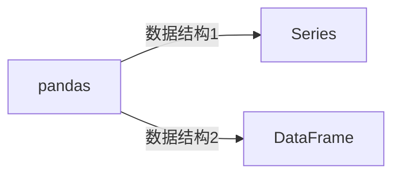

- [1. pandas](#1-pandas)
  - [1.1. install \& import](#11-install--import)
  - [1.2. 体系](#12-体系)
  - [1.3. 数据框DataFrame](#13-数据框dataframe)
    - [1.3.1. 数据框DataFrame创建](#131-数据框dataframe创建)
    - [1.3.2. 转化类型](#132-转化类型)
    - [1.3.3. 获取行、列索引的名字](#133-获取行列索引的名字)
    - [1.3.4. 行数、列数](#134-行数列数)
    - [1.3.5. 自定义索引](#135-自定义索引)
    - [1.3.6. 切片行、列](#136-切片行列)
    - [1.3.7. 单元格](#137-单元格)
    - [1.3.8. 反转reverse](#138-反转reverse)
    - [1.3.9. 插入一行](#139-插入一行)
    - [1.3.10. 插入一列](#1310-插入一列)
    - [1.3.11. 排序](#1311-排序)
    - [1.3.12. 自动化对齐](#1312-自动化对齐)
    - [1.3.13. 转化成np数组](#1313-转化成np数组)
    - [1.3.14. 读取csv文件](#1314-读取csv文件)

# 1. pandas

## 1.1. install & import
```python
# 第三方库
pip install pandas
```
```python
import pandas as pd
```

## 1.2. 体系

pandas中有两类非常重要的数据结构，即序列Series和数据框DataFrame。

- Series类似于numpy中的一维数组，除了通吃一维数组可用的函数或方法，而且其可通过索引标签的方式获取数据，还具有索引的自动对齐功能。

- DataFrame类似于numpy中的二维数组，同样可以通用numpy数组的函数和方法


## 1.3. 数据框DataFrame
### 1.3.1. 数据框DataFrame创建


`df = pd.DataFrame(...)`


如果不给一个指定的索引值，则自动生成一个从0开始的自增索引。


```python
# (1) 嵌套列表

arr1 = [[0, 1, 2], [3, 4, 5], [6, 7, 8], [9, 10, 11]]
df1 = pd.DataFrame(arr1)
print(df1)


# (2) 二维np数组
arr2 = np.array(np.arange(12)).reshape(4, 3)
df2 = pd.DataFrame(arr2)
print(df2)


# (3) 字典列表：key值表示列索引, value列表是此列的列向量
dict3 = {
    'A': [0, 3, 6, 9],
    'B': [1, 4, 7, 10],
    'C': [2, 5, 8, 11]
}
df3 = pd.DataFrame(dict3)
print(df3)


# (4) 嵌套字典：外面是列，里面是对应的每行，也就是指定了行的index
dict4 = {
    'A': {0: 0, 1: 3, 2: 6, 3: 9},
    'B': {0: 1, 1: 4, 2: 7, 3: 10},
    'C': {0: 2, 1: 5, 2: 8, 3: 11}
}
df4 = pd.DataFrame(dict4)
print(df4)


# (5) 赋值DataFrame来创建（通常你要修改原df的值，因为直接在切片上修改是不允许的）
df5 = df1.copy()

'''
   0   1   2
0  0   1   2
1  3   4   5
2  6   7   8
3  9  10  11

   0   1   2
0  0   1   2
1  3   4   5
2  6   7   8
3  9  10  11

   A   B   C
0  0   1   2
1  3   4   5
2  6   7   8
3  9  10  11

   A   B   C
0  0   1   2
1  3   4   5
2  6   7   8
3  9  10  11
'''
```
### 1.3.2. 转化类型
```python
df1 = df.astype(str)
print(type(df1.iat[0,0]))
# <class 'str'>
```

### 1.3.3. 获取行、列索引的名字
默认索引是从0开始的整数数组。
```python
# 行
print(df1.index)
# RangeIndex(start=0, stop=4, step=1)

# 列
print(df1.columns)
# RangeIndex(start=0, stop=3, step=1)
```


### 1.3.4. 行数、列数
```python
>>> df1.index.size      # 行
4
>>> df1.columns.size    # 列
3

>>> df1.shape
(4,3)
>>> df1.shape[0]        # 行
4
>>> df1.shape[1]        # 列
3
```

### 1.3.5. 自定义索引
```python
# 初始化时就自定义索引
arr1 = np.array(np.arange(12)).reshape(4,3)
df1 = pd.DataFrame(arr1, index=['a','b','c','d'],columns=['A','B','C'])
print(df1)
'''
   A   B   C
a  0   1   2
b  3   4   5
c  6   7   8
d  9  10  11
'''
```
```python
# 分开
arr2 = np.array(np.arange(12)).reshape(4,3)
df2 = pd.DataFrame(arr2)
df2.index=['a','b','c','d']		# 自定义索引（行）
print(df2)
'''
   0   1   2
a  0   1   2
b  3   4   5
c  6   7   8
d  9  10  11
'''

df2.columns=['A','B','C']		# 自定义列索引（列）
print(df2)
'''
   A   B   C
a  0   1   2
b  3   4   5
c  6   7   8
d  9  10  11
'''
```

### 1.3.6. 切片行、列
行：
```python
# 选取第2行
df1[1:2]			# 行的下标：前闭后开
df1.iloc[1]			# iloc：根据行的下标
df1['b':'b']		# 索引：前闭后闭
df1.loc['b']		# loc：根据索引

# 选取第2到第3行
df1[1:3]			# 行的下标：前闭后开
df1.iloc[1:3]		# iloc：同上，前闭后开
df1['b':'c']		# 索引：前闭后闭
df1.loc['b':'c']	# loc：同上，前闭后闭

# 按条件选择某些行
df1[[False,True,True,False]]	# 必须是bool
df1[[i<4 for i in df1['A']]]	# [i<4 for i in df1['A']]其实就是[True, True, False, False]
df1[df1['A']<4]					# 简写
df1[(df1['A']==0) | (df1['B']==3)]	# 或关系
df1[(df1['A']<4) & (df1['B']==1)]	# 并关系
df1.iloc[[0,1]]
df1.loc[['a','b']]
```
注意：切片行后，它的行索引**还是原来的索引**。比如，`df = df.iloc[::-1]`


```python
df2 = df1[1:2]
'''
   A  B  C
b  3  4  5
'''

# 获取df1的行索引'b'、列索引'B'的单元格数据 4 的方法

# 做法一：拿df2那行的索引，在原df1中找			
my_variable = df1.at[df2.index[0], 'B']

# 做法二：df2重新生成新索引，在df2中找	
df2.index = [i for i in range(df2.index.size)]
my_variable = df2.at[0, 'B']
```
列：
```python
# 一列
df1['A']
'''
a  0
b  3
c  6
d  9
'''

# 多个列
df1[['A','B']]
'''
   A   B
a  0   1
b  3   4
c  6   7
d  9  10
'''
```
块：
```python
df1[['A','B']][0:2]
df1[0:2][['A','B']]
# 注意：df[0:2][0:2]是错的！因为列索引不支持列数下标。

df1.iloc[0:2, 0:2]				# iloc：根据下标，先行后列
df1.iloc[[0,1], [0,1]]	
df1.loc['a':'b', 'A':'B']		# loc：根据索引，先行后列
df1.loc[['a','b'], ['A','B']]	
# 注意：是df1.iloc[行,列]，而不是df1.iloc[行][列]
'''
   A  B
a  0  1
b  3  4
'''
```
### 1.3.7. 单元格
```python
# 选取行'b'的列'B'
df1.at['b','B']

# 选取第2行第2列
df1.iat[1,1]
```
### 1.3.8. 反转reverse
行反转
- `df1 = df1.reindex(index=df1.index[::-1])`
- `df1 = df1.iloc[::-1]`

列反转：
- `df1 = df1[df1.columns[::-1]]`

### 1.3.9. 插入一行
```python
add_data = {'A':12,'B':13,'C':14}		# '列':值。没添加的就是nan
df2 = df1.append(add_data, ignore_index=True)	
# ignore_index=True用作忽视原来的行索引，重新自动生成
'''
    A   B   C
0   0   1   2
1   3   4   5
2   6   7   8
3   9  10  11
4  12  13  14
''''
```
### 1.3.10. 插入一列
```python
# 都是同一个值
df1['3'] = 1
'''
   0   1   2  3                                                                                                        0  0   1   2  1
1  3   4   5  1
2  6   7   8  1
3  9  10  11  1  
'''
```
```python
# 对应每行
df1['3'] = [1, 2, 3, 4]
'''
   0   1   2  3
0  0   1   2  1
1  3   4   5  2
2  6   7   8  3
3  9  10  11  4
'''
# 但不能对应不全， df1['3'] = [1, 2]
```


### 1.3.11. 排序


<https://www.cnblogs.com/avivi/p/10813318.html>

### 1.3.12. 自动化对齐

如果有两个序列，需要对这两个序列进行算术运算，这时索引的存在就体现的它的价值了—自动化对齐.

> 当有对应的索引时，结果为索引之间的结果。
> 当缺乏对应的索引时，结果为NaN。


```python
d1=pd.DataFrame({'a':[1,2,3],'b':[4,5,6],'c':[7,8,9]})
d2=pd.DataFrame({'b':[10,10,10],'a':[20,20,20],'d':[30,30,30]})
print(d1+d2)
'''
    a   b   c   d
0  21  14 NaN NaN
1  22  15 NaN NaN
2  23  16 NaN NaN
'''
```

### 1.3.13. 转化成np数组
```python
# 方式1：
np_arr = np.array(df1)

# 方式2：此方法不被推荐
np_arr = df1.values

# 方式3：推荐此方法
np_arr = df1.to_numpy()
```
PS：因为在df中列的切边需要直到列名，很麻烦，所以可以将其转化成np数组用列的索引切片。
```python
# 原来：切片需要列名
np_arr2 = np.array(df1[0:2][['A','B']])
# 现在：可以用下标切片
np_arr2 = np.array(df1[0:2])[:,0:2]
```

### 1.3.14. 读取csv文件

```python
# 保存
df.to_csv('digits.csv')

# 读取文件：文件名，编码格式
df = pd.read_csv('digits.csv', encoding='utf-8')
```


注意：保存再读取后的df，会多出一列（其实是表示行索引的），读取的时候要去掉，比如下面的`'Unnamed: 0'`。
```python
>>> df
  Unnamed: 0  A   B   C
0          a  0   1   2
1          b  3   4   5
2          c  6   7   8
3          d  9  10  11

>>> df.columns
Index(['Unnamed: 0', 'A', 'B', 'C'], dtype='object')

### (1) # 这样抛弃了原来的第一列
>> df = df[df[df.columns[1:]].columns]	

### (2) 这个问题可以在保存的时候就避免
df.to_csv('digits.csv', index=False)	# 不保存行索引
'''
   A   B   C
0  0   1   2
1  3   4   5
2  6   7   8
3  9  10  11
'''

df.to_csv('digits.csv', index_label='index')	# 或者直接将其行索引存储为一列
'''
   index  A   B   C
0      0  0   1   2
1      1  3   4   5
2      2  6   7   8
3      3  9  10  11
'''
```


