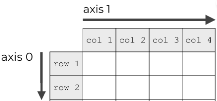

- [1. 向量的范数](#1-向量的范数)
  - [1.1. numpy](#11-numpy)
  - [1.2. torch](#12-torch)
- [2. 向量的长度](#2-向量的长度)
- [3. 向量单位化](#3-向量单位化)
- [4. 归一化](#4-归一化)
  - [4.1. 最大最小归一化 Min-Max Normalization](#41-最大最小归一化-min-max-normalization)
  - [4.2. z-score 标准化](#42-z-score-标准化)

---
## 1. 向量的范数

- 0范数：向量中非零元素的个数. 即稀疏度
- p范数：$\displaystyle \sqrt[p]{\sum_{i=1}^{n} (|x_i|^p) }$
    即`sum(abs(x)**p)**(1./p)`
    通才是1范数2范数比较大，而专才就是无穷范数比较大。
    - 1范数：`sum(abs(x))`
        向量的绝对值之和。$\displaystyle {\left\| X \right\|_1 } = \sum_{i=1}^{n} |x_i|$
    - 2范数：
        向量的平方和的平方根。$\displaystyle {\left\| X \right\|_2 } =\sqrt{\sum_{i=1}^{n} x_i^2 }$
        L2在范数中常常省略下标，即$\|\mathbf{x}\|$。
        别称，Euclidean norm, 向量的长度
    - 无穷范数：所有向量元素绝对值中的最大值（正无穷）或最小值（负无穷）。
        `max(abs(x))`, $\displaystyle {\left\| X \right\|_\infty } = \mathop {\max }\limits_{1 \le i \le n} \left| {​{x_i}} \right|$
        `min(abs(x))`, $\displaystyle {\left\| X \right\|_{-\infty} } = \mathop {\min }\limits_{1 \le i \le n} \left| {​{x_i}} \right|$


注意: $||\mathbf{x}||^2$ ( $||\mathbf{x}||^2_2$ ) 表示L2范数的平方, 即各元素的平方和.
 $||\mathbf{x}||^2= \displaystyle \sum_{i=1}^n x_i^2$


> Frobenius范数（Frobenius norm）是矩阵元素平方和的平方根.

$$\|\mathbf{X}\|_F = \sqrt{\sum_{i=1}^m \sum_{j=1}^n x_{ij}^2}$$

### 1.1. numpy

vector
```python
# 默认2范数
np.linalg.norm(x)
np.linalg.norm(x, 2)

# 1范数
np.linalg.norm(x, 1)

# 3范数
np.linalg.norm(x, 3)
```
- max(abs(x)): `np.linalg.norm(a, np.inf)`
- min(abs(x)): `np.linalg.norm(a, -np.inf)`
- len(x != 0): `np.linalg.norm(a, 0)`


2D matrix:
- Frobenius norm

```python
x = np.arange(12).reshape(3,4)

np.linalg.norm(x)
np.linalg.norm(x, 2)
np.linalg.norm(x, 'fro')
# 22.494443758403985
```

- specifies the axis of x along which to compute the vector norms. 
    沿着那个轴，就是消除那个轴
      

    ```python
    import numpy as np

    t = np.array([1,2,3,4,5,6,7,8]).reshape([2,4])
    y = np.linalg.norm(t, axis=0)
    print(y)
    z = np.linalg.norm(t, axis=1)
    print(z)

    # [[1 2 3 4]
    #  [5 6 7 8]]
    # [5.09901951 6.32455532 7.61577311 8.94427191]
    # [ 5.47722558 13.19090596]
    ```
### 1.2. torch

必须是 float，不能是 long int
`RuntimeError: linalg.vector_norm: Expected a floating point or complex tensor as input. Got Long`

vector
```python
x = torch.arange(12).float()

# 默认2范数
torch.norm(x)
torch.norm(x, 2)

# 1范数
torch.norm(x, 1)

# 3范数
torch.norm(x, 3)
```
- max(abs(x)): `torch.norm(a, torch.inf)`
- min(abs(x)): `torch.norm(a, -torch.inf)`
- len(x != 0): `torch.norm(a, 0)`

2D matrix:
- Frobenius norm

```python
x = torch.arange(12).reshape(3,4).float()
torch.norm(x)
torch.norm(x, 2)
torch.norm(x, 'fro')
# tensor(22.4944)
```

## 2. 向量的长度

向量的长度，叫做的向量的模 $|u|$。向量的模，即是算向量的二范数$\|u\|_2$。

$|u|=\|u\|=\|u\|_2$，都是同一种表示。


## 3. 向量单位化 

A vector that has a magnitude of 1 is a **unit vector**.  It is also known as **direction vector**.

向量除以向量的模，得到和这个向量方向相同的单位向量。

$\hat{u} = \dfrac{u}{\|u\|}$

```python
def normalize(x:np.ndarry):
    return x / np.linalg.norm(x)
```
```python
# torch.nn.functional.normalize(input, p=2.0, dim=1, eps=1e-12, out=None)
# 需要输入是 float
x = torch.tensor([2, 2, 2, 2], dtype=torch.float32)
torch.nn.functional.normalize(x, dim=0)
```

## 4. 归一化

- 归一化在  [0.0, 1.0] 之间是统计的概率分布， 归一化在 [-1.0, 1.0] 之间是统计的坐标分布


- 输入数据的量纲不同时，消除不同的量纲单位的影响。因为入到神经网络中可不带单位，神经网络可认为大家单位都一样。

  ```
  1000(nm)，1(km)
  2000(nm)，1.1(km)
  ```
- 消除各维度的范围影响，加快了梯度下降求最优解的速度。

  

### 4.1. 最大最小归一化 Min-Max Normalization

是对原始数据的线性变换
```python
def normalize(x: np.ndarry):
    min = arr.min()
    max = arr.max()

    # [0.0, 1.0]
    x_1 = (x - min) / (max - min)

    # [-1.0, 1.0]
    x_2 = (x - min) / (max - min) * 2 - 1.0
    # x_2 = x_1 * 2 - 1.0
    return x
```


### 4.2. z-score 标准化

$z=\dfrac{x-\mu}{\sigma}$
z 为经过转换后的 z-score，μ 为总体样本空间的分值均值，σ 则为总体样本空间的标准差。
```python
def normalize(x: np.ndarry):
    x = (x - x.mean) / x.std()
    return x
```
```python
transforms.Normalize(mean=mean, std=std)
```