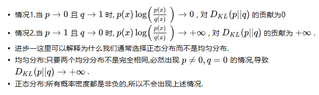

- [1. 熵(Entropy)](#1-熵entropy)
  - [1.1. 信息量](#11-信息量)
  - [1.2. 熵](#12-熵)
  - [1.3. 理解](#13-理解)
- [2. 交叉熵](#2-交叉熵)
  - [2.1. 交叉熵 \>= 熵](#21-交叉熵--熵)
  - [2.2. KL散度的联系](#22-kl散度的联系)
  - [2.3. 例子](#23-例子)
    - [2.3.1. 多分类交叉熵](#231-多分类交叉熵)
    - [2.3.2. 二分类交叉熵](#232-二分类交叉熵)
    - [2.3.3. 测试集](#233-测试集)
- [3. KL divergence](#3-kl-divergence)
  - [3.1. 公式](#31-公式)
  - [3.2. KL散度的性质](#32-kl散度的性质)
  - [3.3. 为什么我们通常选择正态分布而不是均匀分布](#33-为什么我们通常选择正态分布而不是均匀分布)
  - [3.4. KL Divergence between two Gaussian distributions](#34-kl-divergence-between-two-gaussian-distributions)
- [4. JS divergence](#4-js-divergence)
  - [4.1. 性质](#41-性质)
- [5. KL,JS的问题](#5-kljs的问题)

---

- [1. 熵(Entropy)](#1-熵entropy)
  - [1.1. 信息量](#11-信息量)
  - [1.2. 熵](#12-熵)
  - [1.3. 理解](#13-理解)
- [2. 交叉熵](#2-交叉熵)
  - [2.1. 交叉熵 \>= 熵](#21-交叉熵--熵)
  - [2.2. KL散度的联系](#22-kl散度的联系)
  - [2.3. 例子](#23-例子)
    - [2.3.1. 多分类交叉熵](#231-多分类交叉熵)
    - [2.3.2. 二分类交叉熵](#232-二分类交叉熵)
    - [2.3.3. 测试集](#233-测试集)
- [3. KL divergence](#3-kl-divergence)
  - [3.1. 公式](#31-公式)
  - [3.2. KL散度的性质](#32-kl散度的性质)
  - [3.3. 为什么我们通常选择正态分布而不是均匀分布](#33-为什么我们通常选择正态分布而不是均匀分布)
  - [3.4. KL Divergence between two Gaussian distributions](#34-kl-divergence-between-two-gaussian-distributions)
- [4. JS divergence](#4-js-divergence)
  - [4.1. 性质](#41-性质)
- [5. KL,JS的问题](#5-kljs的问题)

---

## 1. 熵(Entropy)

### 1.1. 信息量
I(X)是X的信息量

离散分布：$x\in X$, 
$${I}(x)=-\log _{b}{\mathrm  {P}}(x)$$ 

在这里b是对数所使用的底，2（默认）, e，或是10。

如果有一个系统S内存在多个事件S = {E1,...,En}，每个事件的概率分布P = {p1, ..., pn}，则每个事件本身的讯息（自信息）为：
$I_{e}=-\log _{2}{p_{i}}$
$I_{e}=-\ln {p_{i}}$
如英语有26个字母，假如每个字母在文章中出现次数平均的话，每个字母的讯息量为：

$I_{e}=-\log _{2}{1 \over 26}=4.7$

### 1.2. 熵
事件的概率分布和每个事件的信息量构成了一个随机变量，这个随机变量的均值（即期望）就是这个分布产生的信息量的平均值（即熵）。

随机变量X的熵值 Η（希腊字母Eta）定义如下，其值域为{x1, ..., xn}：

$$\Eta(X) = \mathrm{E}[\mathrm{I}(X)] = \mathrm{E}_{x\sim X}[-\log{\mathrm  {P}}(x)]$$

离散分布：
$$\mathrm{H} (X)=\sum_{x\in X}{{\mathrm  {P}}(x){\mathrm  {I}}(x)}=-\sum_{x\in X}{{\mathrm  {P}}(x)\log{\mathrm  {P}}(x)}$$
连续分布：
$$\mathrm{H} (X)=\int_X{{\mathrm  {P}}(x){\mathrm  {I}}(x)}=-\int_X{{\mathrm  {P}}(x)\log{\mathrm  {P}}(x)dx}$$

(默认)当b = 2，熵的单位是bit；当b = e，熵的单位是nat；而当b = 10,熵的单位是Hart。
### 1.3. 理解

> 编码里的最小平均编码长度

最小编码长度，即底数为2的信息量；最小平均编码长度，即熵

四个编码
|字符|A1|A2|A3|A4|
|-|-:|-:|-:|-:|
|出现频率|50%|25%|12.5%|12.5%|
|最小编码（哈夫曼编码）|0|10|110|111|
|信息量|$-\log_2(50\%)=1$|$-\log_2(25\%)=2$|$-\log_2(12.5\%)=3$|$-\log_2(12.5\%)=3$|

熵 $\Eta(X)=50\%*1+25\%*2+12.5\%*3+12.5\%*3=1.75$

> 意义

不确定性的量度而不是确定性的量度，因为越随机的信源的熵越大。熵更高意味着比较难于预测；熵比较低，也就是说很容易被预测。

> 例子

如果有一枚理想的硬币，其出现正面和反面的机会相等，则抛硬币事件的熵等于其能够达到的最大值。我们无法知道下一个硬币抛掷的结果是什么，因此每一次抛硬币都是不可预测的。

因此，使用一枚正常硬币进行若干次抛掷，这个事件的熵是一比特，因为结果不外乎两个——正面或者反面，可以表示为0, 1编码，而且两个结果彼此之间相互独立。若进行n次独立实验，则熵为n，因为可以用长度为n的比特流表示。

但是如果一枚硬币的两面完全相同，那个这个系列抛硬币事件的熵等于零，因为结果能被准确预测。现实世界里，我们收集到的数据的熵介于上面两种情况之间。

另一个稍微复杂的例子是假设一个随机变量X，取三种可能值${\begin{smallmatrix}x_{1},x_{2},x_{3}\end{smallmatrix}}$，概率分别为${\begin{smallmatrix}{\frac  {1}{2}},{\frac  {1}{4}},{\frac  {1}{4}}\end{smallmatrix}}$，那么编码平均比特长度是：${\begin{smallmatrix}{\frac  {1}{2}}\times 1+{\frac  {1}{4}}\times 2+{\frac  {1}{4}}\times 2={\frac  {3}{2}}\end{smallmatrix}}$。其熵为3/2。

因此熵实际是对随机变量的比特量和顺次发生概率相乘再总和的数学期望。

## 2. 交叉熵

分布$q$相对于分布$p$的交叉熵: 用p计算期望，用q计算信息量
 
$$\Eta(P,Q)=\operatorname {E} _{P}[I(Q)] = \operatorname {E} _{x\sim P}[-\log Q(x)]$$

离散分布：
$$\Eta(P,Q)=-\sum _{x\in X}P(x)\,\log Q(x)$$
连续分布：
$$\Eta(P,Q)=\displaystyle -\int _{X}P(x)\log Q(x)dx$$

交叉熵 $\Eta(P,Q)$ 本身是一个 **measurement**, 而不是一个 **distance**, since ${\displaystyle H(P,P)=:H(P)}$ isn't zero

### 2.1. 交叉熵 >= 熵

不对称性。一般，$\Eta(p,q) \neq \Eta(q,p)$

在p=q的情况下，$\Eta(p,q) = \Eta(q,p) = \Eta(p)$

对于期望，我们使用真实概率分布P来计算；对于编码长度，我们使用假设的概率分布Q来计算，因为它是预估用于编码信息的。因为熵是理论上的平均最小编码长度，所以交叉熵只可能大于等于熵。

### 2.2. KL散度的联系

$$ \Eta(P,Q) = \Eta(P) + D_{KL}(P\|Q)$$

其中 $\Eta(P)$是$P$的熵，$D_{\mathrm {KL} }(P\|Q)$是从$P$与$Q$的KL散度.

### 2.3. 例子
#### 2.3.1. 多分类交叉熵

分类5种动物，每张照片的标签都是**one-hot编码**。比如，狗`[1,0,0,0,0]`，猫`[0,1,0,0,0]`

分类器输出 `[0.4, 0.3, 0.05, 0.05, 0.2]`.

以真实标签作为P，预测输出作为Q，$H(P,Q)=-(1*\log_2 0.4+0*\log_2 0.3+0*\log_2 0.05+0*\log_2 0.05+0*\log_2 0。2)=0.916$

交叉熵对比了模型的预测结果和数据的真实标签，随着预测越来越准确，交叉熵的值越来越小，如果预测完全正确，交叉熵的值就为0。
#### 2.3.2. 二分类交叉熵

$$\Eta(P,Q)=-P(x)\log Q(x)-(1-P(x))\log (1-Q(x))$$
$$\Eta(P,Q)=-P(x)\log P^\prime(x)-(1-P(x))\log (1-P^\prime(x))$$
其中$P^\prime(x)=Q(x)$

#### 2.3.3. 测试集

蒙特卡洛估计。将测试集的分布当作真实分布P，Q还是训练集。

$$\Eta(P,Q)=-\sum^N_{i}\dfrac{1}{N}\log Q(x_i)$$

## 3. KL divergence

### 3.1. 公式

用来衡量概率分布P与参考概率分布Q的差异

$${D_{\text{KL}}(P\parallel Q)=\operatorname {E} _{x\sim P}[\log \dfrac{P(x)}{Q(x)}]=\sum _{x\in {\mathcal {X}}}P(x)\log {\dfrac {P(x)}{Q(x)}}}$$
即等于一个交叉熵减去一个信息熵，
$$\begin{aligned}    
D_{\text{KL}}(P\parallel Q)
&=\sum _{x\in {\mathcal {X}}}\left(-P(x)\log {Q(x)}-(-P(x)\log {P(x)})\right) \\
&=\Eta(P, Q)-\Eta(P)
\end{aligned}
$$

### 3.2. KL散度的性质
- 非负性（一个交叉熵减去一个信息熵，交叉熵>=熵），
    通常没有上界, KL散度取值范围从 $[0, +\infty]$
    $D_{\text{KL}}(P\parallel Q) = 0 \text{ iff. } P=Q$
    **KL散度越小表示分布越近，越大表示分布越远**
- 不对称性，即$D_{\text{KL}}(P\parallel Q)\neq D_{\text{KL}}(Q\parallel P)$。
  所以KL散度不是一个真正的距离或者度量.
- KL散度不满足三角不等式。即不能保证 $D_{\text{KL}}(P\parallel Q)> D_{\text{KL}}(P\parallel R) + D_{\text{KL}}(R\parallel Q)$

### 3.3. 为什么我们通常选择正态分布而不是均匀分布

  

### 3.4. KL Divergence between two Gaussian distributions

$$
D_{\mathrm{KL}}(\mathcal{N}(x;\boldsymbol{\mu}_x,\boldsymbol{\Sigma}_x)\parallel\mathcal{N}(\boldsymbol{y};\boldsymbol{\mu}_y,\boldsymbol{\Sigma}_y))=\frac{1}{2}\left[\log\frac{|\boldsymbol{\Sigma}_y|}{|\boldsymbol{\Sigma}_x|}-d+\mathrm{tr}(\boldsymbol{\Sigma}_y^{-1}\boldsymbol{\Sigma}_x)+(\boldsymbol{\mu}_y-\boldsymbol{\mu}_x)^T\boldsymbol{\Sigma}_y^{-1}(\boldsymbol{\mu}_y-\boldsymbol{\mu}_x)\right]
$$

[实现](https://github.com/openai/guided-diffusion/blob/27c20a8fab9cb472df5d6bdd6c8d11c8f430b924/guided_diffusion/losses.py#L33)

## 4. JS divergence

正是由于KL散度的不对称性问题，我们在KL散度基础上引入了对称的、且平滑效果的JS散度

$${\rm {JSD}}(P\parallel Q)={\frac{1}{2}}D_{\text{KL}}(P\parallel \frac{P+Q}{2})+{\frac {1}{2}}D_{\text{KL}}(Q\parallel \frac{P+Q}{2})$$

### 4.1. 性质

- 对称
- $0\leq {{\rm {JSD}}}(P\parallel Q)\leq 1$，1是底数取2时的$log 2$
  **JS散度越小表示分布越近，越大表示分布越远**
  

## 5. KL,JS的问题

如果两个分布 P,Q 离得很远，完全没有重叠的时候，那么这两个散度都会达到其最大值
- KL散度值为无限大。
- JS散度值为常数log2。

这都意味这一点的梯度为 0，梯度消失了。