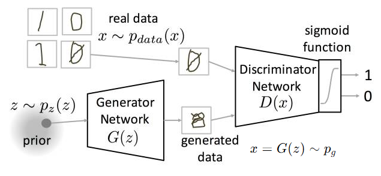
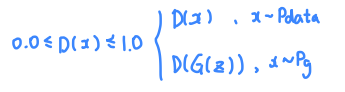
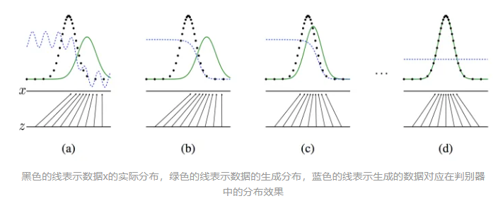
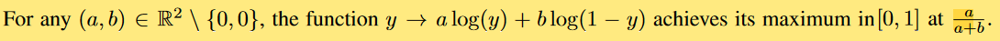
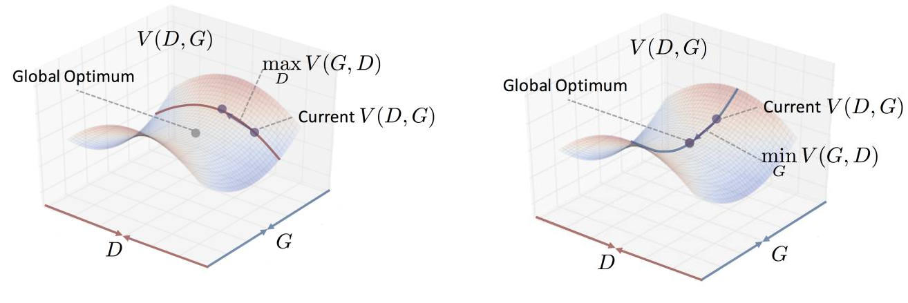

- [1. 网络结构](#1-网络结构)
- [2. 优化目标](#2-优化目标)
- [3. 最优解](#3-最优解)
- [4. 模式坍塌 Helvetica scenario](#4-模式坍塌-helvetica-scenario)

---

[Generative Adversarial Networks](https://arxiv.org/abs/1406.2661)
## 1. 网络结构

  

噪声 $z\sim p_z$ , 真实图片 $x\sim p_{data}$ ，生成图片 $x=G(z)\sim p_g$ .

- G是一个生成网络。
    
    它接收一个随机的噪声`z`，通过这个噪声生成图片，记做`G(z)`。

- D是一个判别网络。判别一张图片是不是“真实的”。

    输入`x`（真实图片或者生成图片），输出`D(x)`输出一个标量，表示`x`为真实图片的概率值`[0.0, 1.0]`，如果为1，就代表100%属于真实图片，而输出为0，就代表不可能是真实的图片, 或者说代表100%属于生成图片。

      

## 2. 优化目标

$$\min_G\max_D V(D,G)=\mathbb{E}_{\boldsymbol{x}\sim p_{\mathrm{data}}(\boldsymbol{x})}[\log D(x)]+\mathbb{E}_{\boldsymbol{z}\sim p_{\boldsymbol{z}}(\boldsymbol{z})}[\log(1-D(G(z)))]$$

$\min_G\max_D$可以分开来看：
- D: $\max_D [\log(D(x))+\log(1-D(G(z)))]$, 即 $\max_D [D(x)]$ 和 $\min[D(G(z))]$ 
    既要让真实图片趋于1，又要让生成图片趋于0.
- G: $\min_G [\log(1-D(G(z)))]$, 即 $\max[D(G(z))]$ 
    为什么没有 $\min_D \log(D(x))$, 因为我们在优化G的参数，而其只和判别器D的参数有关。
- $min_G max_D$，表示先优化判别器，在判别器取得最优 $max_D$ 后，再优化生成器 $min_G$.

或者我们可以直接理解
- D的loss是 
    $-log(D(x)) - log(1-D(G(z))) $
    $-log(D(x)) + log(D(G(z))) $
- G的loss是 
    $log(1-D(G(z))$
    $-log(D(G(z))$

简而言之，让 $p_g(x)$ 趋近于 $p_{data}(x)$

$$
\begin{aligned}
KL(p_g(x)||p_{data}(x))
&=\int_xp_g(x)\log\frac{p_g(x)}{p_{data}(x)}dx \\
&=E_{x\sim p_g}\left[\log\frac{p_g(x)}{p_{data}(x)}\right]\\
\end{aligned}
$$

  

看图(b)，对于蓝色虚线而言，单纯的绿色部分可以很明确的划分为0，黑色虚线的部分可以很明确的划分成1，二者相交的部分划分不是很明确。最后一张图，经过多次更新与对抗生成之后，生成数据已经和原始数据非常相像的了，这时分类器已经无法判断，于是就变成了0.5一条水平线，表示一半几率属于真实图片，一半几率属于生成图片。

## 3. 最优解

$p_g(x) = p_{data}(x)$

1. 全局优化首先固定G优化D，D的最佳情况为：

    $$D_G^*(\boldsymbol{x})=\frac{p_{data}(\boldsymbol{x})}{p_{data}(\boldsymbol{x})+p_g(\boldsymbol{x})}$$

    证明上述结论，D*G(x)是最优解：
    $$\begin{aligned}
    x&=G(z) \\
    z&=G^{-1}(x) \\
    dz&=(G^{-1})^{\prime}(x)dx \\
    p_{g}(x)&=p_{z}(G^{-1}(x))(G^{-1})'(x)
    \end{aligned}
    $$
    
    $$\begin{aligned}
    V(D,G)
    &=\mathbb{E}_{x\sim p_{data}(x)}[\mathrm{log}D(x)]+\mathbb{E}_{z\sim p_z(z)}[\mathrm{log}(1-D(G(z))] \\
    &=\int_{x}p_{data}(x)log(D(x))dx+\int_{z}p_{z}(z)log(1-D(G(z)))dz \\
    &=\int_{x}p_{data}(x)log(D(x))dx+\int_{x}p_{z}(G^{-1}(x))log(1-D(x))(G^{-1})^{\prime}(x)dx \\
    &=\int_{x}p_{data}(x)log(D(x))dx+\int_{x}p_{g}(x)log(1-D(x))dx \\
    &=\int_{x}p_{data}(x)log(D(x))+p_{g}(x)log(1-D(x))dx
    \end{aligned}
    $$

    $$
    \begin{aligned}
    &\begin{aligned}\max_DV(D,G)=\max_D\int_xp_{data}(x)log(D(x))+p_g(x)log(1-D(x))dx\end{aligned} \\
    &\frac{\partial}{\partial D(x)}(p_{data}(x)log(D(x))+p_{g}(x)log(1-D(x)))=0 \\
    &\Rightarrow\frac{p_{data}(x)}{D(x)}-\frac{p_g(x)}{1-D(x)}=0 \\
    &\Rightarrow D(x)=\frac{p_{data}(x)}{p_{data}(x)+p_g(x)}
    \end{aligned}
    $$

      

2. 假设我们已经知道D*G(x)是最佳解了，这种情况下G想要得到最佳解的情况是：

    $$
    \begin{aligned}
    C(G)
    &=V(D_G^*, G) \\
    &=\int_{x}p_{data}(x)log(D_{G}^{*}(x))+p_{g}(x)log(1-D_{G}^{*}(x))dx \\
    &=\int_xp_{data}(x)log(\frac{p_{data}(x)}{p_{data}(x)+p_g(x)})+p_g(x)log(\frac{p_g(x)}{p_{data}(x)+p_g(x)})dx \\
    &=\int_{x}p_{data}(x)log(\frac{p_{data}(x)}{\frac{p_{data}(x)+p_{g}(x)}2})+p_{g}(x)log(\frac{p_{g}(x)}{\frac{p_{data}(x)+p_{g}(x)}2})dx-log(4) \\
    &=KL[p_{data}(x)||\frac{p_{data}(x)+p_{g}(x)}{2}]+KL[p_{g}(x)||\frac{p_{data}(x)+p_{g}(x)}{2}]-log(4) 
    \end{aligned}
    $$

    KL散度是大于等于零的，所以当且仅当 $p_{data}(x)=\dfrac{p_{data}(x)+p_g(x)}2 \Rightarrow p_{data}(x)=p_g(x)$
    $$\min_G C(G) = -log(4)$$

    PS: 或者$C(G) = 2·JSD (p_{data}||p_g ) - \log(4)$

  

## 4. 模式坍塌 Helvetica scenario

生成器 G 将太多的 z 值折叠为相同的 x 值，导致生成器 G 对原始数据分布 $p_{data}$ 建模时发生功能坍塌而失去生成多样性样本的能力

不管输入的随机噪声 z 取值如何，生成器都会一直生成同样的样本。生成器通过不断生成此样本就能够一直骗过判别器，因此生成器也就开始偷奸耍滑了，不好好学习了，一直源源不断地生成同样的数据样本，不会再去训练提高自己生成 多样性数据 的能力了。