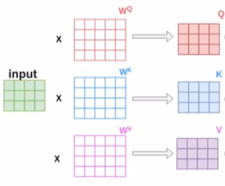
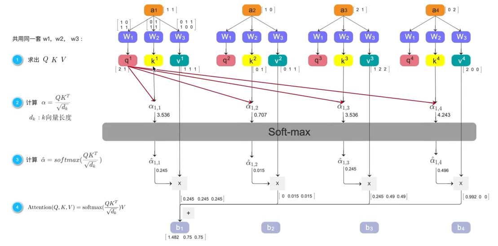
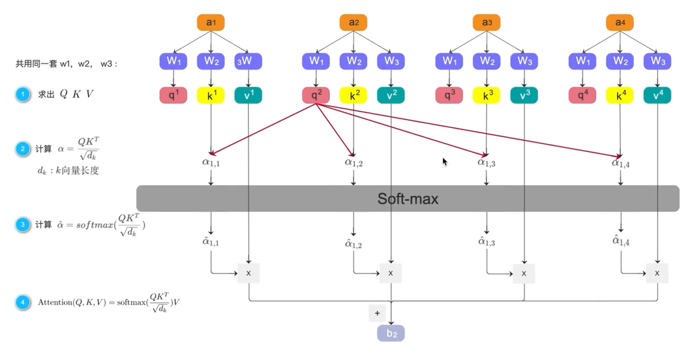
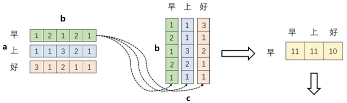
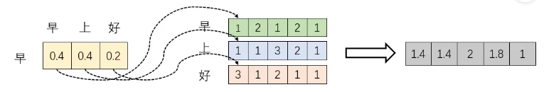
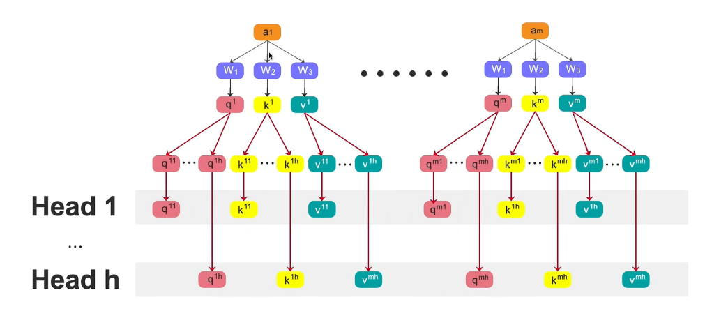
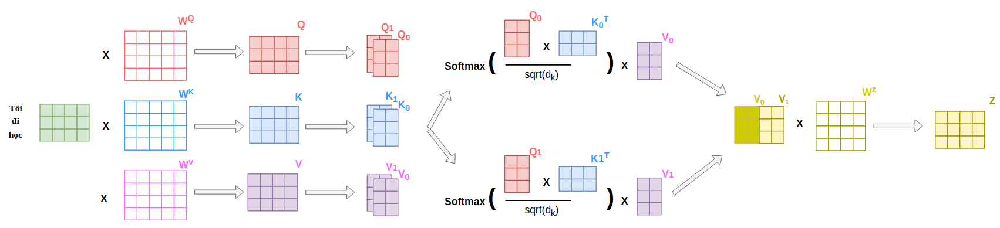

- [1. intro](#1-intro)
- [2. self-attention](#2-self-attention)
  - [2.1. 矩阵乘法](#21-矩阵乘法)
  - [2.2. 向量运算的方式](#22-向量运算的方式)
  - [2.3. code](#23-code)
- [3. multihead-attention](#3-multihead-attention)
  - [3.1. code](#31-code)
- [4. LinearAttention](#4-linearattention)


---

## 1. intro

向量到向量：考虑整个sequence的向量，得到一个向量。

  


注意力函数可以描述为将一个查询 query 和一组键值对 key-value pairs 映射到一个输出 output，其中 query, keys, values, and output 都是向量。

输出计算为值的加权和，其中分配给每个值的权重是通过查询与对应关键字的 兼容性函数compatibility function 来计算的。


  


## 2. self-attention
### 2.1. 矩阵乘法

$$\mathrm{Attention}(Q,K,V)=\mathrm{softmax} \left(\dfrac{QK^T}{\sqrt{d_k}} \right)V$$

QKV本质：矩阵乘法(ab)(bc)(cd)

- a是Q的个数，b是Q和K的维度，c是K和V的个数，d是V的个数
- 两种方式
  - $(QK^\top)V$: 转置K，那么Q(ab),K(cb),V(cd)
  - $(Q^\top K)V$: 转置Q，那么Q(ba),K(bc),V(cd)

在self-attention中，a等于c。

softmax是对最后一个维度，即c. 因为是对c个v进行加权求和。

### 2.2. 向量运算的方式









  


### 2.3. code

```python
from torch import nn
import torch


class Self_Attention(nn.Module):
    def __init__(self, input_dim, dk, dv):
        super().__init__()
        self.q = nn.Linear(input_dim, dk)
        self.k = nn.Linear(input_dim, dk)
        self.v = nn.Linear(input_dim, dv)
        self.scale = dk ** 0.5

    def forward(self, x):
        # x: [b, nq, input_dim]
        Q = self.q(x)  # [b, nq, dk]
        K = self.k(x)  # [b, nk, dk]
        V = self.v(x)  # [b, nv, dv]

        # [b, nq, nk]
        attn = (Q @ K.transpose(-2, -1)) / self.scale
        attn = attn.softmax(dim=-1)

        # [b, nq, dv]
        output = attn @ V
        return output
    
X = torch.randn(4,3,2)  # b,nq,input_dim
model = Self_Attention(input_dim=2, dk=5, dv=5)
model(X).shape
# torch.Size([4, 3, 5])
```


- scaled dot-product attention
  《Attention Is All You Need》中的attention。


- 根据Attention的计算区域，可以分成以下几种：

  1）Soft Attention，这是比较常见的Attention方式，对所有key求权重概率，每个key都有一个对应的权重，是一种全局的计算方式（也可以叫Global Attention）。这种方式比较理性，参考了所有key的内容，再进行加权。但是计算量可能会比较大一些。

  2）Hard Attention，这种方式是直接精准定位到某个key，其余key就都不管了，相当于这个key的概率是1，其余key的概率全部是0。因此这种对齐方式要求很高，要求一步到位，如果没有正确对齐，会带来很大的影响。另一方面，因为不可导，一般需要用强化学习的方法进行训练。（或者使用gumbel softmax之类的）

  3）Local Attention，这种方式其实是以上两种方式的一个折中，对一个窗口区域进行计算。先用Hard方式定位到某个地方，以这个点为中心可以得到一个窗口区域，在这个小区域内用Soft方式来算Attention。


- cross-attention: High-resolution image synthesis with latent diffusion models.


## 3. multihead-attention

- 将通道拆分映射，64到8个8.
- 单头能关注到最重要的一个。但当最重要的有多个时，平均反而让其概率不高（0.4,0.4,0.2）。多头则是每个头关注一个最重要的，而且通道拆分让其不互相重复。
- 计算代价(8个8)和单头(64)一样






### 3.1. code

与 <https://github.com/datnnt1997/multi-head_self-attention/blob/master/selfattention.py> 结果一致

- 给头数和头维度
```python
from torch import nn
import torch
from einops import rearrange


class MultiHead_Attention(nn.Module):
    def __init__(self, input_dim, nh, dh):
        super().__init__()
        self.q = nn.Linear(input_dim, nh * dh)
        self.k = nn.Linear(input_dim, nh * dh)
        self.v = nn.Linear(input_dim, nh * dh)
        self.fc = nn.Linear(nh * dh, nh * dh)
        self.nh = nh
        self.dh = dh
        self.scale = dh ** 0.5

    def forward(self, x):
        Q = self.q(x)
        K = self.k(x)
        V = self.v(x)

        # 拆分head、然后满足矩阵乘法
        Q = rearrange(Q, 'b nq (nh dh) -> b nh nq dh', nh=self.nh)
        K = rearrange(K, 'b nq (nh dh) -> b nh nq dh', nh=self.nh)
        V = rearrange(V, 'b nq (nh dh) -> b nh nq dh', nh=self.nh)

        # [b, nh, nq, nq]
        attn = (Q @ K.transpose(-2, -1)) / self.scale
        attn = attn.softmax(dim=-1)

        # [b, nh, nq, dh]
        output = attn @ V

        # 还原矩阵乘法、然后concat dh
        output = rearrange(output, 'b nh nq dh -> b nq (nh dh)')
        output = self.fc(output)
        return output
    
X = torch.randn(4,3,2)  # b,nq,input_dim
model = MultiHead_Attention(input_dim=2, nh=3, dh=5)
model(X).shape
# torch.Size([4, 3, 15])
```
- 给总维度和头数
```python
from torch import nn
import torch
from einops import rearrange


class MultiHead_Attention(nn.Module):
    def __init__(self, input_dim, d_all, nh):
        super().__init__()
        self.q = nn.Linear(input_dim, d_all)
        self.k = nn.Linear(input_dim, d_all)
        self.v = nn.Linear(input_dim, d_all)
        self.fc = nn.Linear(d_all, d_all)
        self.nh = nh
        self.d_all = d_all
        self.scale = (d_all / nh) ** 0.5

    def forward(self, x):
        Q = self.q(x)
        K = self.k(x)
        V = self.v(x)

        # 拆分head、然后满足矩阵乘法
        Q = rearrange(Q, 'b nq (nh dh) -> b nh nq dh', nh=self.nh)
        K = rearrange(K, 'b nq (nh dh) -> b nh nq dh', nh=self.nh)
        V = rearrange(V, 'b nq (nh dh) -> b nh nq dh', nh=self.nh)

        # [b, nh, nq, nq]
        attn = (Q @ K.transpose(-2, -1)) / self.scale
        attn = attn.softmax(dim=-1)

        # [b, nh, nq, dh]
        output = attn @ V

        # 还原矩阵乘法、然后concat dh
        output = rearrange(output, 'b nh nq dh -> b nq (nh dh)')
        output = self.fc(output)
        return output
    
X = torch.randn(4,3,2)  # b,nq,input_dim
model = MultiHead_Attention(input_dim=2, d_all=15, nh=3)
model(X).shape
# torch.Size([4, 3, 15])
```
## 4. LinearAttention

<https://github.com/CompVis/latent-diffusion/blob/a506df5756472e2ebaf9078affdde2c4f1502cd4/ldm/modules/attention.py#L80>

$(\text{softmax}(k) v^\top)^\top q = (v \text{ softmax}(k)^\top)q$
