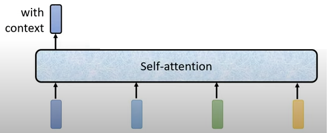
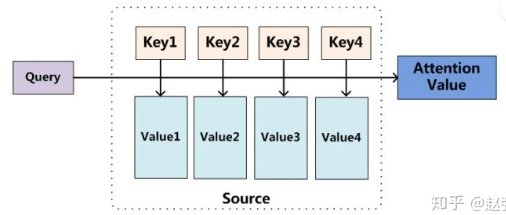

- [1. attention](#1-attention)
- [2. scaled dot-product attention](#2-scaled-dot-product-attention)
  - [2.1. 公式](#21-公式)
  - [2.2. scaled dot-product attention 和 additive attention, dot-product attention 的区别](#22-scaled-dot-product-attention-和-additive-attention-dot-product-attention-的区别)
  - [2.3. mask](#23-mask)

---

## 1. attention

向量到向量：考虑整个sequence的向量，得到一个向量。

  

注意力函数可以描述为将一个查询 query 和一组键值对 key-value pairs 映射到一个输出 output，其中 query, keys, values, and output 都是向量。

输出计算为值的加权和，其中分配给每个值的权重是通过查询与对应关键字的 兼容性函数compatibility function 来计算的。

  

- scaled dot-product attention
  《Attention Is All You Need》中的attention。

- 根据Attention的计算区域，可以分成以下几种：

  1）Soft Attention，这是比较常见的Attention方式，对所有key求权重概率，每个key都有一个对应的权重，是一种全局的计算方式（也可以叫Global Attention）。这种方式比较理性，参考了所有key的内容，再进行加权。但是计算量可能会比较大一些。

  2）Hard Attention，这种方式是直接精准定位到某个key，其余key就都不管了，相当于这个key的概率是1，其余key的概率全部是0。因此这种对齐方式要求很高，要求一步到位，如果没有正确对齐，会带来很大的影响。另一方面，因为不可导，一般需要用强化学习的方法进行训练。（或者使用gumbel softmax之类的）

  3）Local Attention，这种方式其实是以上两种方式的一个折中，对一个窗口区域进行计算。先用Hard方式定位到某个地方，以这个点为中心可以得到一个窗口区域，在这个小区域内用Soft方式来算Attention。