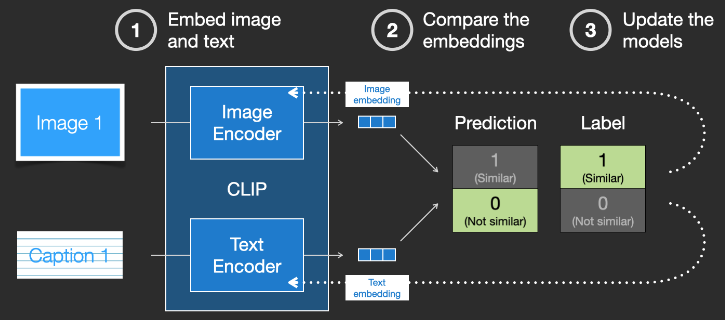

Input: text.
Output: token embeddings vectors, 77 token each in 768 dimensions (77 x 768).

## Training

  

训练数据：image-text pair
网络结构：两个 Encoder, image encoder 和 text encoder

1. image 通过 image ecoder 的 image embedding
2. text 通过 text ecoder 的 text embedding
3. 评估 image embedding 和 text embedding 的相似度。越相似， CLIP Score越高。
4. 根据相似程度来更新两个Encoder。

不仅有正相关的相似，还有负样本的不相似。

## Inference

Stable Diffusion 就拿 CLIP 的 pre-trained **Text Encoder** 去用：将文本通过得到 text embedding.