- [1. 里程碑](#1-里程碑)
- [2. 训练](#2-训练)
  - [2.1. toy understanding](#21-toy-understanding)
  - [2.2. 实际上](#22-实际上)
- [3. Sampling 推理](#3-sampling-推理)
  - [3.1. toy understanding](#31-toy-understanding)
  - [实际上](#实际上)
- [4. UNet](#4-unet)
- [5. DDPM](#5-ddpm)
- [6. DDIM](#6-ddim)
- [7. other](#7-other)
- [8. LDM](#8-ldm)

---

## 1. 里程碑

Diffusion Probabilistic Model (DPM) 简称 Diffusion Model

Denoising Diffusion Probabilistic Models (DDPM) ，多了个 Denoising.

- DPM
- DDPM & cross-attention: 《High-Resolution Image Synthesis with Latent Diffusion Models》
- DDIM: 
- classifier free guidance: 《Classifier-free diffusion guidance》
- LDM:
- sedit: 《Sdedit: Image synthesis and editing with stochastic differential equations》

---

## 2. 训练

### 2.1. toy understanding

> 分开理解

当成supervised learning理解：
- 输入特征:  noisy image 和 其噪声等级 noise amount
- 让unet预测噪声 predicted noise
- 计算 predicted noise 和 ground truth noise (Label) 的 loss 来更新unet

noisy image: 其随机生成的噪声即是 ground truth noise (Label) 
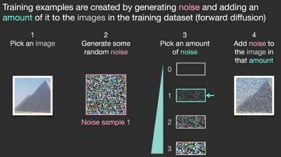
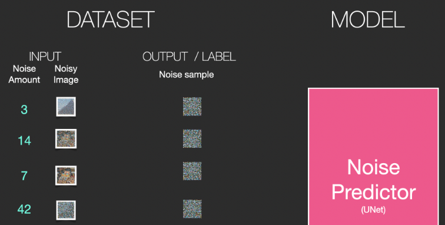
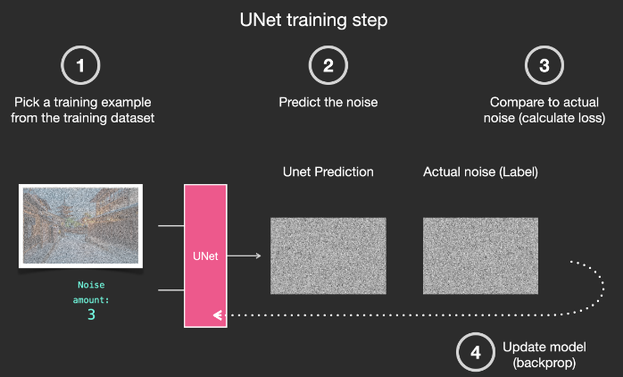

> 整体理解

对一张训练图片，混合不同 noise amount 程度的 ground truth noise 得到 noisy image, noisy image 再通过 unet 得到 predicted noise, 计算 predicted noise 和 ground truth noise (Label) 的 loss 来更新unet.

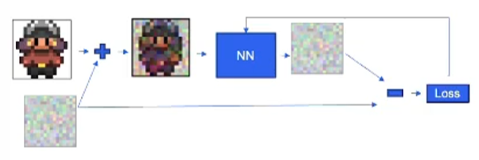

### 2.2. 实际上

> 迭代

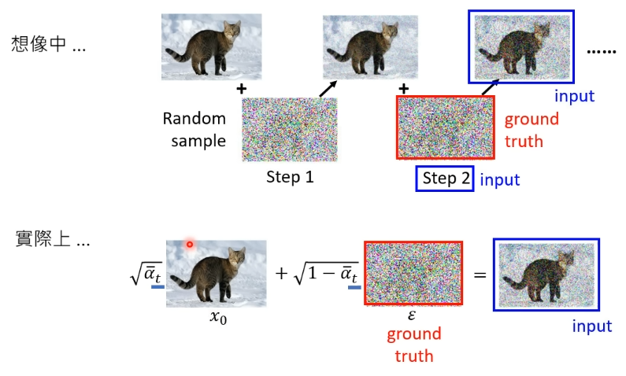

想象中，每一步的 noisy image 是 上一次迭代的 noisy image 加上噪音得到。

实际上，每一步的 noisy image 是直接在原始图片上加噪音得到。

> 只有一步

采用更稳定的训练策略：不是对同一张图片施加随时间步增长（遍历所有的时间步）的噪声等级，而是每次随机取一张图片，对其采**仅一次**随机的时间步的噪声等级。

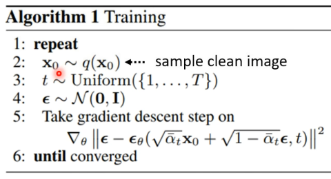

$$L_{DM}=\mathbb{E}_{x,\epsilon\sim\mathcal{N}(0,1),t}\Big[\|\epsilon-\epsilon_{\theta}(x_{t},t)\|_{2}^{2}\Big]$$
- noise amount 即时间步 timestep。$t \in[1,2,3,...,T]$.
- $\epsilon_\theta$ 是unet, $\epsilon_\theta(x_t,t)$ 得到 predicted noise
- $\epsilon$ 是 ground truth noise 
- $x_t = \sqrt{\bar{\alpha}_{t}}x_{0}+\sqrt{1-\bar{\alpha}_{t}}\epsilon$ : noisy image 由 原始图片 $x_0$ 和 噪声 $\epsilon$ 加权求和得到。

## 3. Sampling 推理

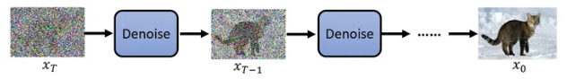

经过 T 步 Denoise, 那么 Denoise具体是什么

### 3.1. toy understanding

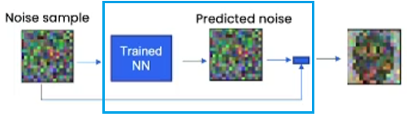

Noise sample 减去 神经网络预测出来的 Predicted Noise, 得到 更清晰的图像。 `sample = sample - predicted_noise`

但这样的结果得到的只是乱七八糟的图片。

### 实际上

- 再加入 extra_noise. 
- 还要让 ddpm scheduler 再预测出三个缩放因子，缩放 sample、predicted_noise、extra_noise。

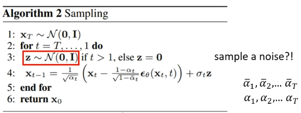
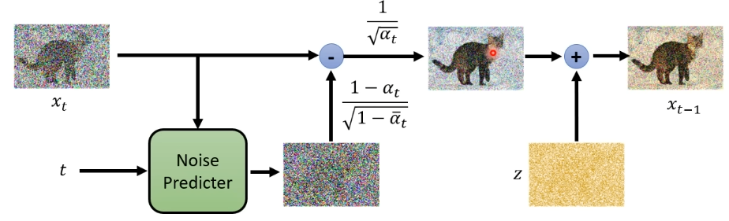
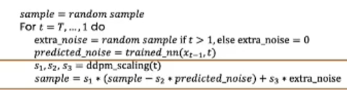

- $s_1=\dfrac{1}{\sqrt{\alpha_t}}$
- $s_2=\dfrac{1-\alpha_t}{\sqrt{1-\bar\alpha_t}}$
- $s_3=\sigma_t$

## 4. UNet

UNet通过多种 embedding 接收更多信息: 
- Time embedding: related to the **timestep and noise level**.
- Context embedding: related to controlling the generation, e.g. text embedding or factor (more later).

为什么time embedding是加而context embedding是乘？
时间扰动是要作用到unet的layer上的，告诉unet在T时刻处理T时刻的噪声，把Unet从一个纯去噪网络变为了T的条件去噪。
这里对unet参数的改变是经过卷积和池化等操作生成一个和layer一样的张量然后 加 到原来的layer上。
而内容的扰动是增加了不同内容的概率or权重。你可以按照“内容的概率去指导结果中内容生成的概率”去理解，那这里就是需要相乘的。

- Context is a vector for controlling generation.
- Context can be text embeddings, e.g. > 1000 in length.
- Context can also be categories, one-shot vector, e.g. 5 in length, [0,0,0,1,0]

## 5. DDPM

Each timestep is dependent on the previous one (Markovian)，

The DDPM paper describes a corruption process that adds a small amount of noise for every 'timestep'. 

Given $x_{t-1}$ for some timestep, we can get the next version $x_t$ with:

$$q(\mathbf{x}_t \vert \mathbf{x}_{t-1}) = \mathcal{N}(\mathbf{x}_t; \sqrt{1 - \beta_t} \mathbf{x}_{t-1}, \beta_t\mathbf{I}) \quad$$

$$q(\mathbf{x}_{1:T} \vert \mathbf{x}_0) = \prod^T_{t=1} q(\mathbf{x}_t \vert \mathbf{x}_{t-1})$$

- we take $x_{t-1}$, scale it by $\sqrt{1 - \beta_t}$ and add noise scaled by $\beta_t$. 
- $\beta$ is defined for every timestep $t$ accoridng to some schedule, and determines how much noise is added per timestep. 

Now, we don't necessariy want to do this operation 500 times to get $x_{500}$ so we have another formula to get $x_t$ for any t given $x_0$:   

$$\begin{aligned}
q(\mathbf{x}_t \vert \mathbf{x}_0) &= \mathcal{N}(\mathbf{x}_t; \sqrt{\bar{\alpha}_t} \mathbf{x}_0, \sqrt{(1 - \bar{\alpha}_t)} \mathbf{I})
\end{aligned}, \text{where } \bar{\alpha}_t = \prod_{i=1}^T \alpha_i \text{ and } \alpha_i = 1-\beta_i$$

- We can plot $\sqrt{\bar{\alpha}_t}$ (labelled as `sqrt_alpha_prod`) and $\sqrt{(1 - \bar{\alpha}_t)}$ (labelled as `sqrt_one_minus_alpha_prod`)

## 6. DDIM

DDIM，采用了别的采样器。

马尔可夫链仅用于概率过程，而DDIM消除了随机性，

DDIM更快，因为可以跳过时间步。

生成质量：500步以下，DDIM更好；500步以上，DDPM更好。

## 7. other

text conditioning

cross-attention

classifier free guidance

---

Denoising diffusion probabilistic models (DDPMs) [9] associate image generation with the sequential denoising process of isotropic Gaussian noise. The model is trained to predict the noise from the input image. Unlike other generative models such as GANs and most traditional-style VAEs that encode input data in a lowdimensional space, diffusion models have a latent space that is the same size as the input. Although DDPMs require a lot of feed-forward steps to generate samples, their image fidelity and diversity are superior to other types of generative models. Compared to DDPMs that assume a Markovian noise-injecting forward diffusion process, Denoising diffusion implicit models (DDIMs) [33] assume a non-Markovian forward process that has the same marginal distribution as DDPMs, and use its corresponding reverse denoising process for sampling, which enables acceleration of the rather onerous sampling process of DDPMs. DDIMs also utilize a deterministic forward-backward process and therefore show nearly-perfect reconstruction ability, which is not the case for DDPMs.

---

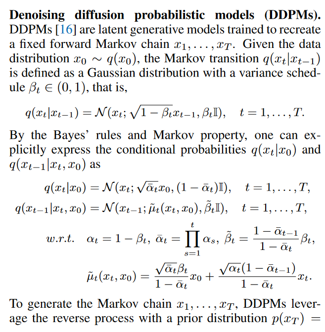

## 8. LDM

Latent Diffusion Models a.k.a Stable Diffusion

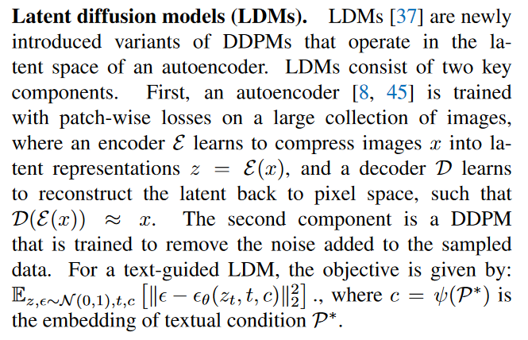

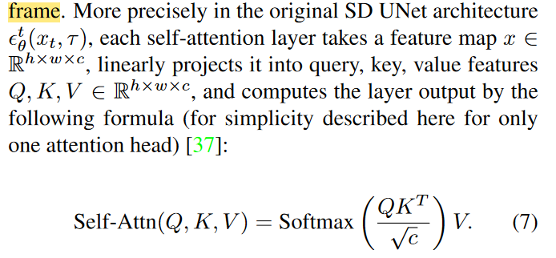

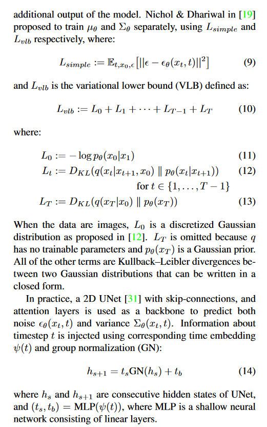

LDM: which first construct an intermediate latent distribution of the training data then fit a diffusion model on the latent distribution

