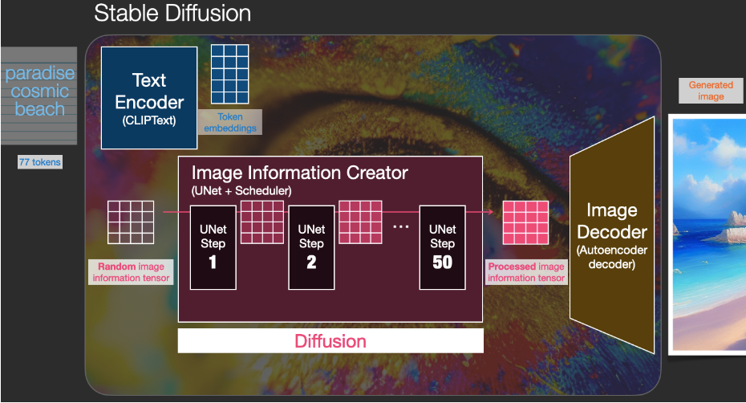
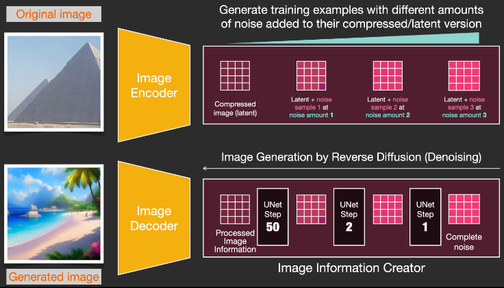
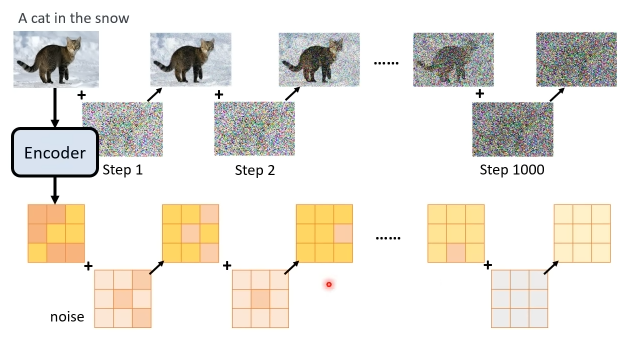
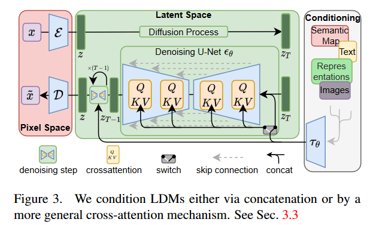
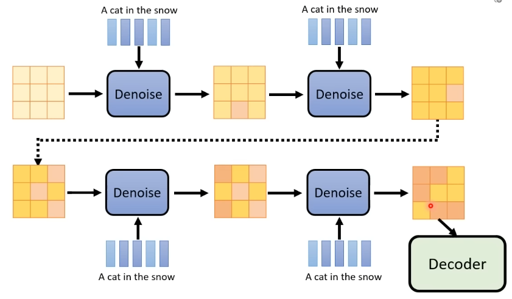

- [1. Overview](#1-overview)
- [2. latent space](#2-latent-space)
- [3. 训练和推理](#3-训练和推理)
  - [3.1. 训练](#31-训练)
  - [3.2. 推理](#32-推理)
- [4. Text conditioning](#4-text-conditioning)

---
## 1. Overview

Stable diffusion 并不是单个模型，而是由三个模型组合起来的。

- Text Encoder (pre-tained 好的Clip中的Encoder)

    作为unet的条件

    Input: text.

    Output: **token embeddings vectors**, **77 tokens** each in 768 dimensions.

- Image Information Creator (ldm中的 UNet + Scheduler)

    gradually denoising process information in the information (latent) space.
    
    Input: token embeddings and a random noise tensor.

    Output: A processed information tensor (4,64,64)

- Autoencoder Decoder (ldm中的Decoder)
    
    paints the final image.
    
    Input:  A processed information tensor (4,64,64)
    
    Output: The resulting image (3, 512, 512).

A processed information tensor 就是中间产物。

## 2. latent space

stable diffusion(latent diffusion)快，是因为不是直接在 pixel space 上操作图片，而是在 latent space 上操作 latent。

压缩，尺寸更小。image size $(H,W,3)$, latent size $(h,w,c)$, 因子$f = \dfrac{H}{h}=\dfrac{W}{w}$

Encoder-Decoder架构，Encoder得到的中间产物，经过Diffusion处理后，传给Decoder。

原本 pixel space 上 噪声和图片一样大小 $(H,W)$，现在 latent space 上 噪声和 latent 一样大小 $(h,w)$

## 3. 训练和推理

### 3.1. 训练

重建原始图片。

### 3.2. 推理

1. 代替encoder：从高斯分布采样，$(h,w)$ latent 大小的噪声
2. 传给unet
3. 最终，多次迭代后unet输出的中间产物，交给Decoder

## 4. Text conditioning

text embedding 在每步都会传给unet。
