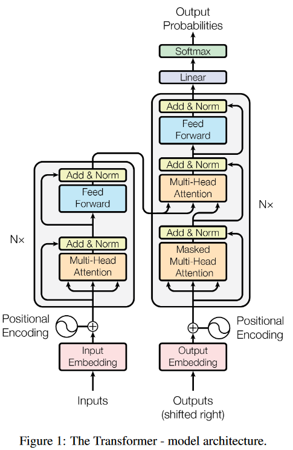
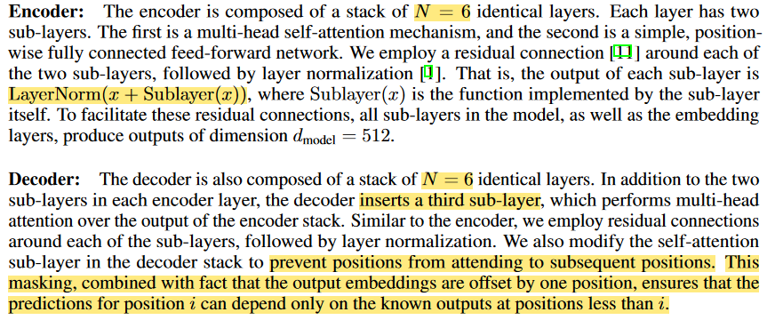
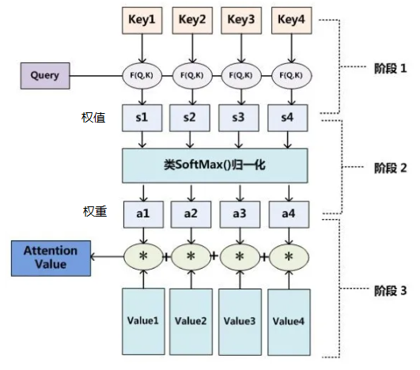
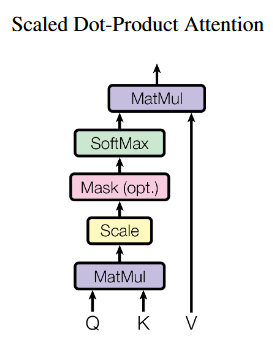
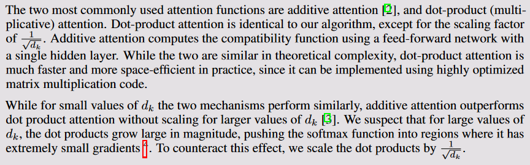
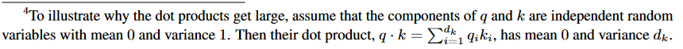
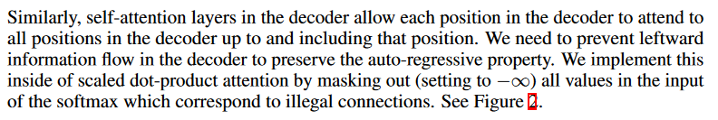
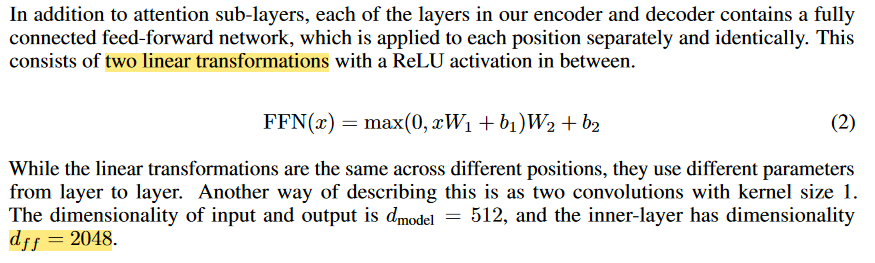
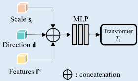

- [1. 目标](#1-目标)
- [2. 结构](#2-结构)
  - [2.1. scaled dot-product attention](#21-scaled-dot-product-attention)
    - [2.1.1. 公式](#211-公式)
    - [2.1.2. scaled dot-product attention 和 additive attention, dot-product attention 的区别](#212-scaled-dot-product-attention-和-additive-attention-dot-product-attention-的区别)
    - [2.1.3. mask](#213-mask)
  - [2.2. FC: Position-wise Feed-Forward Networks](#22-fc-position-wise-feed-forward-networks)
- [3. 输入特征](#3-输入特征)

---

《2017. Attention Is All You Need》

## 1. 目标

To the best of our knowledge, however, the Transformer is the first transduction model **relying entirely on self-attention** to compute representations of its input and output **without using sequencealigned RNNs or convolution**.

## 2. 结构

  

  

### 2.1. scaled dot-product attention

《Attention Is All You Need》中的attention。

#### 2.1.1. 公式

$$\displaystyle \mathrm{Attention}(q,K,V)=\sum_{i=1}^{N} \mathrm{softmax}\left(\dfrac{q \cdot K_i}{\sqrt{d_k}} \right) \cdot V_i =\mathrm{softmax} \left(\dfrac{\sum_{i=1}^{d_k} q_i k_i}{\sqrt{d_k}} \right) \cdot v$$

$$\mathrm{Attention}(Q,K,V)=\mathrm{softmax} \left(\dfrac{QK^T}{\sqrt{d_k}} \right)V$$

一组键值对 key-value pairs (每个key向量的维度是 $d_k$, 每个value向量的维度是 $d_v$) 和 一个查询 query（向量的维度也该是 $d_k$）。 

在实践中，我们同时计算一组查询的注意力函数，将其打包 pack 到矩阵 Q 中。键和值也打包到矩阵 K 和 V 中。

  

  

第一步： query 和 key 进行点积运算，然后缩放，得到权值 s

第二步：将权值进行归一化，得到直接可用的权重 a

第三步：将权重 a 和 value 进行加权求和

#### 2.1.2. scaled dot-product attention 和 additive attention, dot-product attention 的区别

  

  

#### 2.1.3. mask

  

softmax 是 $e^x$, 当 $x = -\infty$ 时， $e^x \approx 0$.

### 2.2. FC: Position-wise Feed-Forward Networks

  

## 3. 输入特征

*Local Implicit Ray Function for Generalizable Radiance Field Representation* 中关于transformer的输入都不是直接输入concatenate起来的features的，而是concatenate后再经过MLP后的。这样起一个 **reduce feature channels** 的作用。

小MLP。The “MLP” is a two-layer MLP and the number of channels is set to 32.

 
