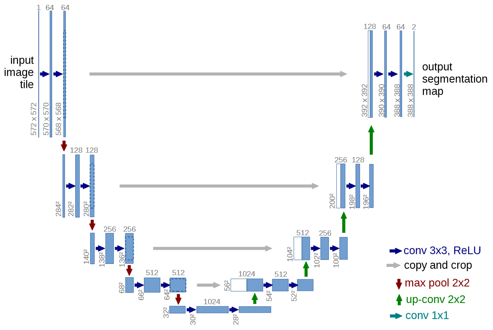
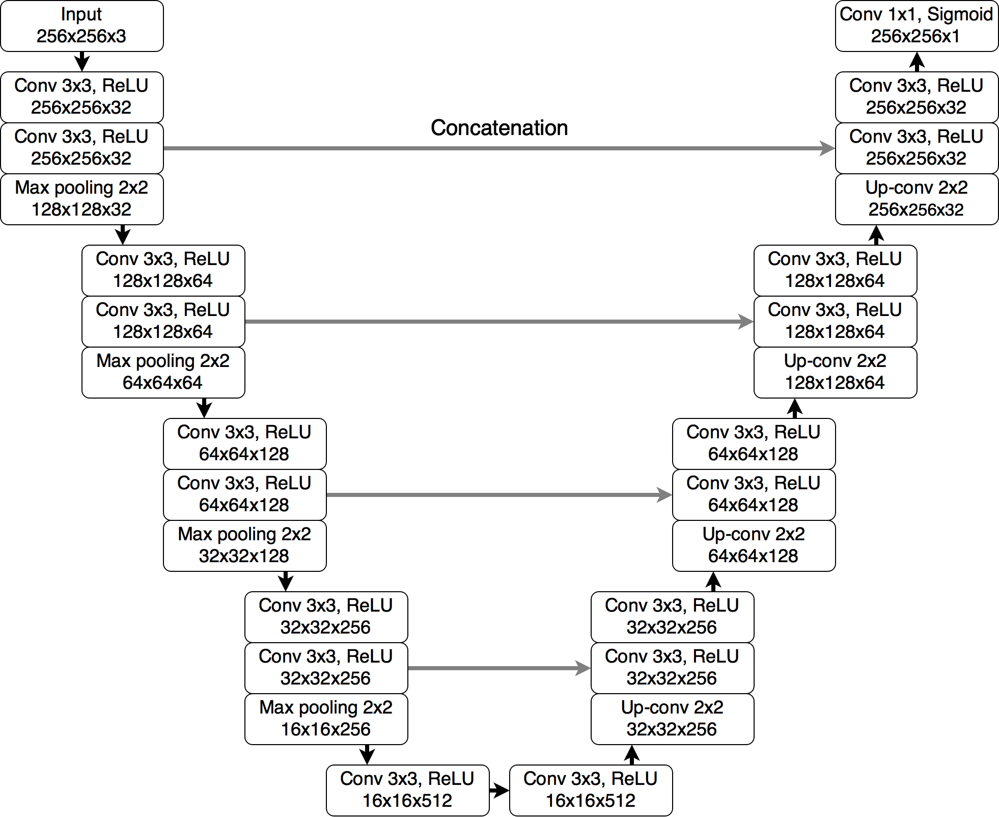
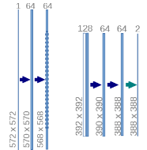

灰色的操作是 concatenate connection.

将 a contracting path (left side) and an expansive path (right side) 的四级的不同尺度的特征融合起来。

每个3x3的卷积都紧跟着ReLU，特征融合的左边都是ReLU后的结果。

左边：
- 2个3x3的卷积：特征通道的加倍, 原始图片特征通道数-> f -> fx2 -> fx4 -> fx8
- 卷积完后的特征将会传给右边。
- 2x2的最大池化：图片尺寸的下采样

中间的bottle-neck：
- 2个3x3的卷积：fx8 -> f*16

右边：
- 2x2的up-convolution：**图片尺寸的上采样，并且通道数减半**（并不是只想最大池化一样只修改尺寸）。bottle-neck 的 fx16 -> fx8 ->fx4 -> fx2 -> f
- concatenate: 左边卷积后的和右边up-convolution后的，通道数双倍了。fx16 -> fx8 ->fx4 -> fx2
- 2个3x3的卷积：特征通道的减半。fx8 ->fx4 -> fx2 -> f

最后：
- 1x1的卷积：输出图片的通道。f -> 输出图片特征通道数


Segmentation of a 512x512 image takes less than a second on a recent GPU.

## 细节
原本的unet是padding=0，从而图片尺寸越来越小，而且拼接的时候还得crop对齐；现在都是保持原图尺寸。




```python
class DoubleConv(nn.Module):
    def __init__(self, in_channels, out_channels):
        super(DoubleConv, self).__init__()
        self.double_conv = nn.Sequential(
            nn.Conv2d(in_channels, out_channels, 3, padding=1),
            # nn.BatchNorm2d(out_channels),
            nn.ReLU(inplace=True),
            nn.Conv2d(out_channels, out_channels, 3, padding=1),
            # nn.BatchNorm2d(out_channels),
            nn.ReLU(inplace=True)
        )

    def forward(self, x):
        return self.double_conv(x)
```


第一个卷积有通道变化，第二个通道不变。

