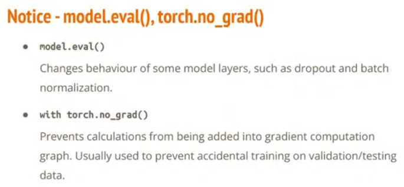
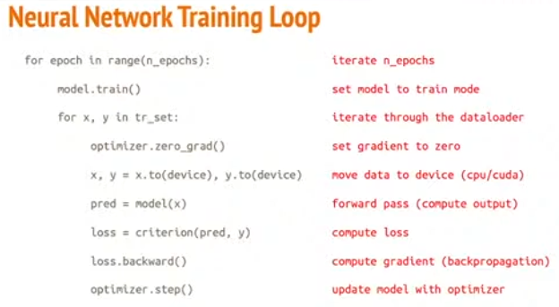
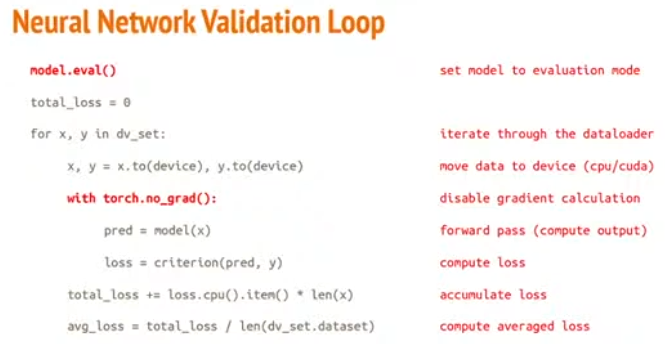
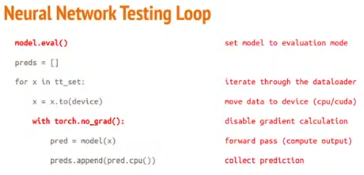

- [1. Net](#1-net)
  - [1.1. model 加载梯度与否](#11-model-加载梯度与否)
    - [1.1.1. 只关乎BN和Dropout](#111-只关乎bn和dropout)
      - [1.1.1.1. torch.no\_grad()](#1111-torchno_grad)
  - [1.2. loss 和 optimizer 的三者顺序](#12-loss-和-optimizer-的三者顺序)
  - [1.3. 训练、验证、测试](#13-训练验证测试)
- [2. train\_val](#2-train_val)

---
## 1. Net

### 1.1. model 加载梯度与否

  

#### 1.1.1. 只关乎BN和Dropout

`model.train()`的作用是启用 Batch Normalization 和 Dropout。在train模式，Dropout层会按照设定的参数p设置保留激活单元的概率，如keep_prob=0.8，Batch Normalization层会继续计算数据的mean和var并进行更新。

`model.eval()`的作用是不启用 Batch Normalization 和 Dropout。在eval模式下，Dropout层会让所有的激活单元都通过，而Batch Normalization层会停止计算和更新mean和var，直接使用在训练阶段已经学出的mean和var值。

`model.eval()`不会影响各层的梯度计算行为，即会和训练模式一样进行梯度计算和存储，只是不进行反向传播。

也就是说，没有用BN和Dropout的架构，就不用写这个。

##### 1.1.1.1. torch.no_grad()

只是防止梯度传递，没有梯度只节省一点点内存，OOM还是会发生。


### 1.2. loss 和 optimizer 的三者顺序

`loss.backward()`紧跟着就是`optimizer.step()`来完成梯度更新，所以只要`optimizer.zero_grad()`不写在二者中间就行。

也就是说，`optimizer.zero_grad()`可以写在for循环开始，还可以写在for循环中间`optimizer.step()`的前面，也可以写在for循环最后面，即`optimizer.step()`后面。

```python
for batch in train_loader:
    optimizer.zero_grad()

    outputs = model() 
    loss = loss()

    train_loss.backward()
    optimizer.step()
---
for batch in train_loader:
    outputs = model() 
    loss = loss()

    optimizer.zero_grad()
    train_loss.backward()
    optimizer.step()
---
for batch in train_loader:
    outputs = model() 
    loss = loss()

    train_loss.backward()
    optimizer.step()
    optimizer.zero_grad()
```

### 1.3. 训练、验证、测试

  


  


  


## 2. train_val

```python
def train(train_loader, val_loader, model, config, device):
    best_acc = 0.0
    for epoch in range(config['num_epoch']):
        train_acc = 0.0
        train_loss = 0.0
        val_acc = 0.0
        val_loss = 0.0

        # training
        model.train() # set the model to training mode
        for i, (x, y) in enumerate(train_loader):
            x, y = x.to(device), y.to(device)
            outputs = model(x) 
            batch_loss = loss(outputs, y)
            _, train_pred = torch.max(outputs, 1) # get the index of the class with the highest probability

            train_acc += (train_pred.cpu() == y.cpu()).sum().item()
            train_loss += batch_loss.item()
            
            batch_loss.backward() 
            optimizer.step() 
            optimizer.zero_grad() 


        # validation
        model.eval() # set the model to evaluation mode
        with torch.no_grad():
            for i, (x,y) in enumerate(val_loader):
                x, y = x.to(device), y.to(device)
                outputs = model(x)
                batch_loss = loss(outputs, y) 
                _, val_pred = torch.max(outputs, 1) 
            
                val_acc += (val_pred.cpu() == y.cpu()).sum().item() # get the index of the class with the highest probability
                val_loss += batch_loss.item()

            print(
                f'[{epoch + 1:03d}/{num_epoch:03d}]',
                f'Train Acc: {train_acc/len(train_loader.dataset):3.6f}',
                f'Loss: {train_loss/len(train_loader):3.6f}',
                f'| Val Acc: {val_acc/len(val_loader.dataset):3.6f}',
                f'loss: {val_loss/len(val_loader):3.6f}'
            )

            # if the model improves, save a checkpoint at this epoch
            if val_acc > best_acc:
                best_acc = val_acc
                torch.save(model.state_dict(), config['model_path'])
                print(f'saving model with acc {best_acc/len(val_loader.dataset):.3f}')

train(train_loader, val_loader, model, config, device)
```

```python
def test(test_loader, model, device):
    predict = []
    model.eval() # set the model to evaluation mode
    with torch.no_grad():
        for i, x in enumerate(test_loader):
            x = x.to(device)
            outputs = model(x)
            _, test_pred = torch.max(outputs, 1) # get the index of the class with the highest probability

            for y in test_pred.cpu().numpy():
                predict.append(y)

    return predict

# reload the best model
del model
model = Classifier().to(device)
ckpt = torch.load(config['model_path'], map_location='cpu') 
model.load_state_dict(ckpt)
predict = test(test_loader, model, device)
```