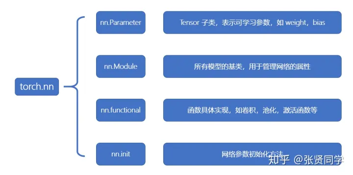

---

  

## 1. 父类的8个属性
`nn.Module` 有 8 个属性，都是`OrderDict`(有序字典)。在 LeNet 的`__init__()`方法中会调用父类`nn.Module`的`__init__()`方法，创建这 8 个属性。
```python
def __init__(self):
    """
    Initializes internal Module state, shared by both nn.Module and ScriptModule.
    """
    torch._C._log_api_usage_once("python.nn_module")

    self.training = True
    self._parameters = OrderedDict()
    self._buffers = OrderedDict()
    self._backward_hooks = OrderedDict()
    self._forward_hooks = OrderedDict()
    self._forward_pre_hooks = OrderedDict()
    self._state_dict_hooks = OrderedDict()
    self._load_state_dict_pre_hooks = OrderedDict()
    self._modules = OrderedDict()
```
`_parameters` 属性：存储管理 `nn.Parameter` 类型的参数
`_modules` 属性：存储管理 `nn.Module` 类型的参数
`_buffers` 属性：存储管理缓冲属性，如 BN 层中的 `running_mean`
5 个 `_xxx_hooks` 属性：存储管理钩子函数
其中比较重要的是 `_parameters` 和 `_modules` 属性。


## 3个容器 container

### ModelSequential

```python
class ModelSequential(nn.Module):
    def __init__(self, classes):
        super().__init__()
        self.features = nn.Sequential(
            nn.Conv2d(3, 6, 5),
            nn.ReLU(),
            nn.MaxPool2d(2, 2),
            nn.Conv2d(6, 16, 5),
            nn.ReLU(),
            nn.MaxPool2d(2, 2)
        )
        self.classifier = nn.Sequential(
            nn.Linear(16*5*5, 120),
            nn.ReLU(),
            nn.Linear(120, 84),
            nn.ReLU(),
            nn.Linear(84, classes)
        )

    def forward(self, x):
        x = self.features(x)
        x = x.view(x.size()[0], -1)
        x = self.classifier(x)
        return x
```

```python
class ModelSequential(nn.Module):
    def __init__(self, classes):
        super().__init__()

        self.features = nn.Sequential(OrderedDict({
            'conv1': nn.Conv2d(3, 6, 5),
            'relu1': nn.ReLU(inplace=True),
            'pool1': nn.MaxPool2d(kernel_size=2, stride=2),

            'conv2': nn.Conv2d(6, 16, 5),
            'relu2': nn.ReLU(inplace=True),
            'pool2': nn.MaxPool2d(kernel_size=2, stride=2),
        }))

        self.classifier = nn.Sequential(OrderedDict({
            'fc1': nn.Linear(16*5*5, 120),
            'relu3': nn.ReLU(),

            'fc2': nn.Linear(120, 84),
            'relu4': nn.ReLU(inplace=True),

            'fc3': nn.Linear(84, classes),
        }))
```

### ModuleDict

```python
class ModuleDict(nn.Module):
    def __init__(self):
        super().__init__()
        self.choices = nn.ModuleDict({
            'conv': nn.Conv2d(10, 10, 3),
            'pool': nn.MaxPool2d(3)
        })

        self.activations = nn.ModuleDict({
            'relu': nn.ReLU(),
            'prelu': nn.PReLU()
        })

    def forward(self, x, choice, act):
        x = self.choices[choice](x)
        x = self.activations[act](x)
        return x


net = ModuleDict()

fake_img = torch.randn((4, 10, 32, 32))

output = net(fake_img, 'conv', 'relu')
```
### ModuleList

[详解PyTorch中的ModuleList和Sequential](https://zhuanlan.zhihu.com/p/75206669)


网络中有很多相似或者重复的层
```python
class ModuleList(nn.Module):
    def __init__(self):
        self.views_linears = nn.ModuleList(
            [nn.Linear(W + W, W)] +
            [nn.Linear(W, W) for i in range(4)]
        )

    def forward(self, inputs):
        h = inputs
        for linear in self.views_linears:
            h = linear(h)
            h = F.relu(h)
```

> `nn.ModuleList([List])`不像`nn.Sequential()`能直接处理输入，必须用for循环列表的元素来一个个处理输入。

```python
# NotImplementedError: Module [ModuleList] is missing the required "forward" function
self.views_linears = nn.ModuleList(
    [nn.Linear(W + W, W), nn.ReLU()]
)
h = self.blocks(inputs)
```

> 不能用列表，只有用`nn.ModuleList([List])`包裹起来的列表才会被注册到整个网络中。
```python
# RuntimeError: Expected all tensors to be on the same device, but found at least two devices, cpu and cuda:1! (when checking argument for argument mat1 in method wrapper_CUDA_addmm)
self.views_linears = [nn.Linear(W + W, W)] + [nn.Linear(W, W) for i in range(4)]
```