- [1. 计算输出大小](#1-计算输出大小)
- [2. 卷积](#2-卷积)
  - [2.1. 核函数的个数](#21-核函数的个数)
  - [2.2. 特殊填充](#22-特殊填充)
  - [2.3. 1x1 卷积层](#23-1x1-卷积层)
  - [2.4. Transposed convolution](#24-transposed-convolution)
    - [2.4.1. stride](#241-stride)
  - [2.5. Dilated convolutions](#25-dilated-convolutions)
- [3. 池化](#3-池化)
  - [3.1. 最大汇聚层](#31-最大汇聚层)
  - [3.2. 平均汇聚层](#32-平均汇聚层)
  - [3.3. 全局平均汇聚层](#33-全局平均汇聚层)


---


- 卷积和池化都一样计算
- 卷积需要学习其参数，但池化不需要学习。
## 1. 计算输出大小

> 默认值

- 卷积: **stride=1, padding=0**

- 池化: **stride=kernel_size, padding=0** 

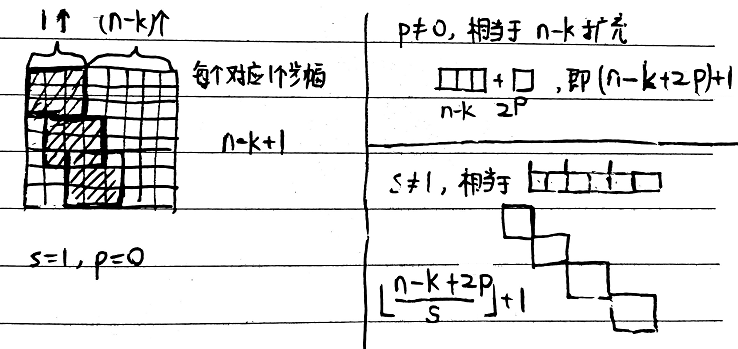  
 

> 具体展开

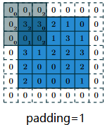  

通式
- zero padding(意思不是p=0，而是有“零填充”，反义词是without zero padding), non-unit strides
    假设输入形状为$n$，卷积核形状为$k$，填充 $p$ (填充半边的个数，number of zeros concatenated at the beginning or at the end of an axis), 垂直步幅为$s$时, 输出形状为

    $$\lfloor\dfrac{(n-k+2p+s)}{s}\rfloor$$
    即，$$\lfloor\dfrac{(n-k+2p)}{s}\rfloor + 1$$

特例：
- without zero padding, unit strides（默认情况，p=0, s=1）时,
    $$(n-k)+1$$
        
- zero padding, unit strides
    $$(n-k+2p)+1$$

- Half(same) padding (使输入和卷积输出具有相同的高度和宽度)
    $p=(k-1)/2$, k是奇数, 默认步幅s=1时

    $$(n-k+2p)+1=(n-k+k-1)+1=n$$
    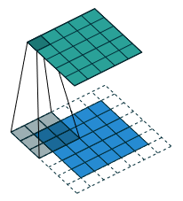  

    
- Full padding ($p = k − 1$，然后输出的图片整个轴一共多了 $k − 1$) .
    即$p = k − 1$ and s = 1

    $$(n-k+2p)+1=(n-k+2k-2)+1=n+(k-1)$$

    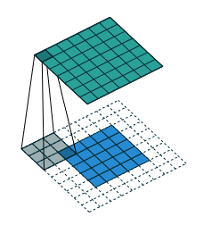  

- 特殊填充$p=k-1$(使输入和卷积输出具有相同的高度和宽度)，特殊步幅 non-unit stride 时

    $$\lfloor \dfrac{(n-k+k-1)}{s}\rfloor+1=\lfloor\dfrac{(n-1)}{s}\rfloor+1$$

    且输入可以被步幅整除时 $n\%s=0$, 有 $\lfloor\dfrac{(n-1)}{s}\rfloor=\dfrac{n}{s}-1$, 则
    $$\dfrac{n}{s}$$


- without zero-padding, non-unit strides
    即 $ p = 0, s \neq 1$
    $$\lfloor\dfrac{(n-k)}{s}\rfloor + 1$$
    - 特殊步幅$s=k$, p=0(即默认池化)
        $$\lfloor\dfrac{(n-k)}{s}\rfloor+1=\lfloor \dfrac{n}{s} \rfloor$$


## 2. 卷积

### 2.1. 核函数的个数

核函数的个数等于输入通道数乘以输出通道数。

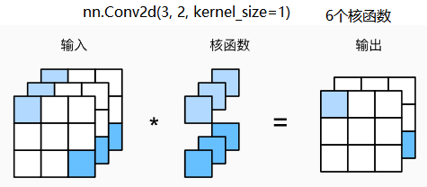  

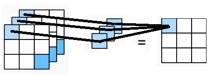  

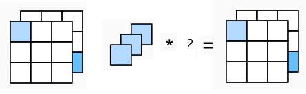  


### 2.2. 特殊填充

使用奇数的核大小提供了便利, 我们可以在顶部和底部填充相同数量的行，在左侧和右侧填充相同数量的列。例如1,3,5,7.

```python
class Conv2d(
    in_channels: int,
    out_channels: int,
    kernel_size: _size_2_t,
    stride: _size_2_t = 1,
    padding: _size_2_t | str = 0,
    dilation: _size_2_t = 1,
    groups: int = 1,
    bias: bool = True,
    padding_mode: str = 'zeros',
    device: Any | None = None,
    dtype: Any | None = None
)

nn.Conv2d(1, 1, 3, 1, 1)
nn.Conv2d(1, 1, kernel_size=3, stride=1, padding=1)
```
```python
## Half padding
net = nn.Conv2d(1, 1, kernel_size=3, padding=1)

X = torch.rand(1, 1, 4, 4)  # B, C, H, W
net(X).shape
# torch.Size([1, 1, 4, 4])


# 特殊填充 + 特殊步幅
net = nn.Conv2d(1, 1, kernel_size=3, stride=2, padding=1)
X = torch.rand(1, 1, 4, 4)
net(X).shape
# torch.Size([1, 1, 2, 2])
# (4 - 3 + 2 * 1) // 2 + 1 = 2
```

```python
conv2 = nn.Conv2d(4, 5, 3, 1, 1)
print(conv2])
# Conv2d(4, 5, kernel_size=(3, 3), stride=(1, 1), padding=(1, 1))
print(conv2.in_channels)
# 4
print(conv2.out_channels)
# 5
print(conv2.kernel_size)
```
### 2.3. 1x1 卷积层


输入和输出具有相同的高度和宽度。

我们可以将 $1\times 1$ 卷积层看作是在每个像素位置应用的全连接层，输出中的每个元素都是从输入图像中同一位置的元素的线性组合，以$c_i$个输入值转换为$c_o$个输出值。同时，$1\times 1$卷积层需要的权重维度为$c_o\times c_i$，再额外加上一个偏置。

PS: 我们常用1x1卷积核的卷积层来改变通道数(输入通道$c_i$个$\to$输出通道$c_o$个)

PS: NiN模型中用1x1卷积核的卷积层来充当全连接层的作用(连接所有通道中同一个ij的像素点).

### 2.4. Transposed convolution

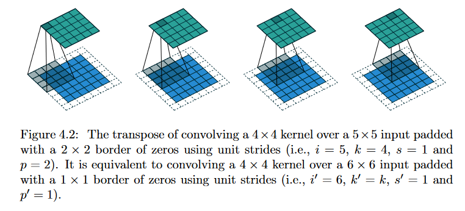  


原本是自上而下的正常卷积，5x5卷出6x6。现在，想要反卷积，6x6到5x5。kernel_size取一样，请问padding取多少？

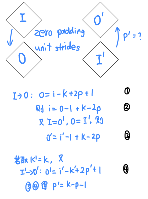  
 

然后下面的padding取1，就可以卷积出上面的了。


> 通式

用现在的 $k', s', p'$来表示：
$$o'=\lfloor\dfrac{(i'-k'+2p')}{s'}\rfloor + 1$$
或者用原本的 $k, s, p$ 来表示
$$o' = s(i' − 1)  + k − 2p + (i'-k+2p)\%s$$

下面代码 `nn.ConvTranspose2d` 就是后者的公式，其 `kerner_size`, `stride` 和 `padding` 都是指原本的 $k, s, p$. 

- 但是 $(i'-k+2p)\%s$ 并没有，而是用 `output_padding`参数，$ \text{output\_padding} = (i'-k+2p)\%s$（添加到输出形状中的**一侧**的附加大小。默认值：0。output padding must be smaller than either stride or dilation），要求我们手动输入。


    ```python
    net = nn.Conv2d(1, 1, kernel_size=3, stride=2, padding=1)
    I = torch.rand(1, 1, 4, 4)
    O = net(X)
    # torch.Size([1, 1, 2, 2])

    net_reverse = nn.ConvTranspose2d(1, 1, kernel_size=3, stride=2, padding=1, output_padding=1)
    I_prime = O
    O_prime = net_reverse(I_prime)
    # torch.Size([1, 1, 4, 4])
    # 2*(2-1) + 3 - 2*1 + 1 = 4
    ```
- 或者指定 `output_size`, 让其自动计算 `output_padding`参数
    ```python
    net = nn.Conv2d(1, 1, kernel_size=3, stride=2, padding=1)
    I = torch.rand(1, 1, 4, 4)
    O = net(X)
    # torch.Size([1, 1, 2, 2])

    net_reverse = nn.ConvTranspose2d(1, 1, kernel_size=3, stride=2, padding=1)
    I_prime = O
    O_prime = net_reverse(I_prime, output_size=I.shape)
    # torch.Size([1, 1, 4, 4])
    ```


> 例子：u-net里的upsample————反池化

对应卷积里的 without padding, p=0, s=k, 输出是$\dfrac{n}{s}$。
```python
up = nn.ConvTranspose2d(c, c//2, kernel_size=2, stride=2)
```

PS: “特殊填充p=k-1, 特殊步幅 non-unit stride 时”，则不行： $o'=s(i'-1)+k-2(k-1)=si'-k+2-s$, 当s=2时，$o'=si'-k$，k又不能等于0，当然不嫌弃麻烦还可以用`output_padding=k`, 注意这里k要小于padding
```python
up = nn.ConvTranspose2d(c, c//2, 1, 2, 0, output_padding=1) 
```
#### 2.4.1. stride

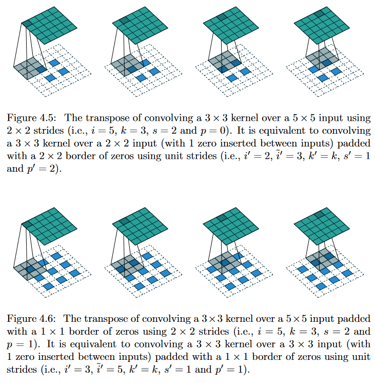  

其实这是一种stride的理解方式，相当于在原来k个元素中每隔几个才保留，其他都舍弃:
- stride=2，保留奇数，舍弃偶数的。

### 2.5. Dilated convolutions

空洞卷积，公式还是卷积的公式，引入的空洞参数 $d$ 相当于扩展了核的大小。

$$\hat k = k+(k-1)(d-1)$$

意思是，相当于在原来k个元素之间插入d-1个0:
- d=1：原本卷积
- d>1：空洞

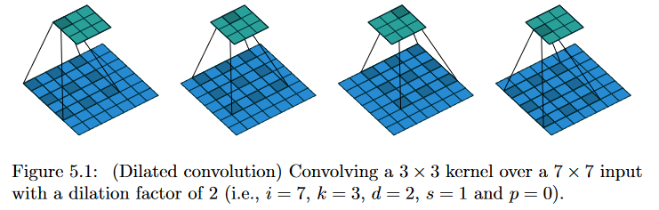  


## 3. 池化

- 两种
    我们通常计算汇聚窗口中所有元素的最大值或平均值。这些操作分别称为最大汇聚层（maximum pooling）和平均汇聚层（average pooling)

- 默认 stride=kernel_size (because usually **non-overlapping patches**)
    ```python
    nn.MaxPool2d(kernel_size, stride=kernel_size, padding=0) 
    ```

- 输出通道数与输入通道数相同
    在处理多通道输入数据时，汇聚层在每个输入通道上单独运算，而不是像卷积层一样在通道上对输入进行汇总。

### 3.1. 最大汇聚层

```python
# net = nn.MaxPool2d(kernel_size=2, stride=2, padding=0) 
net = nn.MaxPool2d(2)
X = torch.arange(16, dtype=torch.float32).reshape(1, 4, 4)
net(X)

'''
tensor([[[ 5.,  7.],
        [13., 15.]]])
'''


net = nn.MaxPool2d(2, stride=1)
X = torch.arange(9, dtype=torch.float32).reshape(1, 3, 3)
net(X)
'''
tensor([[[4., 5.],
         [7., 8.]]])
'''


# padding 也是上下各填充
net = nn.MaxPool2d((2, 3), padding=(1, 0), stride=1)
X = torch.arange(8, dtype=torch.float32).reshape(1, -1, 4)
net(X)
'''
tensor([[[2., 3.],
          [6., 7.],
          [6., 7.]]])
'''

# 两个通道
net = nn.MaxPool2d(2, stride=1)
X = torch.arange(12, dtype=torch.float32).reshape(2, -1, 3)
net(X)
'''
tensor([[[ 4.,  5.]],

        [[10., 11.]]])
'''
```

### 3.2. 平均汇聚层

```python
net = nn.AvgPool2d(2, stride=1)
X = torch.arange(9, dtype=torch.float32).reshape(1, 3, 3)
net(X)
'''
 tensor([[[2., 3.],
          [5., 6.]]])
'''
```

### 3.3. 全局平均汇聚层

将每个通道的 $h \times w$ 图像汇聚成 output_size

```python
# nn.AdaptiveAvgPool2d(output_size)

# 输出的尺寸是(1, 1)
net = nn.AdaptiveAvgPool2d((1, 1))
X = torch.arange(16, dtype=torch.float32).reshape(1, 4, 4)
net(X)
# tensor([[[7.5000]]]))


# 1个样本, 3通道, 4x4图像
net = nn.AdaptiveAvgPool2d((1, 1))
X = torch.arange(48, dtype=torch.float32).reshape(1, 3, 4, 4)
net(X)
'''
tensor([[[[ 7.5000]],
 
          [[23.5000]],
 
          [[39.5000]]]]))
'''
```