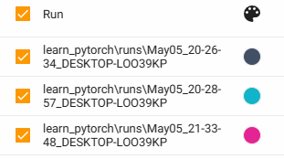
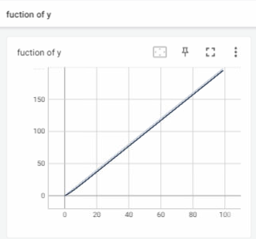
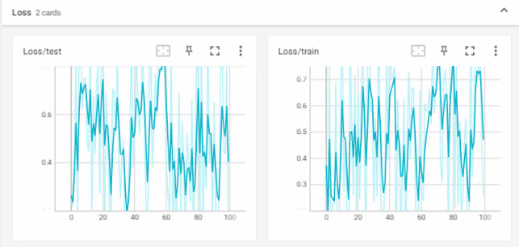
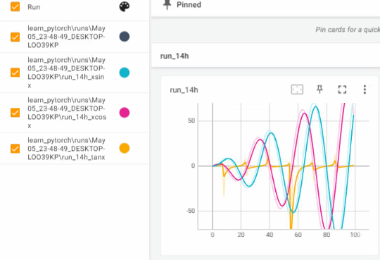
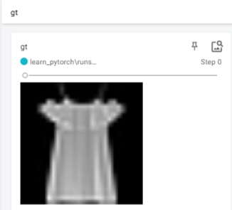
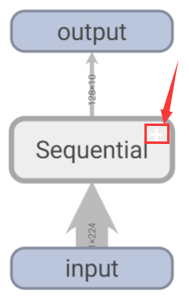
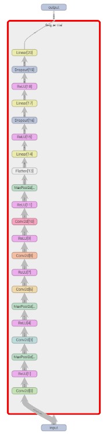

- [1. Installation](#1-installation)
- [2. 创建SummaryWriter()](#2-创建summarywriter)
- [3. 写入](#3-写入)
  - [3.1. scalar](#31-scalar)
    - [3.1.1. add\_scalar](#311-add_scalar)
    - [3.1.2. add\_scalars](#312-add_scalars)
  - [3.2. images](#32-images)
    - [add\_image](#add_image)
    - [3.2.1. add\_images](#321-add_images)
  - [3.3. net graph](#33-net-graph)
  - [3.4. 网络例子](#34-网络例子)
- [4. share](#4-share)

---

## 1. Installation

```python
pip install tensorboard
```

> Can I run tensorboard without a TensorFlow installation?

TensorBoard 1.14+ **can be run** with a reduced feature set if you do not have TensorFlow installed. 

The primary limitation is that as of 1.14, only the following plugins are supported: scalars, custom scalars, image, audio, graph, projector (partial), distributions, histograms, text, PR curves, mesh.

> Duplicate plugins for name projector

运行`tensorboard --logdir=runs`，打开后什么也没有。这是tensorboard安装的问题。

https://github.com/pytorch/pytorch/issues/22676

```bash
# 看看是不是日志的问题
# 显示有日志，那说明没问题
tensorboard --inspect --logdir=runs
```
```bash
pip uninstall tensorboard tb-nightly tensorflow-estimator tensorflow-gpu tf-estimator-nightly torch-tb-profiler
```

```python
import pkg_resources

for entry_point in pkg_resources.iter_entry_points('tensorboard_plugins'):
    print(entry_point.dist)
```
I had a strange package installed, `~ensorboard` and `~ensorboard-2.12.0.dist-info` in `envs\nerf\lib\site-packages` and deleted the directories.

Then reinstall `pip install tensorboard`, ok!


> 使用tensorboard启动之后，想再启动一个新的event发现还是原来的，而且浏览器scalars左下角的目录也仍然是第一次的目录。

通过CTRL+C的退出的时候会有问题, 无法正常关闭。这样退出之后，在浏览器输入地址还是可以看到第一次的event信息。

1. 手动杀死进程。
2. 后来想再开启另一个event的时候只能指定port。
3. 指定全局tensorboard路径，这样就不用担心各自工程路径下的tensorboard路径。
```bash
tensorboard --logdir=D:/tensorboard

writer = SummaryWriter('D:/tensorboard/exp_N1')
```


## 2. 创建SummaryWriter()

`SummaryWriter()`分为有参和无参的两种形式.

- 无参的: 是创建在`runs`文件夹下, 按日期再创子文件夹, 同时显示不同的记录.

```bash
runs
├── May05_20-26-34_DESKTOP-LOO39KP
│   └── events.out.tfevents.1683289594.DESKTOP-LOO39KP.1936.0
├── May05_20-28-57_DESKTOP-LOO39KP
│   └── events.out.tfevents.1683289737.DESKTOP-LOO39KP.1936.3
└── May05_21-33-48_DESKTOP-LOO39KP
    └── events.out.tfevents.1683293628.DESKTOP-LOO39KP.1936.6
```
  

- 有参的: 则是创建在指定文件夹下, 只显示一个最新的记录.
```bash
logs
├── events.out.tfevents.1683298987.DESKTOP-LOO39KP.1936.7
└── events.out.tfevents.1683298989.DESKTOP-LOO39KP.1936.8
```
  


  
所以, 一般有参的话, 如果是超参数调整时, 应该传入不同的文件夹名`logs-100`和`logs-200`, 而不是都是 `logs`(看不到另一个参数). 然后

`tensorboard --logdir=..`(`..`为`logs-100`和`logs-200`的共同父亲目录, 这样就能在一起显示)

Argument `logdir` points to directory where TensorBoard will look to find event files that it can display. TensorBoard will recursively walk the directory structure rooted at `logdir`, looking for `.*tfevents.*` files.

## 3. 写入
```python
from torch.utils.tensorboard import SummaryWriter

# 创建
writer = SummaryWriter()

# 刷入
writer.flush()

# 关闭
writer.close()
```

### 3.1. scalar

#### 3.1.1. add_scalar

`add_scalar(tag, scalar_value, global_step=None, walltime=None)`

```python
from torch.utils.tensorboard import SummaryWriter

# 创建
writer = SummaryWriter()

for i in range(100):
    # 图的名字, y轴, x轴
    writer.add_scalar('fuction of y', i * 2, i)
    
# 关闭
writer.close()
```
  

```python
from torch.utils.tensorboard import SummaryWriter
import numpy as np

writer = SummaryWriter()

for n_iter in range(100):
    writer.add_scalar('Loss/train', np.random.random(), n_iter)
    writer.add_scalar('Loss/test', np.random.random(), n_iter)
    
writer.close()
```
  

#### 3.1.2. add_scalars
```python
from torch.utils.tensorboard import SummaryWriter

writer = SummaryWriter()

r = 5
for i in range(100):
    writer.add_scalars('run_14h',
                       {
                           'xsinx': i*np.sin(i/r),
                           'xcosx': i*np.cos(i/r),
                           'tanx': np.tan(i/r)
                       },
                       i)
writer.close()
```
  

### 3.2. images

#### add_image

- `img`： numpy array, torch tensor
- `dataformats `: Image data format specification of the form `CHW`, `HWC`, `HW`, `WH`, etc.

- tensor
```python
from torch.utils.tensorboard import SummaryWriter

# X.shape = torch.Size([128, 1, 224, 224])
X, y = next(iter(test_iter))

writer = SummaryWriter()
# writer.add_image(tag, img, global_step, dataformats='CHW')
# dataformats: CHW, HWC, HW, WH
writer.add_image('gt', X[0], 0, dataformats='HWC')
writer.close()
```
  

- ndarry

```python
from torch.utils.tensorboard import SummaryWriter
from skimage import io

# (111, 189, 3)
img = io.imread(r'images\494f271c9bdece36a1cc2ae66913f16d296c1f6e0c852278769c7f233c658166.png')

writer = SummaryWriter()
writer.add_image('gt_ndarry', img, 0, dataformats='HWC')
writer.close()
```
  


#### 3.2.1. add_images
- `dataformats `: Image data format specification of the form `NCHW`, `NHWC`, `CHW`, `HWC`, `HW`, `WH`, etc.
```python
# dataformats (str): Image data format specification of the form NCHW, NHWC, CHW, HWC, HW, WH, etc.
# imgs：
# - 可以是一个，(1, H, W, C)
# - 可以全是[0,255]或者全是[0.0, 1.0]，但不能混着来
writer.add_images('gt', imgs, 0, dataformats='NHWC')
```
  

### 3.3. net graph
```python
import torch
# torchvision.datasets.FashionMNIST
import torchvision
# 修改数据集格式
from torchvision import transforms
# data.DataLoader
from torch.utils import data
# nn块
from torch import nn
from torch.utils.tensorboard import SummaryWriter


# 列表
trans = [
    transforms.Resize((224, 224)),
    transforms.ToTensor(),
]
# 转化列表为torchvision.transforms.transforms.Compose对象, 这样就能写 transform=trans
trans = transforms.Compose(trans)
mnist_train_totensor = torchvision.datasets.FashionMNIST(
    root="../data",
    train=True,
    download=True,
    transform=trans
)

# shuffle, 打乱
# num_workers, 使用4个进程来读取数据
batch_size = 128
train_iter = data.DataLoader(
    mnist_train_totensor, batch_size, shuffle=True, num_workers=4)
X, y = next(iter(train_iter))
X = X.to(device)


device = torch.device('cuda:0')
net = nn.Sequential(
    # 这里，我们使用一个11*11的更大窗口来捕捉对象。
    # 同时，步幅为4，以减少输出的高度和宽度。
    # 另外，输出通道的数目远大于LeNet
    nn.Conv2d(1, 96, kernel_size=11, stride=4, padding=1),
    nn.ReLU(),
    nn.MaxPool2d(kernel_size=3, stride=2),
    
    # 减小卷积窗口，使用填充为2来使得输入与输出的高和宽一致，且增大输出通道数
    nn.Conv2d(96, 256, kernel_size=5, padding=2),
    nn.ReLU(),
    nn.MaxPool2d(kernel_size=3, stride=2),
    
    # 使用三个连续的卷积层和较小的卷积窗口。
    # 除了最后的卷积层，输出通道的数量进一步增加。
    # 在前两个卷积层之后，汇聚层不用于减少输入的高度和宽度
    nn.Conv2d(256, 384, kernel_size=3, padding=1),
    nn.ReLU(),
    
    nn.Conv2d(384, 384, kernel_size=3, padding=1),
    nn.ReLU(),
    
    nn.Conv2d(384, 256, kernel_size=3, padding=1),
    nn.ReLU(),
    nn.MaxPool2d(kernel_size=3, stride=2),
    
    nn.Flatten(),
    # 这里，全连接层的输出数量是LeNet中的好几倍。使用dropout层来减轻过拟合
    
    nn.Linear(6400, 4096),
    nn.ReLU(),
    nn.Dropout(p=0.5),
    
    nn.Linear(4096, 4096),
    nn.ReLU(),
    nn.Dropout(p=0.5),
    
    # 最后是输出层。由于这里使用Fashion-MNIST，所以用类别数为10，而非论文中的1000
    nn.Linear(4096, 10)
).to(device)

writer = SummaryWriter()
# writer.add_graph(model, input_to_model)
writer.add_graph(net, X)
writer.close()
```
  
  
  

### 3.4. 网络例子
```python
writer = SummaryWriter()
# 训练
for epoch in range(num_epochs):
    total_train_loss = train_loop(train_iter, net, loss, optimizer)
    writer.add_scalar('epoch', total_train_loss, epoch+1)
writer.close()
```

## 4. share 
```bash
$ tensorboard dev upload --logdir runs \
--name "My latest experiment" \ # optional
--description "Simple comparison of several hyperparameters" # optional
```
Uploaded TensorBoards are **public and visible to everyone**. Do not upload sensitive data.

View your TensorBoard live at URL provided in your terminal. E.g. https://tensorboard.dev/experiment/AdYd1TgeTlaLWXx6I8JUbA

