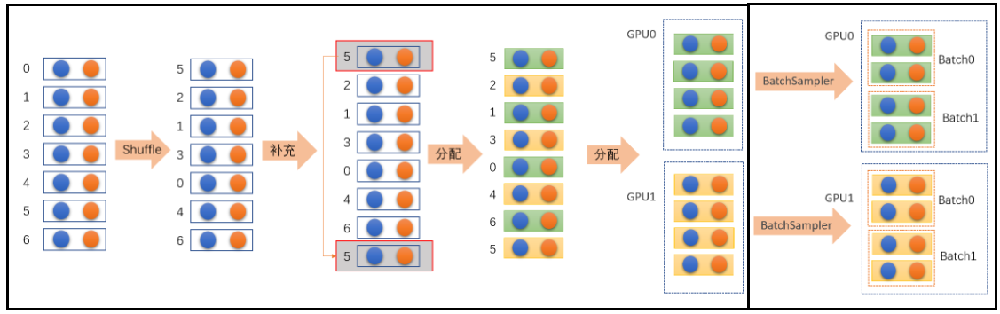

- [1. 单机多卡 DataParallel](#1-单机多卡-dataparallel)
- [2. 分布式计算实现多机多卡 DistributedDataParallel](#2-分布式计算实现多机多卡-distributeddataparallel)
  - [2.1. 代码](#21-代码)
    - [2.1.1. 初始化进程组 process group](#211-初始化进程组-process-group)
    - [2.1.2. 模型](#212-模型)
    - [2.1.3. sampler](#213-sampler)
  - [2.2. launch](#22-launch)
    - [2.2.1. torch.multiprocessing](#221-torchmultiprocessing)
      - [2.2.1.1. 不能直接写](#2211-不能直接写)
    - [2.2.2. torchrun](#222-torchrun)


---

配合设置 `os.environ['CUDA_VISIBLE_DEVICES'] = '0,2'`

- always `torch.nn.parallel.DistributedDataParallel`

    单机多卡时，`DistributedDataParallell` 也比 `DataParallel` 的速度更快
  
## 1. 单机多卡 DataParallel

单进程多线程：
- 线程对于单个机子上的GPU数


`torch.nn.DataParallel(module, device_ids=None, output_device=None, dim=0)
`

- `module` : 表示定义的模型，也就是需要加载到GPU上的模型对象

- `device_ids` : 表示训练时候需要使用的GPU设备集合。

    默认全部设备。
    ```python
    net = nn.DataParallel(net)    # 默认全部GPU
    net = nn.DataParallel(net, device_ids=[0,1])    # 指定GPU
    ```
- `output_device` : 输出的结果 和 后续的loss计算 都在该设备上，所以第一块卡的显存占用比其他卡要多一些。

    默认是第一块GPU卡上。


> 核心

实现简单，只需要使用 `torch.nn.DataParallel` 将模型wrap（包装）一下：

```python
from torch import nn
net = nn.Sequential(nn.Linear(3, 1)).cuda()

net = nn.DataParallel(net)
```

- 先`net.cuda()` 还是先 `nn.DataParallel(net)`都行, 但是必须有`net.cuda()`。

- `net.to(device)`或`net.cuda()`都行，只要送到GPU上。

- 送到哪个GPU上无所谓, 反正都会再复制到**所有指定的**GPU `device_ids` 上.

> 例子


```python
import torch
from torch import nn
from torch.utils.data import DataLoader, Dataset

device = torch.device("cuda")
if torch.cuda.device_count() > 1:
    print("Let's use", torch.cuda.device_count(), "GPUs!")


class RandomDataset(Dataset):
    def __init__(self, length, feature):
        self.len = length
        self.data = torch.randn(length, feature)

    def __getitem__(self, index):
        return self.data[index]

    def __len__(self):
        return self.len


class Model(nn.Module):
    def __init__(self, input_size, output_size):
        super().__init__()
        self.fc = nn.Linear(input_size, output_size)

    def forward(self, input):
        output = self.fc(input)
        print("\tIn Model: input size", input.size(),
              "output size", output.size())
        return output


model = Model(5, 2).to(device)
model = nn.DataParallel(model)

rand_dataset = RandomDataset(length=100, feature=5)
rand_loader = DataLoader(rand_dataset, batch_size=30, shuffle=True)
for data in rand_loader:
    inputs = data.to(device)
    outputs = model(inputs)
    print("Outside: input size", inputs.size(),
          "output_size", outputs.size())
```

对于后续的loss计算，由于来自与多个GPU中，因此需要取一下平均（多维的）：

```python
if gpu_count>1:
    loss = loss.mean()
```

正常执行就行。

```bash
$ python a.py
Let's use 2 GPUs!
        In Model: input size torch.Size([15, 5]) output size torch.Size([15, 2])
        In Model: input size torch.Size([15, 5]) output size torch.Size([15, 2])
Outside: input size torch.Size([30, 5]) output_size torch.Size([30, 2])
        In Model: input size torch.Size([15, 5]) output size torch.Size([15, 2])
        In Model: input size torch.Size([15, 5]) output size torch.Size([15, 2])
Outside: input size torch.Size([30, 5]) output_size torch.Size([30, 2])
        In Model: input size torch.Size([15, 5]) output size torch.Size([15, 2])
        In Model: input size torch.Size([15, 5]) output size torch.Size([15, 2])
Outside: input size torch.Size([30, 5]) output_size torch.Size([30, 2])
        In Model: input size torch.Size([5, 5]) output size torch.Size([5, 2])
        In Model: input size torch.Size([5, 5]) output size torch.Size([5, 2])
Outside: input size torch.Size([10, 5]) output_size torch.Size([10, 2])
```
每一次前向传递 `forward()` 中复制模型（如此重复所以效率低）。然后将数据划分输入到各个GPU的模型中。

可以看到在 Dataloader 的循环中，一个batch_size的输入被分配给两个GPU上的模型，每个模型执行半个batch_size的数据。最后再合并输出为batch_size。
- `[30,5]`->`[15,5]`,`[15,5]`->`[15,2]`,`[15,2]`->`[30,2]`
- `[10,5]`->`[5,5]`,`[5,5]`->`[5,2]`,`[5,2]`->`[10,2]`


## 2. 分布式计算实现多机多卡 DistributedDataParallel

- 每个节点 Node 对应一台机器
- 每个进程 Process 对应一个GPU。
- 所有的进程，即所说的 process_group, world.
- 模型在每个进程上都被复制，每个模型副本都将被提供一组不同的输入数据样本


### 2.1. 代码

使用DDP的应用程序应该生成多个进程，并为每个进程创建一个DDP实例

关键:
- `torch.distributed.init_process_group(backend="nccl")`
- `rank = torch.distributed.get_rank()`: 当前rank
- `model = ToyModel().to(device)`, `ddp_model = nn.parallel.DistributedDataParallel(model, device_ids=[device])`


#### 2.1.1. 初始化进程组 process group

进程组是要同步的设备。

```python
torch.distributed.init_process_group(
    backend='nccl', 
    init_method='tcp://localhost:23456', 
    world_size=1,
    rank=0
)
```
- `backend`
  
    后端，实际上是多个机器之间交换数据的协议。

    `mpi`, `gloo`(windows只支持这个), `nccl`（性能最好）, and `ucc`.
  
- `init_method`
  
    指定主机的地址。

    windows 只支持 `FileStore` 和 `Tcp Store`

    - `FileStore`: 
        
        这意味着每个进程都将打开文件，写入其信息
        
        `init_method='file:///f:/libtmp/some_file'`
    - `TcpStore`: 
        
        `init_method='tcp://127.0.0.1:12345'`(主机的ip)
    - ? : `init_method='env://'`

- `world_size`
  
    进程个数，其实就是机器个数

- `rank`：
    
    表示当前进程的序号。
    
    分为主机和从机的, 主节点为`0`, 剩余的为`1`到`rank-1`.
#### 2.1.2. 模型

提前把模型在DDP构建时间时复制到gpu（而不是像 DataParallel 在每个前向过程中重复复制）, 然后才可以加载到 DistributedDataParallel

```python
model = model.cuda()
model = nn.parallel.DistributedDataParallel(model)
```


#### 2.1.3. sampler

`torch.utils.data.distributed.DistributedSampler` 打乱和补充数据，然后分配给各GPU
  
```python
class DistributedSampler(
    dataset: Dataset,
    num_replicas: int | None = None,
    rank: int | None = None,
    shuffle: bool = True,
    seed: int = 0,
    drop_last: bool = False
)
```

  


### 2.2. launch

#### 2.2.1. torch.multiprocessing

##### 2.2.1.1. 不能直接写

```python
os.environ["MASTER_ADDR"] = "localhost"
os.environ["MASTER_PORT"] = "29500"
world_size = 2
mp.spawn(example,
    args=(world_size,),
    nprocs=world_size,
    join=True)

# 报错
# torch.multiprocessing.spawn.ProcessExitedException: process 0 terminated with exit code 1
```

最后的启动必须`if __name__=="__main__":`包裹起来

- 单文件
  
    ```python
    if __name__=="__main__":
        os.environ["MASTER_ADDR"] = "localhost"
        os.environ["MASTER_PORT"] = "29500"
        world_size = 2
        mp.spawn(example,
            args=(world_size,),
            nprocs=world_size,
            join=True)
    ```
- 多文件
  
    ```python
    # a.py

    def sss():
        os.environ["MASTER_ADDR"] = "localhost"
        os.environ["MASTER_PORT"] = "29500"
        world_size = 2
        mp.spawn(example,
            args=(world_size,),
            nprocs=world_size,
            join=True)
    ```

    ```python
    # b.py
    import a

    if __name__=="__main__":    # 去掉就是不行
        a.sss()
    ```

```python
import os

import torch
import torch.distributed as dist
import torch.multiprocessing as mp
from torch import nn
from torch.nn.parallel import DistributedDataParallel as DDP
from torch.utils.data import DataLoader, Dataset
from torch.utils.data.distributed import DistributedSampler

from tqdm import tqdm

class RangeDataset(Dataset):
    def __init__(self, length):
        self.len = length
        self.data = torch.arange(0, length, dtype=torch.float32)

    def __getitem__(self, index):
        return self.data[index]

    def __len__(self):
        return self.len


class Model(nn.Module):
    def __init__(self, input_size, output_size):
        super().__init__()
        self.fc = nn.Linear(input_size, output_size)

    def forward(self, input):
        output = self.fc(input)
        return output


def demo_basic(rank, world_size):
    # 当前设备
    print(f"Running basic DDP example on rank {rank}.")

    # init_process_group
    # 表示使用 tcp
    os.environ["MASTER_ADDR"] = "localhost"
    os.environ["MASTER_PORT"] = "12355"
    dist.init_process_group("gloo", rank=rank, world_size=world_size)

    train(rank)

    # destroy_process_group
    dist.destroy_process_group()


def train(rank):
    # create model and move it to GPU with id rank
    model = Model(5, 2).to(rank)
    model = DDP(model, device_ids=[rank])

    # DataLoader
    rand_dataset = RangeDataset(length=10)
    rand_distributed_sampler = DistributedSampler(rand_dataset, rank=rank, shuffle=True)
    # `sampler`和`shuffle`是互斥的，或者说 sampler 中自己就已经 shuffle了，所以不用 dataloader 再shuffle
    rand_dataloader = DataLoader(rand_dataset, batch_size=5, sampler=rand_distributed_sampler)
    
    for epoch in range(10):
        rand_distributed_sampler.set_epoch(epoch)
        # 因为是同步的进度，所以只显示一个进程的进度条就行
        pbar = tqdm(rand_dataloader) if rank == 0 else rand_dataloader
        for data in pbar:
            inputs = data.to(rank)
            outputs = model(inputs)

        loss_fn = nn.MSELoss()
        optimizer = torch.optim.SGD(model.parameters(), lr=0.001)
        labels = torch.randn(outputs.shape).to(rank)
        loss = loss_fn(outputs, labels)
        loss.backward()
        optimizer.step()
        optimizer.zero_grad()


if __name__ == "__main__":
    if torch.cuda.device_count() > 1:
        print("Let's use", torch.cuda.device_count(), "GPUs!")

    world_size = 2
    mp.spawn(demo_basic, args=(world_size,), nprocs=world_size, join=True)
```

model parallel 是指模型太大而拆分在多个GPU上。
```python
import os
import sys
import tempfile

import torch
import torch.distributed as dist
import torch.multiprocessing as mp
import torch.nn as nn
import torch.optim as optim
from torch.nn.parallel import DistributedDataParallel as DDP


class ToyModel(nn.Module):
    def __init__(self):
        super().__init__()
        self.net1 = nn.Linear(10, 10)
        self.relu = nn.ReLU()
        self.net2 = nn.Linear(10, 5)

    def forward(self, x):
        return self.net2(self.relu(self.net1(x)))
    
class ToyMpModel2(nn.Module):
    def __init__(self, dev0, dev1):
        super().__init__()
        self.dev0 = dev0
        self.dev1 = dev1
        self.net1 = torch.nn.Linear(10, 10).to(dev0)
        self.relu = torch.nn.ReLU()
        self.net2 = torch.nn.Linear(10, 5).to(dev1)

    def forward(self, x):
        x = x.to(self.dev0)
        x = self.relu(self.net1(x))
        x = x.to(self.dev1)
        return self.net2(x)

def setup(rank, world_size):
    os.environ['MASTER_ADDR'] = 'localhost'
    os.environ['MASTER_PORT'] = '12355'

    # initialize the process group
    dist.init_process_group("gloo", rank=rank, world_size=world_size)

def cleanup():
    dist.destroy_process_group()

def demo_basic(rank, world_size):
    print(f"Running basic DDP example on rank {rank}.")
    setup(rank, world_size)

    # create model and move it to GPU with id rank
    model = ToyModel().to(rank)
    ddp_model = DDP(model, device_ids=[rank])

    loss_fn = nn.MSELoss()
    optimizer = optim.SGD(ddp_model.parameters(), lr=0.001)

    optimizer.zero_grad()
    outputs = ddp_model(torch.randn(20, 10))
    labels = torch.randn(20, 5).to(rank)
    loss_fn(outputs, labels).backward()
    optimizer.step()

    cleanup()

def demo_checkpoint(rank, world_size):
    print(f"Running DDP checkpoint example on rank {rank}.")
    setup(rank, world_size)

    model = ToyModel().to(rank)
    ddp_model = DDP(model, device_ids=[rank])


    CHECKPOINT_PATH = tempfile.gettempdir() + "/model.checkpoint"
    print(CHECKPOINT_PATH)
    if rank == 0:
        # All processes should see same parameters as they all start from same
        # random parameters and gradients are synchronized in backward passes.
        # Therefore, saving it in one process is sufficient.
        torch.save(ddp_model.state_dict(), CHECKPOINT_PATH)

    # Use a barrier() to make sure that process 1 loads the model after process
    # 0 saves it.
    dist.barrier()
    # configure map_location properly
    map_location = {'cuda:%d' % 0: 'cuda:%d' % rank}
    ddp_model.load_state_dict(
        torch.load(CHECKPOINT_PATH, map_location=map_location))

    loss_fn = nn.MSELoss()
    optimizer = optim.SGD(ddp_model.parameters(), lr=0.001)

    optimizer.zero_grad()
    outputs = ddp_model(torch.randn(20, 10))
    labels = torch.randn(20, 5).to(rank)

    loss_fn(outputs, labels).backward()
    optimizer.step()

    # Not necessary to use a dist.barrier() to guard the file deletion below
    # as the AllReduce ops in the backward pass of DDP already served as
    # a synchronization.

    if rank == 0:
        os.remove(CHECKPOINT_PATH)

    cleanup()


def demo_model_parallel(rank, world_size):
    print(f"Running DDP with model parallel example on rank {rank}.")
    setup(rank, world_size)

    # setup mp_model and devices for this process
    dev0 = rank * 2
    dev1 = rank * 2 + 1
    mp_model = ToyMpModel2(dev0, dev1)
    ddp_mp_model = DDP(mp_model)

    loss_fn = nn.MSELoss()
    optimizer = optim.SGD(ddp_mp_model.parameters(), lr=0.001)

    optimizer.zero_grad()
    # outputs will be on dev1
    outputs = ddp_mp_model(torch.randn(20, 10))
    labels = torch.randn(20, 5).to(dev1)
    loss_fn(outputs, labels).backward()
    optimizer.step()

    cleanup()


def run_demo(demo_fn, world_size):
    mp.spawn(demo_fn,
             args=(world_size,),
             nprocs=world_size,
             join=True)

if __name__ == "__main__":
    n_gpus = torch.cuda.device_count()
    assert n_gpus >= 2, f"Requires at least 2 GPUs to run, but got {n_gpus}"
    world_size = n_gpus
    run_demo(demo_basic, world_size)
    run_demo(demo_checkpoint, world_size)
    world_size = n_gpus//2
    run_demo(demo_model_parallel, world_size)
```
#### 2.2.2. torchrun

torchrun 就是所说的 Elastic Launch.

<https://pytorch.org/docs/stable/distributed.elastic.html>

<https://pytorch.org/docs/stable/elastic/run.html#launcher-api>

执行方式:
```bash
# torchrun 可以替换成 python -m torch.distributed.run ，是其打包好的console script
# 但后者已经是 deprecated 版本
torchrun --参数 脚本名.py
```

好处：
- Worker failures are handled gracefully by restarting all workers.
- Worker `RANK` and `WORLD_SIZE` are assigned automatically.
- Number of nodes is allowed to change between minimum and maximum sizes (elasticity).

参数：
```bash
torchrun
    --rdzv-backend=c10d
    --rdzv-endpoint=localhost:0
    --nnodes=1
    --nproc-per-node=$NUM_TRAINERS
    YOUR_TRAINING_SCRIPT.py (--arg1 ... train script args...)
```
- `nnodes`: 节点数量
- `nproc_per_node=NUM_GPUS_YOU_HAVE`：每个node上的GPU数


可以直接写，不需要`if __name__=="__main__":`包裹起来

    
> 例子
```python
import torch
import torch.distributed as dist
from torch import nn
from torch.nn.parallel import DistributedDataParallel as DDP


class ToyModel(nn.Module):
    def __init__(self):
        super().__init__()
        self.net1 = nn.Linear(10, 10)
        self.relu = nn.ReLU()
        self.net2 = nn.Linear(10, 5)

    def forward(self, x):
        return self.net2(self.relu(self.net1(x)))


dist.init_process_group(backend="gloo")
rank = dist.get_rank()
print(f"Start running basic DDP example on rank {rank}.")

# create model and move it to GPU with rank
model = ToyModel().to(rank)
model = DDP(model, device_ids=[rank])

loss_fn = nn.MSELoss()
optimizer = torch.optim.SGD(model.parameters(), lr=0.001)

optimizer.zero_grad()
outputs = model(torch.randn(20, 10))
labels = torch.randn(20, 5).to(rank)
loss_fn(outputs, labels).backward()
optimizer.step()
```

```bash
$ torchrun --nnodes=1 --nproc_per_node=2 --rdzv_id=100 --rdzv_backend=c10d --rdzv_endpoint=localhost:29400 elastic_ddp.py
NOTE: Redirects are currently not supported in Windows or MacOs.
master_addr is only used for static rdzv_backend and when rdzv_endpoint is not specified.
WARNING:torch.distributed.run:
*****************************************
Setting OMP_NUM_THREADS environment variable for each process to be 1 in default, to avoid your system being overloaded, please further tune the variable for optimal performance in your application as needed.
*****************************************
Start running basic DDP example on rank 1.
Start running basic DDP example on rank 0.
```