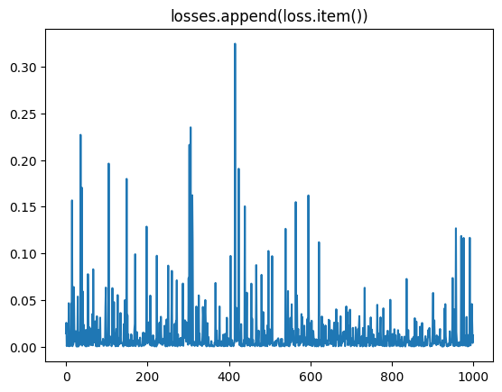

- [1. 加载](#1-加载)
- [2. 操作](#2-操作)
  - [2.1. 数据集大小和num\_batch](#21-数据集大小和num_batch)
  - [2.2. 取出一批来](#22-取出一批来)
  - [2.3. 打印](#23-打印)
  - [2.4. 遍历](#24-遍历)
- [batch\_size](#batch_size)


---

## 1. 加载


```python
batch_size = 16
# shuffle, 打乱
# num_workers, 使用4个进程来读取数据
train_iter = data.DataLoader(
    mnist_train_totensor, batch_size, shuffle=True, num_workers=4)
test_iter = data.DataLoader(
    mnist_test_totensor, batch_size, shuffle=True, num_workers=4)
```

- `shuffle`:
    
    打乱不打乱, 是指取出的此批数据是乱序的.

    打乱`shuffle=True`; 不打乱 `shuffle=False`.

- `num_workers`
    
    
## 2. 操作

### 2.1. 数据集大小和num_batch


```python
test_dataloader = data.DataLoader(mnist_test, batch_size)

print(len(mnist_test))
# 10000

# 可以通过 test_dataloader.dataset，获取到原来传入的 DataSet。
print(len(test_dataloader.dataset))
# 10000

# batch_size=16, 10000/16=625.
print(len(test_dataloader))
# 625
```


### 2.2. 取出一批来

```python
batch = next(iter(test_dataloader))
X, y = batch
```

### 2.3. 打印

list化就行
```python
print(list(test_dataloader))
```

### 2.4. 遍历

```python
for batch in test_dataloader:
    X, y = batch
    # X是特征值，y是标签
    # X 是 batch_size 个行的1通道28*28图像, y是 batch_size 个标签
    print(X.shape, y.shape)
    # torch.Size([16, 1, 28, 28]) torch.Size([16])
    break
```

```python
# 必须是 i, (X, y)，不能是 i, X, y
for i, (X, y) in enumerate(test_dataloader):
    # i 是第几批，X是特征值，y是标签
    print(i, X.shape, y.shape)
    # 0 torch.Size([16, 1, 28, 28]) torch.Size([16])
    break
```

## batch_size

小的 batch_size 可能会导致收敛速度减慢和精度降低.

如下图，直接打印每个 batch 的 loss，可以看到忽高忽低的变化。

 

解决方法：对于当前的 batch_size ，学习率太大了。
- 保持小的 batch_size, 使用**更小的 learning rate**
- 保持 learning rate, 使用**更大的 batch_size** ( 联系 [gradient_accumulation_steps](../多GPU/OOM.md) )