- [1. model transformation 模型变换](#1-model-transformation-模型变换)
- [2. camera/view transformation 视角变换](#2-cameraview-transformation-视角变换)
  - [2.1. 右手坐标系 right-handed coordinates](#21-右手坐标系-right-handed-coordinates)
  - [2.2. 各种右手的相机坐标系的转换](#22-各种右手的相机坐标系的转换)
  - [2.3. other](#23-other)
- [3. projection transformation](#3-projection-transformation)
  - [3.1. orthographic projection](#31-orthographic-projection)
    - [3.1.1. viewporrt transformation](#311-viewporrt-transformation)
  - [3.2. perspective projection](#32-perspective-projection)
    - [3.2.1. orthographic-based perspective (GAMES101)](#321-orthographic-based-perspective-games101)
    - [3.2.2. pinhole 的 K矩阵](#322-pinhole-的-k矩阵)
      - [3.2.2.1. 相机坐标系-\>图像坐标系](#3221-相机坐标系-图像坐标系)
      - [3.2.2.2. 图像坐标系-\>像素坐标系](#3222-图像坐标系-像素坐标系)
      - [3.2.2.3. 相机内参](#3223-相机内参)
      - [3.2.2.4. 综合](#3224-综合)
- [4. 反向](#4-反向)
- [???](#)

---

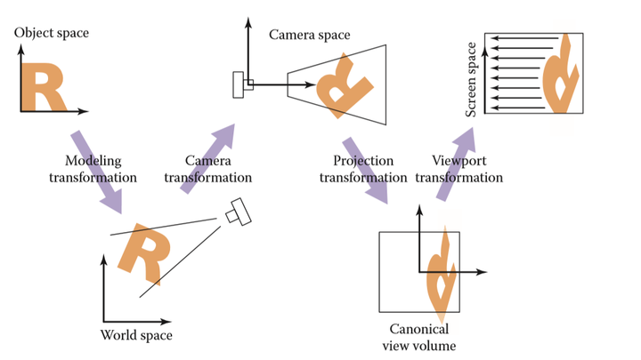

图像的成像过程经历了世界坐标系—>相机坐标系—>图像坐标系—>像素坐标系这四个坐标系的转换，如下图所示：

  
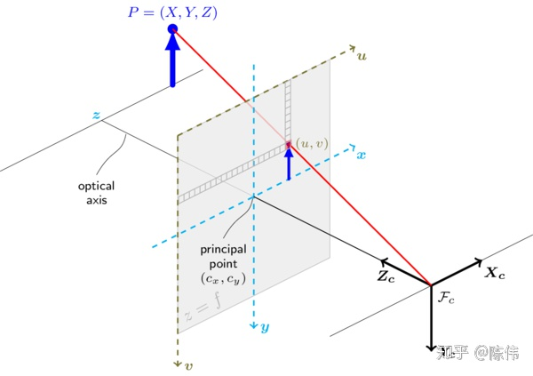
- 像素坐标系 pixels coordinate：以图像平面左上角为原点的坐标系 ，X 轴和Y 轴分别平行于图像坐标系的 X 轴和Y 轴，用 $(u,v)$ 表示其坐标值。像素坐标系就是以像素为单位的图像坐标系。

- 图像坐标系 image coordinate：以光心在图像平面投影为原点的坐标系 ，X轴和Y 轴分别平行于图像平面的两条垂直边，用 $(x, y)$ 表示其坐标值。图像坐标系是用物理单位表示像素在图像中的位置。

- 相机坐标系 camera coordinate：以相机光心为原点的坐标系，X 轴和Y 轴分别平行于图像坐标系的 X 轴和Y 轴，相机的光轴为Z 轴，用 $(x_{c}, y_{c},z_{c})$ 表示其坐标值。

- 世界坐标系 world coordinate：是三维世界的绝对坐标系，我们需要用它来描述三维环境中的任何物体的位置，用 $(x_{w}, y_{w},z_{w})$ 表示其坐标值。


## 1. model transformation 模型变换

如何放置模型坐标到世界坐标中。

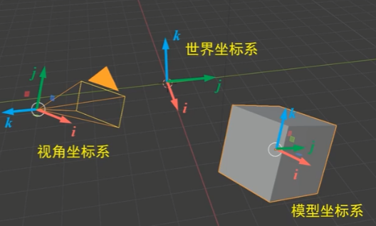


SRT: scale, rotation, translation. 而且顺序也是先 scale, 后rotation, 最后translation。

模型的中心一开始就在世界坐标系原点。

操作都是以物体的角度看。不是旋转坐标系，而是旋转人头；不是翻转y轴，而是翻转人头；先旋转后要看正脸还是侧脸后，我们把模型沿着z轴平移（look at)，因为中点在人头内部，看不到uv。
```python
def pose_spherical(radius, theta, phi):
    '''
    theta: 方位角
    phi: 极角
    return: [4, 4]
    '''
    pose = np.array([
        [1, 0, 0, 0],
        [0, 1, 0, 0],
        [0, 0, 1, 0],
        [0, 0, 0, 1]], dtype=np.float32)
    pose = rot_theta(theta/180.*np.pi) @ pose   # y
    pose = rot_phi(phi/180.*np.pi) @ pose       # x
    pose = trans_t(radius) @ pose
    pose = pose @ np.diag([1, -1, 1, 1])        # 这b是倒吊人
    return pose
```

## 2. camera/view transformation 视角变换

**将相机坐标系转到与世界坐标系重合：先旋转轴来轴向一致，再将相机平移到世界原点; M=RT， 先平移再旋转**。

将相机和物体一起变换。所以相机坐标系下的物体坐标，变换矩阵乘物体的世界坐标。(变换点，就是变换整个坐标系)

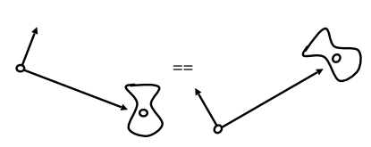


乘了这个后，再乘别的变换矩阵，就是从原点移动相机矩阵的位置。

所以外参中的xyz是负的相机原点在世界坐标系的位置。

---

> 从点的角度理解

c2w的含义: camera's pose matrix in world coordinate.

c2w矩阵是一个4x4的矩阵，左上角3x3是旋转矩阵R，又上角的3x1向量是平移向量T。有时写的时候可以忽略最后一行[0,0,0,1]。

$$\begin{bmatrix}R&t\\0^\top &1\end{bmatrix}=\begin{bmatrix}\begin{array}{ccc|c}r_{11}&r_{12}&r_{13}&t_1\\r_{21}&r_{22}&r_{23}&t_2\\r_{31}&r_{32}&r_{33}&t_3\\\hline0&0&0&1\end{array}\end{bmatrix}$$

$$\begin{bmatrix}R&t\end{bmatrix}=\begin{bmatrix}\begin{array}{ccc|c}r_{11}&r_{12}&r_{13}&t_1\\r_{21}&r_{22}&r_{23}&t_2\\r_{31}&r_{32}&r_{33}&t_3\end{array}\end{bmatrix}$$


The camera's extrinsic matrix describes the camera's location in the world $\mathbf{t}$, and what direction it's pointing $\mathbf{R}$. 

For a **Column-Major** transform matrix, the first 3 columns are the +X, +Y, and +Z defining the camera orientation, and the forth column X, Y, Z values define the camera origin. 具体来说, camera orientation 是当前坐标系的轴在要变换到的另一坐标系的轴的方向, camera origin 是当前坐标系的原点在要变换到的另一坐标系的下的坐标。比如，c2w，则旋转矩阵的每一列分别表示了相机坐标系的XYZ轴方向在世界坐标系下对应的XYZ轴方向，平移向量表示的是相机坐标系的原点在世界坐标系中的位置。


> 从向量的角度

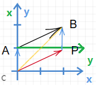  

描述点B。在绿色坐标系下，B点(1,2)。在蓝色坐标系下，B点(2,2)。怎么转化？借助向量。

描述向量AB。在绿色坐标系下，AB是起点(0,0)和方向向量(1,2)，即AB(1,2)=(0,0)+(1,2)。在蓝色坐标系下是CB=CA+AB, (2,2)=(0,1)+(2,1)。

也即A点(0,1)和B点(2,2)=(1,2)-(-1,0)。

怎么做到从绿色到蓝色？旋转坐标系，方向向量(2,1)变化为(1,2)，平移向量(-1,0)就是在绿色坐标系下观察的世界坐标系原点的位置。

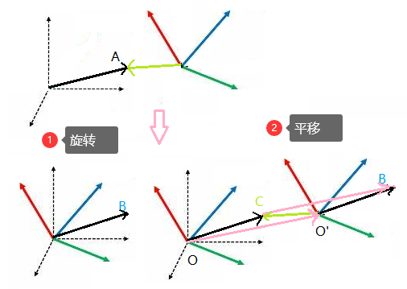  

相机坐标系虚线坐标轴，世界坐标系彩色坐标轴。相机坐标的黑色OA，选转后世界坐标的OB，在相机坐标下看世界坐标原点的平移量是粉色的OO'，世界坐标的O'C = OB - OO'。

也就是说，关键点，**世界坐标下的向量 = 旋转后的向量 - 相机坐标下看世界坐标原点的平移向量**，或者，****世界坐标下的向量 = 旋转后的向量 + 世界坐标下看相机坐标原点的平移向量****。后者才是矩阵中的 $t$。


### 2.1. 右手坐标系 right-handed coordinates


> 将左右手性和right-up-forward联系在一起，而不是xyz

The only thing that defines the handedness of the coordinate system is the orientation of the left (or right) vector relative to the up and forward vectors, regardless of what these axes represent.

- 右手：选一个判断就行————$\text{up} \times \text{forward} = + \text{right}$
    
    右手坐标系的6个性质：
    $$\begin{aligned}
    {right}\times{up}&=+{forward} \\
    {up}\times{forward}&=+{right} \\
    {forward}\times{right}&=+{up} \\
    {up}\times{right}&=-{forward} \\
    {forward}\times{up}&=-{right} \\
    {right}\times{forward}&=-{up}
    \end{aligned}$$
- 左手：$\text{up} \times \text{forward} = - \text{right}, 即 +\text{left}$
    
    左手坐标系的6个性质：
    $$\begin{aligned}
    {right}\times{up}&=-{forward} \\
    {up}\times{forward}&=-{right} \\
    {forward}\times{right}&=-{up} \\
    {up}\times{right}&=+{forward} \\
    {forward}\times{up}&=+{right} \\
    {right}\times{forward}&=+{up}
    \end{aligned}$$


手掌：用右手的**4个指头从a转向b**（合拳，而不是松拳），大拇指朝向就是aXb的方向。

三指：右手，大拇指a，食指b，中指的方向就是axb。（是大食中、食中大、中大食的升序，而不是中食大等的降序）

  
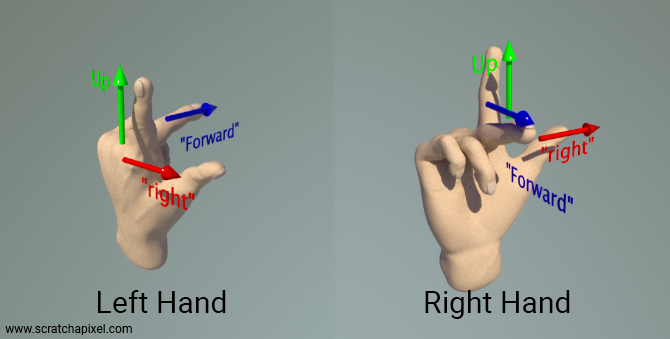

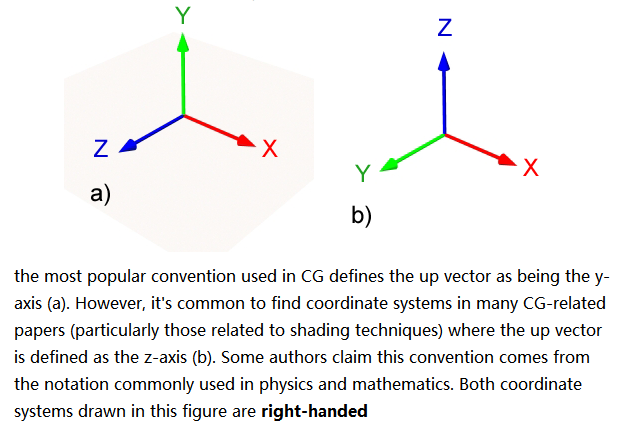

图中b还是右手性，是认为up是z轴，按照right-up-forward来判断它还是右手性。


> 目前，默认采用图a的方式，+X is right, +Y is up, and +Z is forward

判断左右手坐标系：
- 右手坐标系：$\vec{x}\times\vec{y}=+\vec{z}$
- 左手坐标系：$\vec{x}\times\vec{y}=-\vec{z}$

右手坐标系的6个性质：
$$\begin{aligned}
&\vec{x}\times\vec{y}=+\vec{z} \\
&\vec{y}\times\vec{z}=+\vec{x} \\
&\vec{z}\times\vec{x}=+\vec{y} &\text{特别记住}\\
&\vec{y}\times\vec{x}=-\vec{z}\\
&\vec{z}\times\vec{y}=-\vec{x} \\
&\vec{x}\times\vec{z}=-\vec{y}  &\text{特别记住}
\end{aligned}$$

> 旋转不变性

一个坐标系是左(右)手坐标系, 如果我们把手转90°，这依旧是一个左(右)手坐标系。

The only thing that defines the handedness of the coordinate system is the orientation of the left (or right) vector relative to the up and forward vectors, regardless of what these axes represent.

> 约定俗成的配置：
- x points to the right
- y is up
- z is backwards (look at -z) (coming out of the screen).
    
    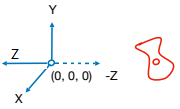

### 2.2. 各种右手的相机坐标系的转换

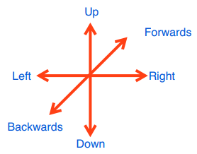

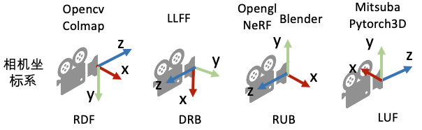

> R: [3, 3]

```python
# RDF to RUB: x'=x, y'=-y, z'=z
pose = np.concatenate([pose[:, 0:1], -pose[:, 1:2], -pose[:, 2:3]], 1)

# DRB to RUB: x'=y, y'=-x, z'=z
pose = np.concatenate([pose[:, 1:2], -pose[:, 0:1], pose[:, 2:3]], 1)
```
```python
# RDF to RUB
pose = pose @ np.diag([1, -1, -1])

# DRB to RUB
pose = pose @ np.array([[0, -1, 0], [1, 0, 0], [0, 0, 1]])
```

> RT pose: [3, 4] or [4, 4]
```python
# RDF to RUB: x'=x, y'=-y, z'=z
pose = np.concatenate([pose[:, 0:1], -pose[:, 1:2], -pose[:, 2:3], pose[:, 3:4]], 1)

# DRB to RUB: x'=y, y'=-x, z'=z
pose = np.concatenate([pose[:, 1:2], -pose[:, 0:1], pose[:, 2:3], pose[:, 3:4]], 1)
```
```python
# RDF to RUB
pose = pose @ np.diag([1, -1, -1, 1])

# DRB to RUB
pose = pose @ np.array([[0, -1, 0, 0], [1, 0, 0, 0], [0, 0, 1, 0], [0, 0, 0, 1]])
```

### 2.3. other


属于刚体变换，包括旋转和平移操作（先平移后旋转）。

比如column-major w2c：
- 世界坐标系的欧式点$P_{w}=[X_{w}, Y_{w}, Z_{w}]^\top$，相机坐标系的欧式点$P_{c}=[X_{c}, Y_{c}, Z_{c}]^\top$，

    $$\begin{aligned}
    P_{c}&=RP_{w}+t \\
    \begin{bmatrix} X_{c} \\ Y_{c} \\ Z_{c}  \end{bmatrix}  
    &= R \begin{bmatrix} X_{w} \\  Y_{w} \\ Z_{w}  \end{bmatrix} + \begin{bmatrix} t_{x} \\  t_{y} \\ t_{z}  \end{bmatrix}
    \end{aligned}$$

- 世界坐标系的齐次坐标点$P_{w}=[X_{w}, Y_{w}, Z_{w}, 1]^\top$，相机坐标系的欧式点$P_{c}=[X_{c}, Y_{c}, Z_{c}]^\top$，

    $$\begin{aligned}
    P_{c}&=\begin{bmatrix} R & t \end{bmatrix}P_{w}\\
    \begin{bmatrix} X_{c} \\ Y_{c} \\ Z_{c} \end{bmatrix}  
    &= \begin{bmatrix} R & t \end{bmatrix}  \begin{bmatrix} X_{w} \\  Y_{w} \\ Z_{w} \\ 1 \end{bmatrix}
    \end{aligned}$$

- 世界坐标系的齐次坐标点$P_{w}=[X_{w}, Y_{w}, Z_{w}, 1]^\top$，相机坐标系的齐次坐标点$P_{c}=[X_{c}, Y_{c}, Z_{c}, 1]^\top$，
    $$\begin{aligned}
    P_{c}&=\begin{bmatrix} R & t \\ 0^\top & 1 \end{bmatrix}P_{w}\\
    \begin{bmatrix} X_{c} \\ Y_{c} \\ Z_{c} \\ 1 \end{bmatrix}  
    &= \begin{bmatrix} R & t \\ 0^\top & 1  \end{bmatrix}  \begin{bmatrix} X_{w} \\  Y_{w} \\ Z_{w} \\ 1 \end{bmatrix}
    \end{aligned}$$

    甚至可以进一步分解，这样就很明显是先乘旋转矩阵，后乘平移矩阵。

    $$
    \begin{aligned}
    \left[\begin{array}{c|c}R&\mathbf{t}\\\hline\mathbf{0\top}&1\end{array}\right]
    & =\left[\begin{array}{c|c}I&\mathbf{t}\\\hline\mathbf{0\top}&1\end{array}\right]\times\left[\begin{array}{c|c}R&\mathbf{0}\\\hline\mathbf{0\top}&1\end{array}\right]  \\
    &=\left[\begin{array}{ccc|c}1&0&0&t_1\\0&1&0&t_2\\0&0&1&t_3\\\hline0&0&0&1\end{array}\right]\times\left[\begin{array}{ccc|c}r_{1,1}&r_{1,2}&r_{1,3}&0\\r_{2,1}&r_{2,2}&r_{2,3}&0\\r_{3,1}&r_{3,2}&r_{3,3}&0\\\hline0&0&0&1\end{array}\right]
    \end{aligned}
    $$

比如row-major w2c：
- 世界坐标系的欧式点$P_{w}=[X_{w}, Y_{w}, Z_{w}]$，相机坐标系的欧式点$P_{c}=[X_{c}, Y_{c}, Z_{c}]$，

    $$\begin{aligned}
    P_{c}&=P_{w}R+t \\
    \begin{bmatrix} X_{c} & Y_{c} & Z_{c}  \end{bmatrix}  
    &= \begin{bmatrix} X_{w} & Y_{w} & Z_{w}  \end{bmatrix} R + \begin{bmatrix} t_{x} & t_{y} & t_{z} \end{bmatrix}
    \end{aligned}$$

- 世界坐标系的齐次坐标点$P_{w}=[X_{w}, Y_{w}, Z_{w}, 1]$，相机坐标系的欧式点$P_{c}=[X_{c}, Y_{c}, Z_{c}]$，

    $$\begin{aligned}
    P_{c}&=P_{w}\begin{bmatrix} R \\ t \end{bmatrix}\\
    \begin{bmatrix} X_{c} & Y_{c} & Z_{c} \end{bmatrix}  
    &= \begin{bmatrix} X_{w} &  Y_{w} & Z_{w} & 1 \end{bmatrix} \begin{bmatrix} R \\ t \end{bmatrix}
    \end{aligned}$$

- 世界坐标系的齐次坐标点$P_{w}=[X_{w}, Y_{w}, Z_{w}, 1]$，相机坐标系的齐次坐标点$P_{c}=[X_{c}, Y_{c}, Z_{c}, 1]$，
    $$\begin{aligned}
    P_{c}&=\begin{bmatrix} R &  0 \\ t & 1 \end{bmatrix}P_{w}\\
    \begin{bmatrix} X_{c} & Y_{c} & Z_{c} & 1 \end{bmatrix}  
    &= \begin{bmatrix} X_{w} & Y_{w} & Z_{w} & 1 \end{bmatrix}\begin{bmatrix} R &  0 \\ t & 1 \end{bmatrix}  
    \end{aligned}$$

    甚至可以进一步分解，这样就很明显是先乘旋转矩阵，后乘平移矩阵。

    $$
    \begin{aligned}
    \left[\begin{array}{c|c}R&\mathbf{0}\\\hline\mathbf{t}&1\end{array}\right]
    & =\left[\begin{array}{c|c}R&\mathbf{0}\\\hline\mathbf{0}&1\end{array}\right]\times \left[\begin{array}{c|c}I&\mathbf{0}\\\hline\mathbf{t}&1\end{array}\right] \\
    &=\left[\begin{array}{ccc|c}r_{1,1}&r_{1,2}&r_{1,3}&0\\r_{2,1}&r_{2,2}&r_{2,3}&0\\r_{3,1}&r_{3,2}&r_{3,3}&0\\\hline0&0&0&1\end{array}\right] \times \left[\begin{array}{ccc|c}1&0&0&0\\0&1&0&0\\0&0&1&0\\\hline t_1&t_2&t_3&1\end{array}\right]
    \end{aligned}
    $$
## 3. projection transformation

perspective projection 透射投影 和 orthographic projection 正交投影 的区别：无有近大远小。

### 3.1. orthographic projection

将三维空间投影至标准二维平面($[-1,1]^2$)之上 

orthographic projection is affine transformation (最后一行是 $\begin{bmatrix} 0 & 0 & 0 & 1\end{bmatrix}$)

> 不常用的做法

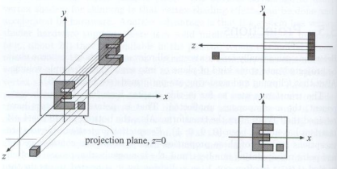

1. 直接把 camera coordinate 下的 z 坐标扔掉
2. Translate and scale the resulting rectangle to $[-1, 1]^2$ .  

> 常用的做法

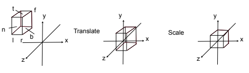

1. find a **cuboid** [l, r] x [b, t] x [f, n]. 按照此相机坐标系，look at -z, near > far.
2. map to the “canonical (正则、规范、标准)” cube $[-1, 1]^3$ . 先平移，再缩放。

$M_{ortho}=\mathbf{ST}=\begin{bmatrix}\frac{2}{r-l}&0&0&0\\0&\frac{2}{t-b}&0&0\\0&0&\frac{2}{n-f}&0\\0&0&0&1\end{bmatrix}\begin{bmatrix}1&0&0&-\frac{r+l}2\\0&1&0&-\frac{t+b}2\\0&0&1&-\frac{n+f}2\\0&0&0&1\end{bmatrix} = \begin{bmatrix}\frac{2}{r-l}&0&0&-\frac{r+l}{r-l}\\0&\frac{2}{t-b}&0&-\frac{t+b}{t-b}\\0&0&\frac{2}{n-f}&-\frac{n+f}{n-f}\\0&0&0&1\end{bmatrix}$

PS: 这里的z并没有丢掉，为了之后的遮挡关系检测
#### 3.1.1. viewporrt transformation

将处于标准平面映射到屏幕分辨率范围之内，即$[-1,1]^2 \rightarrow [0,width]*[0,height]$, 其中width和height指屏幕分辨率大小.

$M_{viewport}=\begin{pmatrix}\frac{width}{2}&0&0&\frac{width}{2}\\0&\frac{height}{2}&0&\frac{height}{2}\\0&0&1&0\\0&0&0&1\end{pmatrix}$

完整的正交投影即，$M = M_{viewport}M_{ortho}$


### 3.2. perspective projection

perspective projection (最后一行是 $\begin{bmatrix} 0 & 0 & 1 &0\end{bmatrix}$ ) is **not** affine transformation ($\begin{bmatrix} 0 & 0 & 0 & 1\end{bmatrix}$)

#### 3.2.1. orthographic-based perspective (GAMES101)

这个的投影考虑视锥的 left, right, top, bottom, near, far

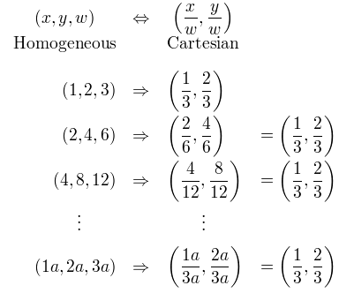

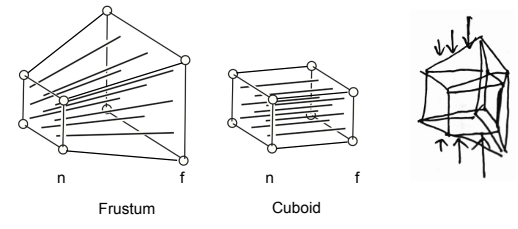

将透射投影分解为 $M = M_{ortho}M_{persp-ortho}$：
- First “squish” the frustum into a cuboid (n -> n, f -> f) ($M_{persp-ortho}$). 
    把f面挤压成和n面一样大，是为了确定f面中的物体投影到n面上的大小，再进行正交投影即可。

    所以近大远小可以解释为，近处的被挤压的程度小，远处的被挤压的程度大。
- Do orthographic projection ($M_{ortho}$)

那么如何得到 $M_{persp-ortho} = \begin{bmatrix}?&?&?&?\\?&?&?&?\\?&?&?&?\\?&?&?&?\end{bmatrix}$

$\begin{bmatrix}x^\prime \\ y^\prime \\ z^\prime \\ 1 \end{bmatrix} = M_{persp-ortho}\begin{bmatrix}x \\ y \\ z \\ 1 \end{bmatrix}$

> 第一个观察：我们发现 x/y 被挤压后的坐标 x'/y', 刚好可以根据在近平面上的相似三角形计算。PS：z'不是不变，而且是非相似三角形的变动。

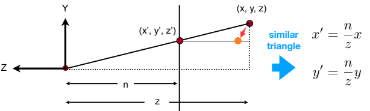


$\begin{bmatrix}x^\prime \\ y^\prime \\ z^\prime \\ 1 \end{bmatrix} = \begin{bmatrix}nx/z \\ ny/z \\ ?  \\ 1 \end{bmatrix} == \begin{bmatrix}nx \\ ny \\ ?  \\ z \end{bmatrix}$， 这里和之后齐次坐标都是乘以原来点的z位置，不是乱乘的。

从而有 $M_{persp-ortho}\begin{bmatrix}x \\ y \\ z \\ 1 \end{bmatrix} = \begin{bmatrix}nx \\ ny \\ ?  \\ z \end{bmatrix}$

推测出 $M_{persp-ortho} = \begin{bmatrix}n&0&0&0\\0&n&0&0\\?&?&?&?\\0&0&1&0\end{bmatrix}$

> 第二个观察：近远平面上的点的特点
- Any point on the near plane will not change. x'=x, y'=y, z'=z=n
  
  $M_{persp-ortho}\begin{bmatrix}x \\ y \\ n \\ 1 \end{bmatrix} = \begin{bmatrix}x \\ y \\ n \\ 1 \end{bmatrix} == \begin{bmatrix}nx \\ ny \\ n^2  \\ n \end{bmatrix}$, 即$M_{persp-ortho}\begin{bmatrix}x \\ y \\ n \\ 1 \end{bmatrix} = \begin{bmatrix}nx \\ ny \\ n^2  \\ n \end{bmatrix}$

  则有第三行 $\begin{bmatrix} ? & ? & ? & ? \end{bmatrix}\begin{bmatrix}x \\ y \\ n \\ 1 \end{bmatrix} = n^2$

  推测出前两个系数与x和y无关，是0. 则只剩两个未知系数，$\begin{bmatrix} 0 & 0 & A & B\end{bmatrix}$

  且(1)，$An+B=n^2$

- Any point’s z on the far plane will not change. z'=z=f

  取远平面的中心点

  $M_{persp-ortho}\begin{bmatrix}0 \\ 0 \\ f \\ 1 \end{bmatrix} = \begin{bmatrix}0 \\ 0 \\ f \\ 1 \end{bmatrix} == \begin{bmatrix}0\\0 \\ f^2  \\ f \end{bmatrix}$, 即$M_{persp-ortho}\begin{bmatrix}0 \\ 0 \\ f \\ 1 \end{bmatrix} = \begin{bmatrix}0\\0 \\ f^2  \\ f \end{bmatrix}$

  则有第三行 $\begin{bmatrix} 0 & 0 & A & B \end{bmatrix}\begin{bmatrix}0 \\ 0 \\ f \\ 1 \end{bmatrix} = f^2$


  且(2)，$Af+B=f^2$

联立(1)(2)，有 $A=n+f, B=-nf$

综上，$M_{persp-ortho} = \begin{bmatrix}n&0&0&0\\0&n&0&0\\0 &0 & n+f & -nf\\0&0&1&0\end{bmatrix}$

$M = M_{ortho}M_{persp-ortho} = \begin{bmatrix}\frac{2}{r-l}&0&0&-\frac{r+l}{r-l}\\0&\frac{2}{t-b}&0&-\frac{t+b}{t-b}\\0&0&\frac{2}{n-f}&-\frac{n+f}{n-f}\\0&0&0&1\end{bmatrix} 
\begin{bmatrix}n&0&0&0\\0&n&0&0\\0 &0 & n+f & -nf\\0&0&1&0\end{bmatrix}
= \begin{bmatrix}\frac{2n}{r-l}&0&-\frac{r+l}{r-l}&0\\0&\frac{2n}{t-b}&-\frac{t+b}{t-b}&0\\0&0&\frac{n+f}{n-f}&-\frac{2nf}{n-f}\\0&0&1&0\end{bmatrix}$

没加 viewport transformation.

#### 3.2.2. pinhole 的 K矩阵

##### 3.2.2.1. 相机坐标系->图像坐标系

这里的相似三角形就不是任意值的近平面了，而是 image plane (the distance between the pinhole and image plane is **focal length**.)


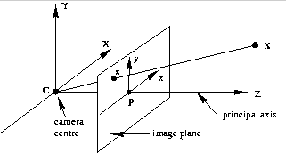

图像坐标系(对应平面叫做image plane)的x和y轴方向和相机坐标系的保持一致。

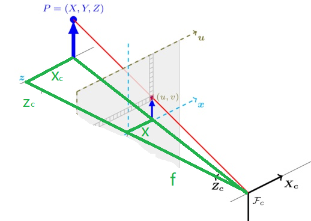

从3D的相机坐标系下的欧式点 $(X_{c}, Y_{c}, Z_{c})$ 到2D的图像坐标系下的欧式点 $(x,y)$  

$$\begin{aligned}
\dfrac{f}{Z_{c}} &= \dfrac{x}{X_c} = \dfrac{y}{Y_c}
\\ x&=f\dfrac{X_{c}}{Z_{c}}
\\ y&=f\dfrac{Y_{c}}{Z_{c}}\end{aligned}$$

$\begin{bmatrix} f_x & 0 & 0 & 0\\ 0 & f_y & 0 & 0\\ 0 & 0 & 1 & 0\end{bmatrix}  \begin{bmatrix} X_{c} \\  Y_{c} \\ Z_{c} \\ 1 \end{bmatrix}
=\begin{bmatrix} f_xX_c \\ f_yY_c \\ Z_c \end{bmatrix} 
=Z_c\begin{bmatrix} f_x\dfrac{X_{c}}{Z_{c}} \\ f_y\dfrac{Y_{c}}{Z_{c}} \\ 1 \end{bmatrix}
=Z_c\begin{bmatrix}x \\y \\1 \end{bmatrix}$

$\begin{bmatrix} f_x & 0 & 0\\ 0 & f_y & 0\\ 0 & 0 & 1\end{bmatrix}  \begin{bmatrix} X_{c} \\  Y_{c} \\ Z_{c}\end{bmatrix}
=\begin{bmatrix} f_xX_c \\ f_yY_c \\ Z_c \end{bmatrix} 
=Z_c\begin{bmatrix} f_x\dfrac{X_{c}}{Z_{c}} \\ f_y\dfrac{Y_{c}}{Z_{c}} \\ 1 \end{bmatrix}
=Z_c\begin{bmatrix}x \\y \\1 \end{bmatrix}$


PS：倒像问题

  
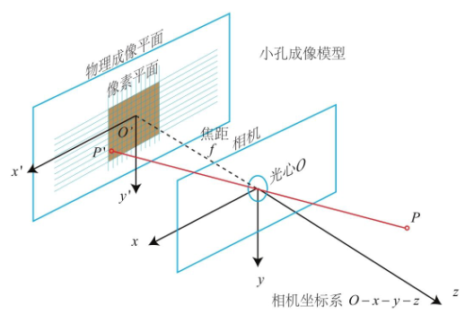

P点的x是负坐标，P'点的x是正坐标。

$$\dfrac{f}{Z_{c}} = -\dfrac{x}{X_c} = -\dfrac{y}{Y_C}$$

其中负号表示成的像是倒立的。为了简化模型，我们可以把成像平面对称到相机前方，和三维空间点一起放在摄像机坐标系的同一侧，这样做可以把公式中的负号去掉，使式子更加简洁。

  
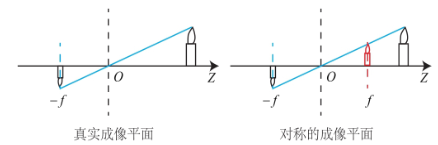

##### 3.2.2.2. 图像坐标系->像素坐标系
  
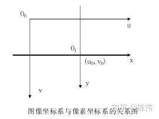

像素坐标系：以左上角点为原点，u轴向右与x轴平行，v轴向右与y轴平行。像素坐标系和图像坐标系之间，相差了一个缩放 $\alpha, \beta$和原点的平移 $c_x, c_y$。

$$\begin{aligned}
u&=\alpha x + c_x
\\ v&=\beta y + c_y
\end{aligned}$$

$
Z_c \begin{bmatrix}\alpha & 0 & c_x \\0 & \beta & c_y \\ 0 & 0 & 1 \end{bmatrix}\begin{bmatrix}x \\y \\1 \end{bmatrix} = 
Z_c\begin{bmatrix} u \\v \\ 1\end{bmatrix}
$
##### 3.2.2.3. 相机内参

The intrinsic matrix transforms 3D camera cooordinates to 2D homogeneous image coordinates.

$K = \begin{bmatrix} \alpha f_x & s & c_x\\ 0 & \beta f_y & c_y\\ 0 & 0 & 1\end{bmatrix}$

  
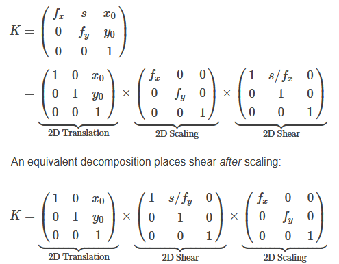

平移操作放在最后（即最左）。

在内参矩阵中还有个参数 $s$（通常也可当成0），用来建模像素是平行四边形而不是矩形，与像素坐标系的u，v轴之间的夹角$\theta$的正切值$tan(\theta)$成反比，因此当 $s = 0$时，表示像素为矩形。

##### 3.2.2.4. 综合
 
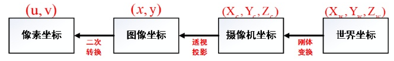


像素坐标的齐次坐标点 $P_{uv}=[u, v]$. 外参，投影自然是 w2c.

三种运算方式：

1. 加法
   
    外参 `[3, 3]` 和 `3`

    $$ Z_c\begin{bmatrix} u \\ v \\ 1\end{bmatrix} = K\left( R\begin{bmatrix} X_w \\ Y_w \\ Z_w \end{bmatrix} + t \right)$$

2. 世界坐标系的欧式点$P_{w}=[X_{w}, Y_{w}, Z_{w}]$，像素坐标的齐次坐标点 $P_{uv}=[u, v]$

    外参 `[3, 4]`

    $$\begin{aligned}
    Z_c\begin{bmatrix} u \\ v \\ 1\end{bmatrix} 
    &= \begin{bmatrix} \alpha & 0 & c_x \\0 & \beta & c_y \\ 0 & 0 & 1 \end{bmatrix}
    \begin{bmatrix} f_x & 0 & 0\\ 0 & f_y & 0\\ 0 & 0 & 1\end{bmatrix}
    \begin{bmatrix} R & t\end{bmatrix}  \begin{bmatrix} X_{w} \\  Y_{w} \\ Z_{w} \\ 1 \end{bmatrix}
    \\ &= 
    \begin{bmatrix} \alpha f_x & 0 & c_x\\ 0 & \beta f_y & c_y\\ 0 & 0 & 1\end{bmatrix}
    \begin{bmatrix} R & t\end{bmatrix}  \begin{bmatrix} X_{w} \\  Y_{w} \\ Z_{w} \\ 1 \end{bmatrix}
    \\ &= KTP_w
    \end{aligned}
    $$


3. 世界坐标系的齐次坐标点$P_{w}=[X_{w}, Y_{w}, Z_{w}, 1]$
   
    外参 `[4, 4]`

    $$\begin{aligned}
    Z_c\begin{bmatrix} u \\ v \\ 1\end{bmatrix} 
    &= \begin{bmatrix} \alpha & 0 & c_x \\0 & \beta & c_y \\ 0 & 0 & 1 \end{bmatrix}
    \begin{bmatrix} f_x & 0 & 0 & 0\\ 0 & f_y & 0 & 0\\ 0 & 0 & 1 & 0\end{bmatrix}
    \begin{bmatrix} R & t \\ 0^T & 1  \end{bmatrix}  \begin{bmatrix} X_{w} \\  Y_{w} \\ Z_{w} \\ 1 \end{bmatrix}
    \\ &= 
    \begin{bmatrix} \alpha f_x & 0 & c_x & 0\\ 0 & \beta f_y & c_y & 0\\ 0 & 0 & 1 & 0\end{bmatrix}
    \begin{bmatrix} R & t \\ 0^T & 1  \end{bmatrix}  \begin{bmatrix} X_{w} \\  Y_{w} \\ Z_{w} \\ 1 \end{bmatrix}
    \\ &= KTP_w
    \end{aligned}
    $$


**相机深度**$z_{c}$ 乘以 **像素坐标**$P_{uv}$ = **相机内参**K 乘以 **相机外参RT** 乘以 **世界坐标**$P_{w}$

像素坐标系下的一点可以被认为是三维空间中的一条射线， $z_{c}$ 就是像素点在相机坐标系下的深度。


## 4. 反向

> column-major w2c↔c2w，两矩阵互逆。

$$
\begin{aligned}
\left[\begin{array}{c|c}\mathbf{R_c}&\mathbf{C}\\\hline \mathbf{0}\top&1\end{array}\right]
& = \left[\begin{array}{c|c}\mathbf{R}&\mathbf{t}\\\hline\mathbf{0}\top&1\end{array}\right]^{-1}  \\
&=\left[\left[\begin{array}{c|c}\mathbf{I}&\mathbf{t}\\\hline\mathbf{0}\top&1\end{array}\right]\left[\begin{array}{c|c}\mathbf{R}&0\\\hline\mathbf{0}&1\end{array}\right]\right]^{-1}& (\text{decomposing rigid transform})  \\
&=\left[\begin{array}{c|c}\mathbf{R}&0\\\hline\mathbf{0}\top&1\end{array}\right]^{-1}\left[\begin{array}{c|c}\mathbf{I}&\mathbf{t}\\\hline\mathbf{0}\top&1\end{array}\right]^{-1}& (\text{distributing the inverse})  \\
&=\left[\begin{array}{c|c}\mathbf{R}^\top &0\\\hline\mathbf{0}\top&1\end{array}\right]\left[\begin{array}{c|c}\mathbf{I}&-\mathbf{t}\\\hline\mathbf{0}\top&1\end{array}\right]& \text{(applying the inverse)}  \\
&=\left[\begin{array}{c|c}\mathbf{R}^\top&-\mathbf{R}^\top\mathbf{t}\\\hline\mathbf{0}\top&1\end{array}\right]& (\text{matrix multiplication}) 
\end{aligned}
$$


即 $T_{w2c} = [\mathbf{R}, \mathbf{t}], 则T_{c2w} = T_{w2c}^{-1} = [\mathbf{R}^\top, -\mathbf{R}^\top\mathbf{t}]$

```python
c2w = np.linalg.inv(w2c)
```

> 例子: 外参，Inverse project 自然是 c2w

例子：已知，$T_{c2w} = [\mathbf{R}, \mathbf{t}]$， $P_c=[u,v,1]^\top$

则，
$$P_w = \mathbf{R}\mathbf{K}^{−1} \begin{bmatrix} u \\ v \\ 1 \end{bmatrix} + \mathbf{t} $$

- a target pixel $x\in\mathbf{RP}^{2}$ , c2w extrinsics $[R | t]$ , intrinsics $K$ .
- ray origin $o=\mathbf{t}$, ray direction $r=\mathbf{R}\mathbf{K}^{−1}[u,v,1]^\top$

例子：已知，$T_{w2c} = [\mathbf{R}, \mathbf{t}]$， $P_c=[u,v,1]^\top$

则，

$$P_w = \mathbf{R}^{\top}\mathbf{K}^{−1} \begin{bmatrix} u \\ v \\ 1 \end{bmatrix} + (-\mathbf{R}^\top\mathbf{t})$$

- a target pixel $x\in\mathbf{RP}^{2}$ , w2c extrinsics $[R | t]$ , intrinsics $K$
- ray origin $o=-\mathbf{R}^\top\mathbf{t}$, ray direction $r=\mathbf{R}^{\top}\mathbf{K}^{−1}[u,v,1]^\top$


## ???
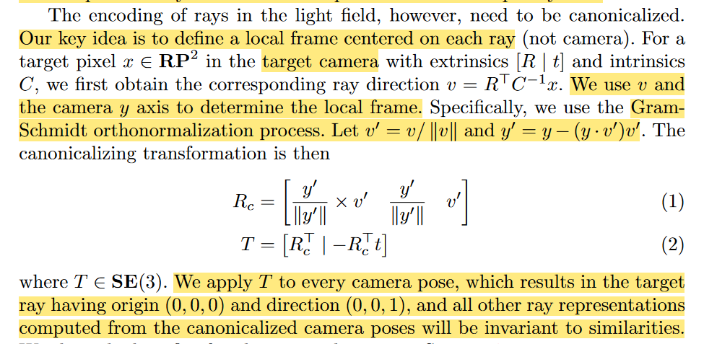

- $R_c$代表的意思
- w2c和c2w的真正理解还没有理解
  
  第三行：从第四行ray direction的计算来看，原来的extrinsice应该是w2c

  公式1的$R_c$应该是3x3的矩阵，但是第一列是什么意思？怎么会是两个向量的out product?
  
  那么公式1的计算结果，应该是world的坐标，公式2再转化为c2w。

  那么We apply T to every camera pose，这个 camera pose 是不是上面的w2c的extrinsice，把c2w的T乘以camera pose？？？而且是谁先乘谁????