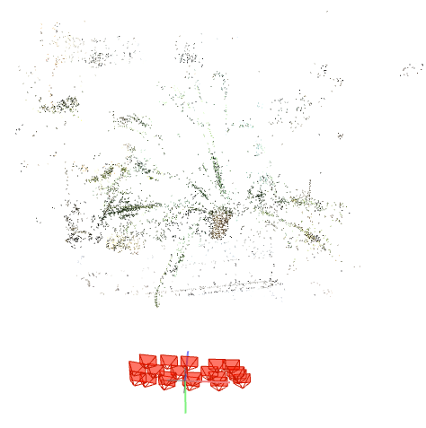
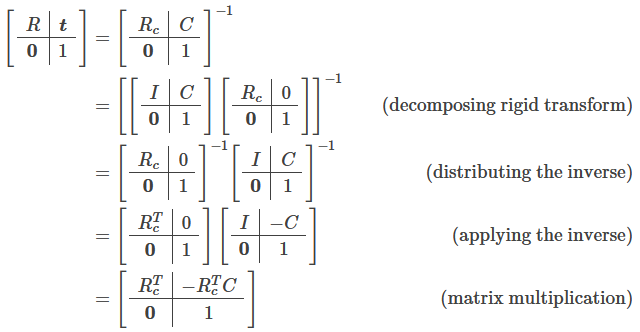

- [5. Frame Transforms](#5-frame-transforms)
  - [5.1. 世界坐标系\<-\>相机坐标系](#51-世界坐标系-相机坐标系)
  - [5.2. 透射](#52-透射)
    - [5.2.1. 相机坐标系\<-\>图像坐标系](#521-相机坐标系-图像坐标系)
- [6. 反向](#6-反向)

---


### 3.1. 内参

The intrinsic matrix transforms 3D camera cooordinates to 2D homogeneous image coordinates.

$K = \begin{bmatrix} \alpha f_x & s & c_x\\ 0 & \beta f_y & c_y\\ 0 & 0 & 1\end{bmatrix}$

  


平移操作放在最后（即最左）。

在内参矩阵中还有个参数 $s$（通常也可当成0），用来建模像素是平行四边形而不是矩形，与像素坐标系的u，v轴之间的夹角$\theta$的正切值$tan(\theta)$成反比，因此当 $s = 0$时，表示像素为矩形。

```python
# 焦距、W、H

# 缩放尺寸为1，不缩放
# 平移到图像中心
K = np.array([
    [focal_x, 0, 0.5*W],
    [0, focal_y, 0.5*H],
    [0, 0, 1]
])
```

### 3.2. 外参

**将相机坐标系转到与世界坐标系重合：先旋转轴来轴向一致，再将相机平移到世界原点; M=RT， 先平移再旋转**。

将相机和物体一起变换。所以相机坐标系下的物体坐标，变换矩阵乘物体的世界坐标。

乘了这个后，再乘别的变换矩阵，就是从原点移动相机矩阵的位置。

所以外参中的xyz是负的相机原点在世界坐标系的位置。

let's consider **translation for points (positions)** and **rotations for vectors (directions)**.


> **NeRF主要使用c2w**

c2w的含义: camera's pose matrix

c2w矩阵是


## 5. Frame Transforms

图像的成像过程经历了世界坐标系—>相机坐标系—>图像坐标系—>像素坐标系这四个坐标系的转换，如下图所示：

  

- 像素坐标系 pixels coordinate：以图像平面左上角为原点的坐标系 ，X 轴和Y 轴分别平行于图像坐标系的 X 轴和Y 轴，用 $(u,v)$ 表示其坐标值。像素坐标系就是以像素为单位的图像坐标系。

- 图像坐标系 image coordinate：以光心在图像平面投影为原点的坐标系 ，X轴和Y 轴分别平行于图像平面的两条垂直边，用 $(x, y)$ 表示其坐标值。图像坐标系是用物理单位表示像素在图像中的位置。

- 相机坐标系 camera coordinate：以相机光心为原点的坐标系，X 轴和Y 轴分别平行于图像坐标系的 X 轴和Y 轴，相机的光轴为Z 轴，用 $(x_{c}, y_{c},z_{c})$ 表示其坐标值。

- 世界坐标系 world coordinate：是三维世界的绝对坐标系，我们需要用它来描述三维环境中的任何物体的位置，用 $(x_{w}, y_{w},z_{w})$ 表示其坐标值。

### 5.1. 世界坐标系<->相机坐标系

属于刚体变换，包括旋转和平移操作，通过六个自由度的外参矩阵反应了物体与相机的相对运动关系


- 世界坐标系的欧式点$P_{w}=[X_{w}, Y_{w}, Z_{w}]$，相机坐标系的欧式点$P_{c}=[X_{c}, Y_{c}, Z_{c}]$，

    $$P_{c}=RP_{w}+t$$

    $$\begin{bmatrix} X_{c} \\ Y_{c} \\ Z_{c}  \end{bmatrix}  
    = R \begin{bmatrix} X_{w} \\  Y_{w} \\ Z_{w}  \end{bmatrix} + \begin{bmatrix} t_{x} \\  t_{y} \\ t_{z}  \end{bmatrix}$$

- 世界坐标系的齐次坐标点$P_{w}=[X_{w}, Y_{w}, Z_{w}, 1]$，相机坐标系的欧式点$P_{c}=[X_{c}, Y_{c}, Z_{c}]$，

    $$P_{c}=\begin{bmatrix} R & T \end{bmatrix}P_{w}$$

    $$\begin{bmatrix} X_{c} \\ Y_{c} \\ Z_{c} \end{bmatrix}  
    = \begin{bmatrix} R & t \end{bmatrix}  \begin{bmatrix} X_{w} \\  Y_{w} \\ Z_{w} \\ 1 \end{bmatrix}$$

- 世界坐标系的齐次坐标点$P_{w}=[X_{w}, Y_{w}, Z_{w}, 1]$，相机坐标系的齐次坐标点$P_{c}=[X_{c}, Y_{c}, Z_{c}, 1]$，

    $$P_{c}=\begin{bmatrix} R & t \\ 0^T & 1 \end{bmatrix}P_{w}$$

    $$\begin{bmatrix} X_{c} \\ Y_{c} \\ Z_{c} \\ 1 \end{bmatrix}  
    = \begin{bmatrix} R & t \\ 0^T & 1  \end{bmatrix}  \begin{bmatrix} X_{w} \\  Y_{w} \\ Z_{w} \\ 1 \end{bmatrix}$$


例子：

$\begin{bmatrix} R & T \end{bmatrix}
\begin{bmatrix} \cos(\theta) \\ -\sin(\theta) \\ -\sin(\theta*zrate) \\ 1 \end{bmatrix}$

  

colmap已经设定好了世界坐标系，外参也是依据此世界坐标系的。

### 5.2. 透射

#### 5.2.1. 相机坐标系<->图像坐标系


## 6. 反向

反向 $P_c \to P_w$

> w2c

w2c 可以通过 c2w 的逆

  

- c2w: $M_{c2w} = [R, t]$

    $$P_w = RK^{−1} \begin{bmatrix} v \\ u \\ 1 \end{bmatrix} + t $$

- w2c: $M_{w2c} = [R, t]$，相当于 c2w 形式为 $M_{c2w} = M_{w2c}^{-1} = [R^T, -R^Tt]$

    $$P_w = R^{T}K^{−1} \begin{bmatrix} v \\ u \\ 1 \end{bmatrix} + (-R^Tt)$$

    - a target pixel $x\in\mathbf{RP}^{2}$ , w2c extrinsics $[R | t]$ , intrinsics $K$ .
    - ray direction $v=R^{\top}K^{-1}x$
