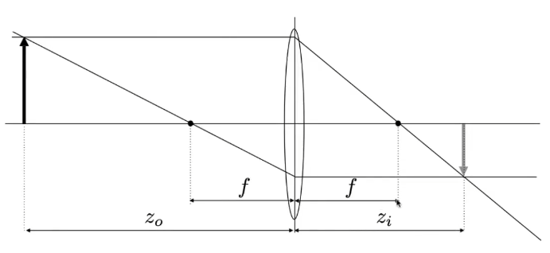
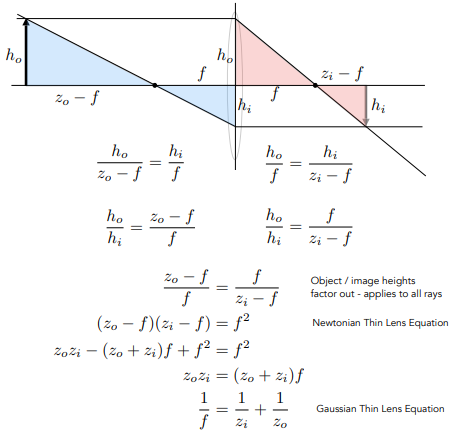
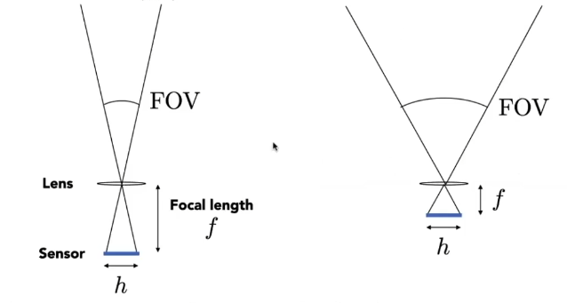
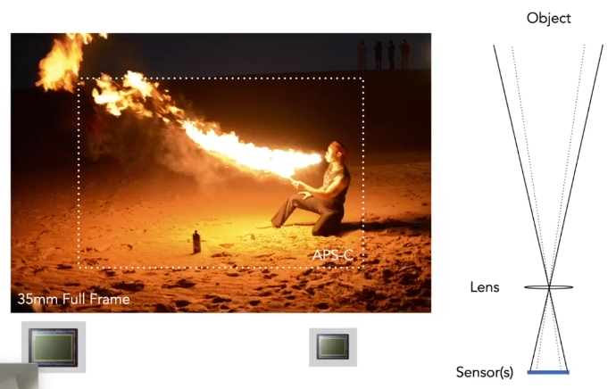
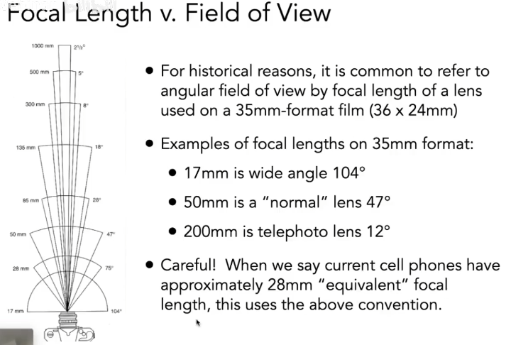
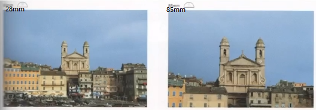
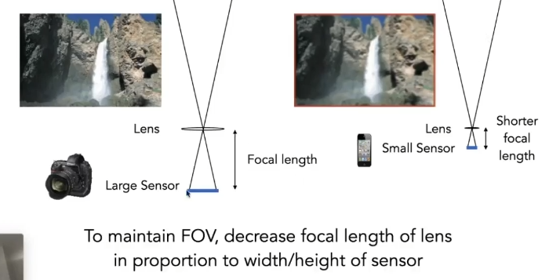
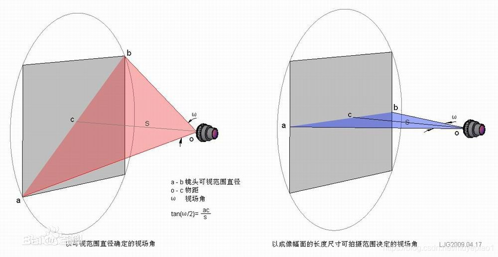
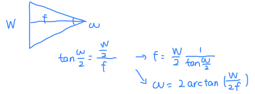

- [1. 物像关系](#1-物像关系)
- [2. FOV](#2-fov)
- [3. 相机参数](#3-相机参数)


---
## 1. 物像关系
  

  


$\dfrac{1}{f} = \dfrac{1}{z_0} + \dfrac{1}{z_i}$

f为焦距， $z_0$为物距（物体到透镜的距离）， $z_i$为像距（透镜到像面的距离）。


[由此可以推出不同的成像关系](https://www.zhihu.com/question/38929736/answer/2327108553)


## 2. FOV
视场 Field of view（FOV），是一个角度。

> 当传感器大小固定时，焦距越短，FOV越大；焦距越长，FOV越小。



> 当焦距固定时，传感器大小越小，FOV越小。

  


> 镜头参数

  

我们以35mm-format的底片大小为标准，17mm、50mm、200mm、28mm的焦距是在这样大小的底片上，这个焦距是等效的虚指。意思是，实际手机镜头的焦距很小，对应的也是很小的底片大小。

拍照的效果就是，视场越窄，镜头拍到的就越远。

  

> maintain same FOV

  

相反，想要拍到远处的高清图片，就要更大的sensor底片，就要更长焦距的镜头lens。

> 公式就是tan三角函数联系起焦距与高宽、或物距与物高宽。

  


  


W、H是图像的宽度、高度（传感器大小），$\omega$是视角宽度 fov，f是焦距。`W`的单位是pixel， f的单位也是pixel。
```python
# `camera_angle_x`即在x轴的视角，对应图像的宽度。
def fov2focal(fov, pixels):
    '''
    fov = camera_angle_y, camera_angle_x
    pixels = H , W
    '''
    return .5 * pixels / math.tan(.5 * fov)

def focal2fov(focal, pixels):
    return 2 * math.atan( pixels / (2 * focal))
```
`"camera_angle_x": 0.5235987755982988,`，弧度制 radians。
- 360 degrees = $2\pi$
- $\theta_{radians} = \dfrac{\pi}{180}\theta_{degrees}$ . 比如30°， Π/6 = 0.5235987755982988


## 3. 相机参数

相机两个参数：内参和外参

- 外参extrinsics，即**M**
    描述相机的位姿（位置t是指相机在空间中的哪个地方，而姿态R则是指相机的朝向）
    
    相机外参是一个4x4的矩阵M。

    - 相机外参叫做**world-to-camera (w2c)矩阵**，其作用是把3D世界坐标系的坐标变换到2D相机坐标系的坐标。

    - 相机外参的逆矩阵被称为**camera-to-world (c2w)矩阵**，其作用是把2D相机坐标系的坐标变换到3D世界坐标系的坐标。
- 内参intrinsics，即**K**
    固定不变的，如果不知道可以通过**标定**求得。

- 内参共有，外参变化：
    由于多组图片都是同一个相机拍摄得到，所以其内参数由多组图像共有，而外参数随着不同的图像将发生变化
- 都用齐次坐标表示
  


