- [1. 为什么要用齐次坐标？](#1-为什么要用齐次坐标)
- [2. homogenous coordinates](#2-homogenous-coordinates)
- [3. affine transformation](#3-affine-transformation)
  - [3.1. linear transformation](#31-linear-transformation)
    - [3.1.1. Shear](#311-shear)
    - [3.1.2. Scale](#312-scale)
    - [3.1.3. Reflection（沿着y轴对称）](#313-reflection沿着y轴对称)
    - [3.1.4. Rotate](#314-rotate)
  - [3.2. translation transformation](#32-translation-transformation)
- [4. 变化可逆](#4-变化可逆)
- [5. 顺序](#5-顺序)
- [row/column major](#rowcolumn-major)

---

## 1. 为什么要用齐次坐标？
因为translation is NOT linear transform! 
  
旋转、倾斜、缩放、翻折等可以用欧式坐标的矩阵乘法，但平移（及包含平移的K透射)不能用矩阵表示。
  
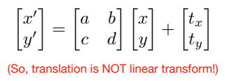

所以需要引入一种新的形式来统一用矩阵表示上述变换，即“homogenous coordinates 用矩阵乘法一次性实现仿射变换”：
- Affine map = linear map + translation （而且顺序是**先线性变换后平移变换**）

    $
    \begin{bmatrix} x^{\prime}  \\y^{\prime}\end{bmatrix} = 
    \begin{bmatrix}A & B \\C & D\end{bmatrix}
    \begin{bmatrix}x \\y\end{bmatrix} +
    \begin{bmatrix}t_x \\t_y\end{bmatrix}
    $

- use homogenous coordinates

    $
    \begin{bmatrix} x^{\prime}  \\y^{\prime} \\1 \end{bmatrix} = 
    \begin{bmatrix}A & B & t_x \\C & D & t_y \\0 & 0 & 1\end{bmatrix}
    \begin{bmatrix}x \\y \\1\end{bmatrix}
    $

    $\begin{bmatrix}
    x^{\prime} \\
    y^{\prime} \\
    z^{\prime} \\
    1
    \end{bmatrix}
    =\begin{bmatrix}
    a & b & c & t_{x} \\
    d & e & f & t_{y} \\
    g & h & i & t_{z} \\
    0 & 0 & 0 & 1
    \end{bmatrix} 
    \cdot\begin{bmatrix}
    x \\
    y \\
    z \\
    1
    \end{bmatrix}$
## 2. homogenous coordinates

Add a third coordinate (w-coordinate): 点升维加`1`，向量升维加`0`
- 2D point = $(x, y, 1)^T$，2D vector = $(x, y, 0)^T$
- 3D point = $(x, y, z, 1)^T$，3D vector = $(x, y, z, 0)^T$

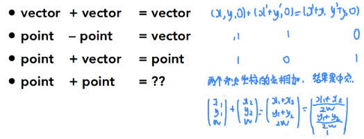  

PS:
- $(x, y, \omega)^T$ is the 2D point $(x/\omega, y/\omega)^T$ $(\omega\neq0)$
- $(x, y, z, \omega)^T$ is the 3D point $(x/\omega, y/\omega, z/\omega)^T$ $(\omega\neq0)$

e.g. $\begin{bmatrix} 1 \\ 2 \\ 3 \end{bmatrix} == \begin{bmatrix} 2 \\ 4 \\ 6 \end{bmatrix} == \begin{bmatrix} 1/3\\ 2/3 \\ 3/3 \end{bmatrix}$

PS2:

- 这是错的，表示相同的点不假，但是不是等号啊！
    
    $\begin{bmatrix} f_xX_c \\ f_yY_c \\ Z_c \end{bmatrix} 
\neq \begin{bmatrix} f_x\dfrac{X_{c}}{Z_{c}} \\ f_y\dfrac{Y_{c}}{Z_{c}} \\ 1 \end{bmatrix}$

- 这才是矩运算阵
    
    $\begin{bmatrix} f_xX_c \\ f_yY_c \\ Z_c \end{bmatrix} 
=Z_c\begin{bmatrix} f_x\dfrac{X_{c}}{Z_{c}} \\ f_y\dfrac{Y_{c}}{Z_{c}} \\ 1 \end{bmatrix}$

    $\begin{bmatrix} f_x\dfrac{X_{c}}{Z_{c}} \\ f_y\dfrac{Y_{c}}{Z_{c}} \\ 1 \end{bmatrix}
=\dfrac{1}{Z_c} \begin{bmatrix} f_xX_c \\ f_yY_c \\ Z_c \end{bmatrix} $

- 这是齐次坐标到欧式坐标（你心里知道 `==` 表示齐次坐标的相等）
    
    $\begin{bmatrix} f_xX_c \\ f_yY_c \\ Z_c \end{bmatrix} 
    ==\begin{bmatrix} f_x\dfrac{X_{c}}{Z_{c}} \\ f_y\dfrac{Y_{c}}{Z_{c}} \\ 1 \end{bmatrix} \underrightarrow{当\omega=1时，可以直接转化} \begin{bmatrix} f_x\dfrac{X_{c}}{Z_{c}} \\ f_y\dfrac{Y_{c}}{Z_{c}} \end{bmatrix}$

## 3. affine transformation

如果是表示仿射变换，那么齐次坐标矩阵的最后一行就必然是 $\begin{bmatrix} 0^\top & 1\end{bmatrix}$ (前面列向量代表向量则都是0，最后一列代表点则是1)

### 3.1. linear transformation

#### 3.1.1. Shear

具体方法，代入点算

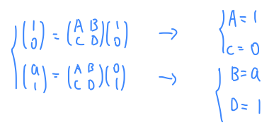

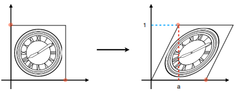

$
\begin{bmatrix} x^{\prime}  \\y^{\prime}\end{bmatrix} = 
\begin{bmatrix}1 & a \\0 & 1\end{bmatrix}
\begin{bmatrix}x \\y\end{bmatrix}
$

$\text{shear-x}(s)=\begin{bmatrix}1&s\\0&1\end{bmatrix}, \quad\text{shear-y}(s)=\begin{bmatrix}1&0\\s&1\end{bmatrix}$

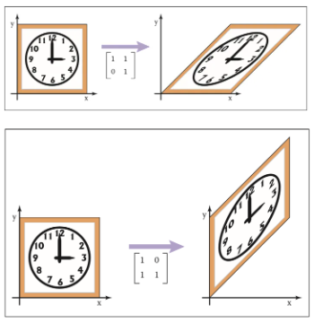

$
\text{shear-x}(d_y,d_z)=\begin{bmatrix}1&d_y&d_z\\0&1&0\\0&0&1\end{bmatrix}
$

#### 3.1.2. Scale

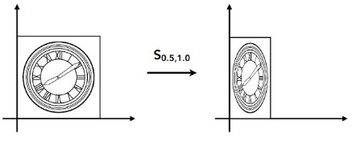

$
\begin{bmatrix} x^{\prime}  \\y^{\prime}\end{bmatrix} = 
\begin{bmatrix}s_{x} & 0 \\0 & s_{y}\end{bmatrix}
\begin{bmatrix}x \\y\end{bmatrix}
$

$
\begin{bmatrix} x^{\prime}  \\y^{\prime} \\ 1 \end{bmatrix} =
\begin{bmatrix}s_x&0&0\\0&s_y&0\\0&0&1\end{bmatrix}
\begin{bmatrix}x \\y \\1 \end{bmatrix}
$

#### 3.1.3. Reflection（沿着y轴对称）

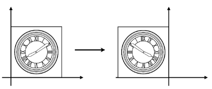

$
\begin{bmatrix} x^{\prime}  \\y^{\prime}\end{bmatrix} = 
\begin{bmatrix}-1 & 0 \\0 & 1\end{bmatrix}
\begin{bmatrix}x \\y\end{bmatrix} =
\begin{bmatrix}-x \\y\end{bmatrix}
$

#### 3.1.4. Rotate

**绕坐标原点**逆时针旋转则 $\theta$ 为正，反之为负

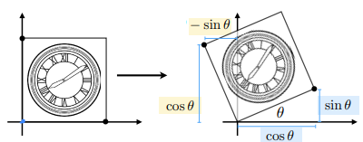

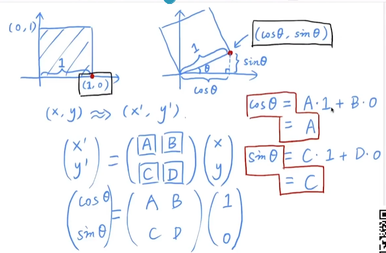 

$
\begin{bmatrix} x^{\prime}  \\y^{\prime}\end{bmatrix} = 
\begin{bmatrix}\cos\theta & -\sin\theta \\\sin\theta & \cos\theta\end{bmatrix}
\begin{bmatrix}x \\y\end{bmatrix}
$

$
\begin{bmatrix} x^{\prime}  \\y^{\prime} \\ 1 \end{bmatrix} =
\begin{bmatrix}\cos\alpha&-\sin\alpha&0\\\sin\alpha&\cos\alpha&0\\0&0&1\end{bmatrix}
\begin{bmatrix}x \\y \\1 \end{bmatrix}
$

PS: $\sin \theta$ .Note that the angle  is defined in radians. 

$\theta_{degrees}= 360 \degree = \theta_{radians} = 2\pi$

$\theta_{radians} = \dfrac{\pi}{180}\theta_{degrees}$

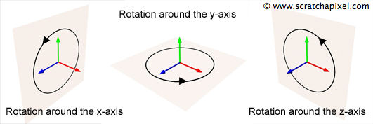

- $\mathbf{R}_x(\alpha) $ 绕X轴: $Y \times Z = X$
  
    $
    \begin{bmatrix} x^{\prime}  \\y^{\prime} \\z^{\prime}\end{bmatrix} =
    \begin{bmatrix}1&0&0\\0&\cos\alpha&-\sin\alpha\\0&\sin\alpha&\cos\alpha \end{bmatrix}
    \begin{bmatrix}x \\y \\z \end{bmatrix}
    $

- $\mathbf{R}_y(\beta) $ 绕Y轴: $Z \times X = Y$，所以是反的。

    $
    \begin{bmatrix} x^{\prime}  \\y^{\prime} \\z^{\prime}\end{bmatrix} =
    \begin{bmatrix}\cos\beta&0&\sin\beta\\0&1&0\\-\sin\beta&0&\cos\beta\end{bmatrix}
    \begin{bmatrix}x \\y \\z \end{bmatrix}
    $

- $\mathbf{R}_z(\gamma) $ 绕Z轴: $X \times Y = Z$

    $
    \begin{bmatrix} x^{\prime}  \\y^{\prime} \\z^{\prime}\end{bmatrix} =
    \begin{bmatrix}\cos\gamma&-\sin\gamma&0\\\sin\gamma&\cos\gamma&0\\0&0&1\end{bmatrix}
    \begin{bmatrix}x \\y \\z \end{bmatrix}
    $

> 3维绕任意轴旋转

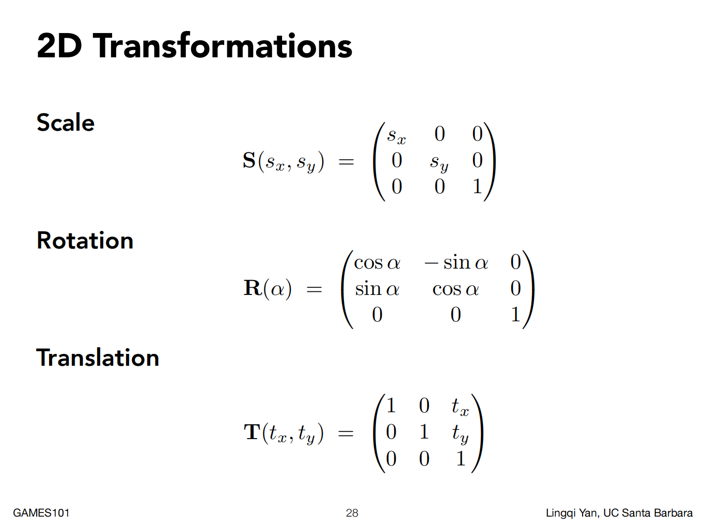

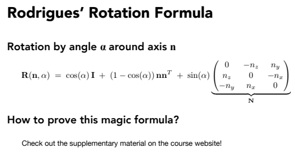

> 矩阵和四元数

旋转矩阵不适合插值(用途)，因为两个矩阵的均值并不是旋转角度的均值。

四元数就可以均值。

> 性质

$\mathbf{R} \in SO(2)$

$SO(n) = \{\mathbf{R} \in \R^{n\times n}|\mathbf{R}\mathbf{R}^T=I,\det(\mathbf{R})=1\}$
- 旋转矩阵是一个正交矩阵（正交矩阵的逆等于其转置矩阵，则有$\mathbf{R}^{-1} = \mathbf{R}^{\top}$）
  1. 根据三角函数的性质和对称矩阵
    $$
    \mathbf{R}(-\theta) = \begin{bmatrix}\cos(-\theta) & -\sin(-\theta) \\\sin(-\theta) & \cos(-\theta)\end{bmatrix} = \begin{bmatrix}\cos\theta & \sin\theta \\-\sin\theta & \cos\theta\end{bmatrix} = \mathbf{R}(\theta)^\top
    $$
  2. 根据变换可逆的性质
    $$
    \mathbf{R}(-\theta) = \mathbf{R}(\theta)^{-1}
    $$
- 行列式值为1

### 3.2. translation transformation
    
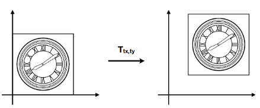

$
\begin{bmatrix} x^{\prime}  \\y^{\prime}\end{bmatrix} = 
\begin{bmatrix}x \\y\end{bmatrix}  + 
\begin{bmatrix}t_x \\ t_y\end{bmatrix}
$

$
\begin{bmatrix} x^{\prime}  \\y^{\prime} \\ 1 \end{bmatrix} =
\begin{bmatrix}1&0&t_x\\0&1&t_y\\0&0&1\end{bmatrix}
\begin{bmatrix}x \\y \\1 \end{bmatrix}
$

## 4. 变化可逆

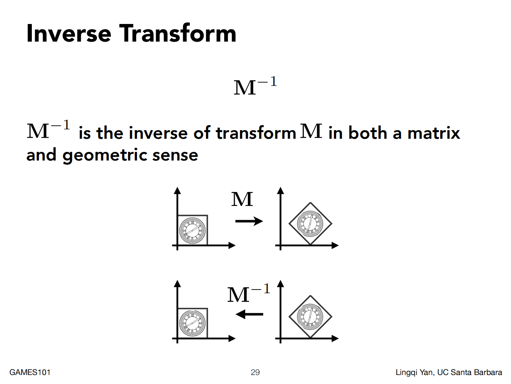

## 5. 顺序

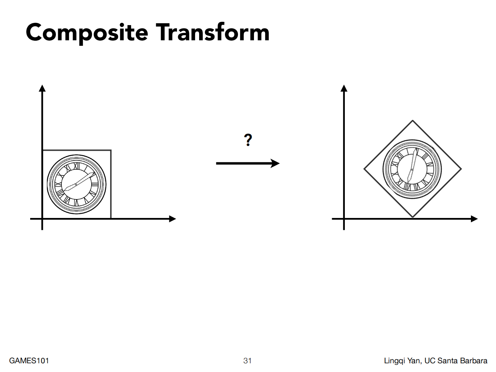

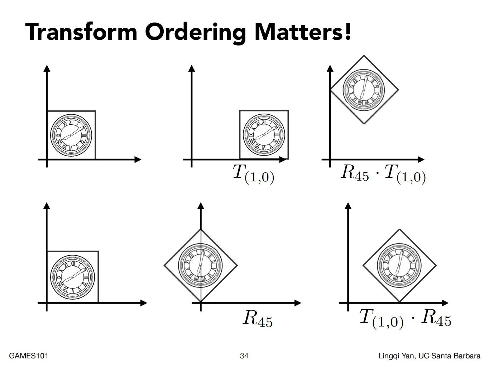

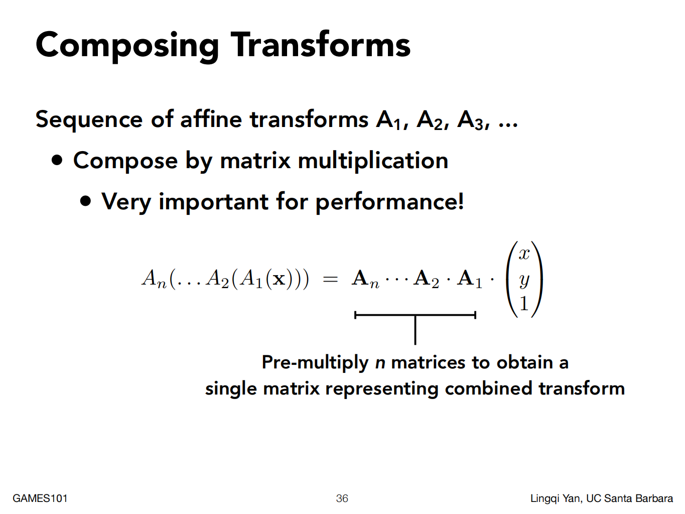

## row/column major

用 camera transformation 举例：

red: x-axis, green: y-axis, blue: z-axis

| Column-Major Vector| Row-Major Vector|
|:-:|:-:|
|从右到左, Post-multiplication | 从左到右, Pre-multiplication |
|$P^{\prime} = T*R*P$ | $P^{\prime}=P*R*T$ |
| API: OpenGL, Blender, PBRT|API: Direct X, Maya |
|${ \begin{bmatrix} \color{red}{X0}& \color{green}{Y0}&\color{blue}{Z0}&X\\ \color{red}{X1}& \color{green}{Y1}&\color{blue}{Z1}&Y\\ \color{red}{X2}& \color{green}{Y2}&\color{blue}{Z2}&Z\\0&0&0&1\end{bmatrix} } = \begin{bmatrix} \color{red}{\textbf{Col}_X} & \color{green}{\textbf{Col}_Y} & \color{blue}{\textbf{Col}_Z} & \textbf{Col}_t\\ 0 &0 & 0 & 1\end{bmatrix}$ | ${\begin{bmatrix} \color{red}{X0}& \color{red}{X1}&\color{red}{X2}&0\\ \color{green}{Y0}& \color{green}{Y1}&\color{green}{Y2}&0\\ \color{blue}{Z0}& \color{blue}{Z1}&\color{blue}{Z2}&0\\ X & Y &Z & 1 \end{bmatrix} } = \begin{bmatrix} \color{red}{\textbf{Row}_X} & 0\\ \color{green}{\textbf{Row}_Y} & 0\\ \color{blue}{\textbf{Row}_Z} & 0 \\ \textbf{Row}_t & 1\end{bmatrix}$ |

**NeRF主要使用 Column-Major 的 c2w**

属于刚体变换，包括旋转和平移操作（先平移后旋转）。

比如column-major w2c：
- 世界坐标系的欧式点$P_{w}=[X_{w}, Y_{w}, Z_{w}]^\top$，相机坐标系的欧式点$P_{c}=[X_{c}, Y_{c}, Z_{c}]^\top$，

    $$\begin{aligned}
    P_{c}&=RP_{w}+t \\
    \begin{bmatrix} X_{c} \\ Y_{c} \\ Z_{c}  \end{bmatrix}  
    &= R \begin{bmatrix} X_{w} \\  Y_{w} \\ Z_{w}  \end{bmatrix} + \begin{bmatrix} t_{x} \\  t_{y} \\ t_{z}  \end{bmatrix}
    \end{aligned}$$

- 世界坐标系的齐次坐标点$P_{w}=[X_{w}, Y_{w}, Z_{w}, 1]^\top$，相机坐标系的欧式点$P_{c}=[X_{c}, Y_{c}, Z_{c}]^\top$，

    $$\begin{aligned}
    P_{c}&=\begin{bmatrix} R & t \end{bmatrix}P_{w}\\
    \begin{bmatrix} X_{c} \\ Y_{c} \\ Z_{c} \end{bmatrix}  
    &= \begin{bmatrix} R & t \end{bmatrix}  \begin{bmatrix} X_{w} \\  Y_{w} \\ Z_{w} \\ 1 \end{bmatrix}
    \end{aligned}$$

- 世界坐标系的齐次坐标点$P_{w}=[X_{w}, Y_{w}, Z_{w}, 1]^\top$，相机坐标系的齐次坐标点$P_{c}=[X_{c}, Y_{c}, Z_{c}, 1]^\top$，
    $$\begin{aligned}
    P_{c}&=\begin{bmatrix} R & t \\ 0^\top & 1 \end{bmatrix}P_{w}\\
    \begin{bmatrix} X_{c} \\ Y_{c} \\ Z_{c} \\ 1 \end{bmatrix}  
    &= \begin{bmatrix} R & t \\ 0^\top & 1  \end{bmatrix}  \begin{bmatrix} X_{w} \\  Y_{w} \\ Z_{w} \\ 1 \end{bmatrix}
    \end{aligned}$$

    甚至可以进一步分解，这样就很明显是先乘旋转矩阵，后乘平移矩阵。

    $$
    \begin{aligned}
    \left[\begin{array}{c|c}R&\mathbf{t}\\\hline\mathbf{0\top}&1\end{array}\right]
    & =\left[\begin{array}{c|c}I&\mathbf{t}\\\hline\mathbf{0\top}&1\end{array}\right]\times\left[\begin{array}{c|c}R&\mathbf{0}\\\hline\mathbf{0\top}&1\end{array}\right]  \\
    &=\left[\begin{array}{ccc|c}1&0&0&t_1\\0&1&0&t_2\\0&0&1&t_3\\\hline0&0&0&1\end{array}\right]\times\left[\begin{array}{ccc|c}r_{1,1}&r_{1,2}&r_{1,3}&0\\r_{2,1}&r_{2,2}&r_{2,3}&0\\r_{3,1}&r_{3,2}&r_{3,3}&0\\\hline0&0&0&1\end{array}\right]
    \end{aligned}
    $$

比如row-major w2c：
- 世界坐标系的欧式点$P_{w}=[X_{w}, Y_{w}, Z_{w}]$，相机坐标系的欧式点$P_{c}=[X_{c}, Y_{c}, Z_{c}]$，

    $$\begin{aligned}
    P_{c}&=P_{w}R+t \\
    \begin{bmatrix} X_{c} & Y_{c} & Z_{c}  \end{bmatrix}  
    &= \begin{bmatrix} X_{w} & Y_{w} & Z_{w}  \end{bmatrix} R + \begin{bmatrix} t_{x} & t_{y} & t_{z} \end{bmatrix}
    \end{aligned}$$

- 世界坐标系的齐次坐标点$P_{w}=[X_{w}, Y_{w}, Z_{w}, 1]$，相机坐标系的欧式点$P_{c}=[X_{c}, Y_{c}, Z_{c}]$，

    $$\begin{aligned}
    P_{c}&=P_{w}\begin{bmatrix} R \\ t \end{bmatrix}\\
    \begin{bmatrix} X_{c} & Y_{c} & Z_{c} \end{bmatrix}  
    &= \begin{bmatrix} X_{w} &  Y_{w} & Z_{w} & 1 \end{bmatrix} \begin{bmatrix} R \\ t \end{bmatrix}
    \end{aligned}$$

- 世界坐标系的齐次坐标点$P_{w}=[X_{w}, Y_{w}, Z_{w}, 1]$，相机坐标系的齐次坐标点$P_{c}=[X_{c}, Y_{c}, Z_{c}, 1]$，
    $$\begin{aligned}
    P_{c}&=\begin{bmatrix} R &  0 \\ t & 1 \end{bmatrix}P_{w}\\
    \begin{bmatrix} X_{c} & Y_{c} & Z_{c} & 1 \end{bmatrix}  
    &= \begin{bmatrix} X_{w} & Y_{w} & Z_{w} & 1 \end{bmatrix}\begin{bmatrix} R &  0 \\ t & 1 \end{bmatrix}  
    \end{aligned}$$

    甚至可以进一步分解，这样就很明显是先乘旋转矩阵，后乘平移矩阵。

    $$
    \begin{aligned}
    \left[\begin{array}{c|c}R&\mathbf{0}\\\hline\mathbf{t}&1\end{array}\right]
    & =\left[\begin{array}{c|c}R&\mathbf{0}\\\hline\mathbf{0}&1\end{array}\right]\times \left[\begin{array}{c|c}I&\mathbf{0}\\\hline\mathbf{t}&1\end{array}\right] \\
    &=\left[\begin{array}{ccc|c}r_{1,1}&r_{1,2}&r_{1,3}&0\\r_{2,1}&r_{2,2}&r_{2,3}&0\\r_{3,1}&r_{3,2}&r_{3,3}&0\\\hline0&0&0&1\end{array}\right] \times \left[\begin{array}{ccc|c}1&0&0&0\\0&1&0&0\\0&0&1&0\\\hline t_1&t_2&t_3&1\end{array}\right]
    \end{aligned}
    $$