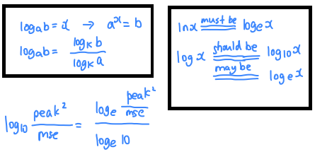

库里都默认`log`为 $\log_e$, `log10`才是 $\log_{10}$
```python
>>> import math
>>> math.log(math.e)
1.0
>>> math.log10(10)
1.0


>>> import torch
>>> torch.log(torch.tensor(math.e))
tensor(1.)
>>> torch.log10(torch.tensor(10))
tensor(1.)


>>> import numpy as np
>>> np.log(math.e)
1.0
>>> np.log10(10)
1.0
```