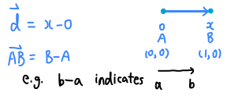

## direction of vector from points

## 几何

$\langle a,b \rangle$就代表a和b的内积， $\|a\|=\sqrt{\langle a,a\rangle}$代表a的模

## 施密特正交化
  
$$\begin{gathered}
\beta_1 =\alpha_1 \\
\beta_{2}=\alpha_{2} -\frac{\langle\alpha_2,\beta_1\rangle}{\langle\beta_1,\beta_1\rangle}\beta_1 \\
\\
\beta_{m}=\alpha_{m}-{\frac{\langle\alpha_{m},\beta_{1}\rangle}{\langle\beta_{1},\beta_{1}\rangle}}\beta_{1}-{\frac{\langle\alpha_{m},\beta_{2}\rangle}{\langle\beta_{1},\beta_{2}\rangle}}\beta_{2}-\cdots-{\frac{\langle\alpha_{m},\beta_{m-1}\rangle}{\langle\beta_{m-1},\beta_{m-1}\rangle}}\beta_{m-1} 
\end{gathered}
$$

再单位化就是满足要求的标准正交向量组

$$e_i=\frac{\beta_i}{\|\beta_i\|}$$

$a'=a/\|a\|,  b'=b-(b\cdot a')a'$ 其实就是 $b'= b-\dfrac{(b, a')}{\sqrt{(a,a)}}a = b-\dfrac{(b, a)}{(a,a)}a$